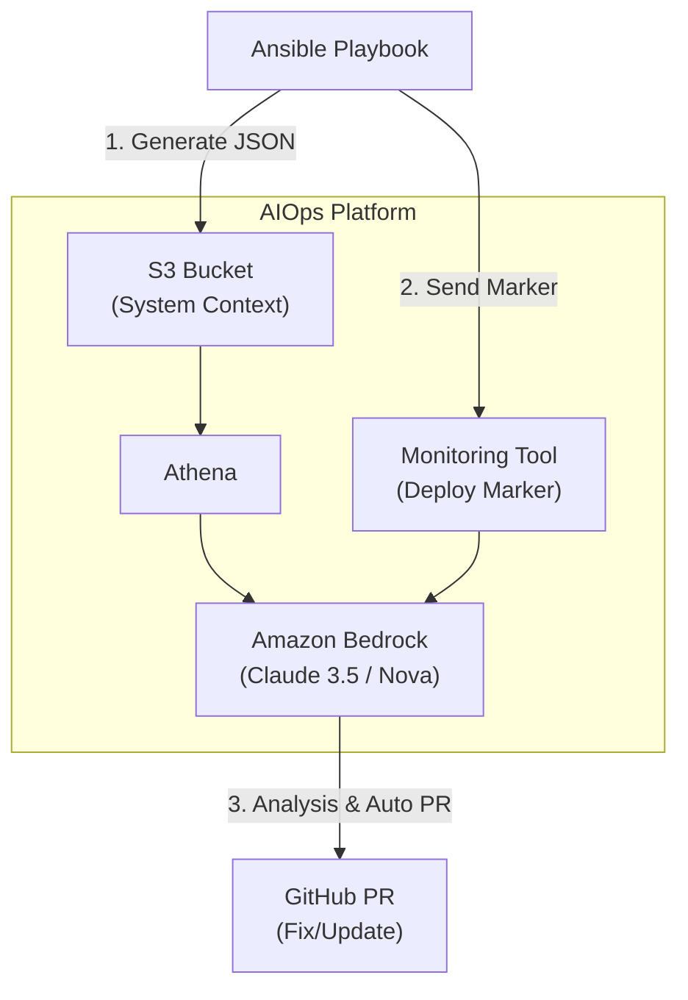

# Ansible の実行ログ、捨ててませんか？」AI 時代に備える "構成管理 × AIOps" の第一歩

---

## はじめに

Ansible でインフラを管理している皆さん、日々の運用でこんな **「もやもや」** はありませんか？

  * **「Playbook は正常終了したのに、なぜかアプリが動かない…」**
  * **「先週の変更と今日の変更、OS レベルでは具体的に何が違った？」**
  * **「障害発生。この原因は直近の Ansible なのか、誰かの手動変更なのか？」**

これまで私たちは、Git の差分や膨大なコンソールログを目視で追ってきました。しかし、**AI (LLM)** が実用段階に入った今、その「調査」、AI に任せてみませんか？

この記事では、難しい機械学習の知識ゼロで始められる、**「Ansible で構築したサーバーの状態を、AI が理解できる形で残す」** 方法を紹介します。

いつもの Playbook に「数行のタスク」を追加するだけで、未来の運用が劇的に楽になります。

## 📌 目次

1.  **なぜ Ansible × AI なのか？（AI に「文脈」を渡す）**
2.  **実践①：Ansible で「AI 用の状態ログ」を出力する**
3.  **実践②：インフラ変更の「瞬間」を記録する（デプロイマーカー）**
4.  **未来編：ログとマーカーがあれば、AI はここまでできる**
5.  **まとめ**

-----

## 1. <a id="why-ansible-ai"></a>なぜ Ansible × AI なのか？

生成 AI (ChatGPTやClaude等) にログ解析を依頼するとき、最も重要なのは **「コンテキスト（文脈）」** です。

単にエラーログを渡すだけでは、AI は一般的な回答しかできません。しかし、Ansible は **「そのサーバーがどうあるべきか（Desirable State）」** を知っています。

Ansible ユーザーである私たちがやるべきことは、以下の2つを **AI が読みやすいデータ（JSON）** として残してあげることだけです。

1.  **スナップショット**: パッケージ一覧やカーネルパラメータの**実測値**
2.  **デプロイマーカー**: 「いつ」「誰が」「どの Playbook で」変更したかの**記録**

これを S3 等に置いておくだけで、トラブルシューティングの際、AI は「あ、この日時の変更で OpenSSL のバージョンが上がっていますね。これが原因です」と教えてくれるようになります。

-----

## 2. <a id="practice-1"></a>実践①：Ansible で「AI 用の状態ログ」を出力する

まずは、Ansible の実行完了時に「その時点のサーバーの状態」を JSON で保存しましょう。テキストログではなく **JSON** にするのがコツです（AI の解析精度が段違いに高いため）。

### ◆ Playbook 例：システム情報の構造化と保存

標準の `setup` モジュールに加え、AI に読ませたい情報を `jq` で整形して S3 に送ります。

```yaml
- name: Collect system info for AIOps
  hosts: all
  gather_facts: true
  tasks:
    # 1. 必要な情報をテキストで取得（package_factsモジュールより軽量に済ませる例）
    - name: Get package list and kernel info
      shell: |
        rpm -qa --qf '%{NAME}-%{VERSION}-%{RELEASE}\n' > /tmp/packages.txt
        sysctl -a > /tmp/sysctl.txt
      changed_when: false

    # 2. jq を使って「AIが読みやすいJSON」に整形する
    # ポイント：AIに渡す前提なので、キー名は分かりやすく英語にする
    - name: Generate System Context JSON
      shell: |
        jq -n \
          --arg packages "$(cat /tmp/packages.txt)" \
          --arg sysctl "$(cat /tmp/sysctl.txt)" \
          --arg ansible "{{ ansible_version.full }}" \
          --arg distribution "{{ ansible_facts.distribution }} {{ ansible_facts.distribution_version }}" \
          '{
            system: {
              distribution: $distribution,
              ansible_core: $ansible,
              collected_at: "'$(date -Iseconds)'"
            },
            state: {
              packages: ($packages | split("\n") | map(select(length > 0))),
              kernel_params: ($sysctl | split("\n") | map(select(length > 0)))
            }
          }' > /tmp/system_context_{{ inventory_hostname }}.json
      changed_when: false

    # 3. S3へアップロード（パス設計が重要！）
    # 設計：バケット/環境/ロール/ホスト/日時.json
    - name: Upload Context to S3
      aws_s3:
        bucket: my-infra-logs
        object: "{{ env }}/{{ role_name }}/{{ inventory_hostname }}/{{ ansible_date_time.iso8601 }}.json"
        src: /tmp/system_context_{{ inventory_hostname }}.json
        mode: put
      delegate_to: localhost # 実行元からS3に送る場合
```

### 💡 Tips

* **パス設計** : `env/role/host/date/` のように階層化しておくと、後で Amazon Athena などを使って「特定のサーバーの時系列変化」を SQL で検索できるようになります。

-----

## 3. <a id="practice-2"></a>実践②：インフラ変更の「瞬間」を記録する

サーバーの状態だけでなく、「いつ変更したか」というイベント情報（デプロイマーカー）も重要です。これにより、Datadog や CloudWatch のメトリクスグラフに **「Ansible 実行」という縦線** を入れることができます。

### ◆ Playbook 例：Datadog にイベントを送信

`post_tasks` などに入れておくと良いでしょう。

```yaml
- name: Send Deploy Marker to Datadog
  uri:
    url: "https://api.datadoghq.com/api/v1/events"
    method: POST
    headers:
      Content-Type: "application/json"
      # ※ APIキーは環境変数や Ansible Vault で安全に管理してください
      DD-API-KEY: "{{ lookup('env', 'DD_API_KEY') }}"
    body_format: json
    body:
      title: "Ansible Provisioning Completed"
      text: |
        Role: {{ role_name }}
        Env: {{ env }}
        Executed by: {{ ansible_user_id }}
      tags:
        - "env:{{ env }}"
        - "role:{{ role_name }}"
        - "source:ansible"
```

### 📉 これでどうなる？

監視ツールのグラフ上で「CPU使用率が跳ね上がったタイミング」と「Ansible の実行マーカー」が重なっていれば、**「あ、原因はさっきの Playbook だ」** と一瞬で特定できます。

-----

## 4. <a id="future"></a>未来編：ログとマーカーがあれば、AI はここまでできる

さて、ここからが「AIOps」の本領発揮です。上記で集めた **「JSON ログ」** と **「デプロイマーカー」** があれば、以下のような自動化基盤が構築可能になります。

### ◆ AIOps アーキテクチャの全体像

スマホでも見やすいように縦方向のフローで表します。



### 実現できるユースケース

1.  **「昨日と何が変わった？」の自動要約**
      * AI が昨日の JSON と今日の JSON を比較。「RPM パッケージが 3つ更新されました。特に glibc の更新は挙動に影響する可能性があります」と Slack に通知。
2.  **脆弱性対応の自動化（Self-Healing）**
      * AI が「古いパッケージ」を検知 → Ansible の変数ファイル（`vars.yml`）のバージョン指定を書き換える → **GitHub で修正 PR を自動作成する**。

-----

## 5. <a id="summary"></a>まとめ

AIOps というと大掛かりなシステムに聞こえますが、Ansible ユーザーにとっての第一歩はシンプルです。

1.  **Ansible で構成変更する際、結果を「構造化データ(JSON)」として S3 に残す**
2.  **実行したタイミングを「デプロイマーカー」として監視ツールに送る**

この2つを Playbook に仕込んでおくだけで、あなたのインフラは **「AI が読めるインフラ」** に進化します。そしてトラブルが起きた時、そのデータがあなたを助けてくれるはずです。

まずは `shell` モジュールで `rpm -qa` を JSON にして書き出すところから、始めてみませんか？
