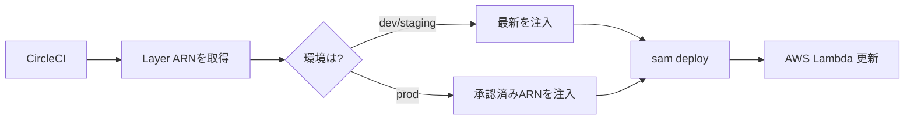

# Day 10：Lambda Layer の ARN 更新を CI/CD で自動化する（SAM へ安全に注入）

---

## “最新追従” の注意点（本番はそのまま最新にしない）

CI/CD が自動で最新 Layer ARN を取れるのは便利ですが、**本番環境で「常に最新」をそのまま使う設計は危険**です。

* Layer の更新が破壊的変更だった場合、**アプリ側の変更なしで本番が壊れる**
* “誰がいつ上げた Layer を使ったか” が曖昧になり、障害調査が難しくなる

そのため現場では、次のように使い分けることが多いです。

* **dev/staging：最新追従**（動作確認の速度優先）
* **prod：固定（ピン留め）**（承認済みバージョンのみ適用）

この「環境で戦略を変える」方針は、Day11 の **OIDC を使った安全なデプロイ** と相性が良いです。

---

## AWS CLI：取得を堅牢にする（リージョン・空配列対策）

`list-layer-versions` はリージョン依存なので、CI では明示しておくと事故が減ります。

```bash
LAYER_NAME="aws-s3-utils-layer"
REGION="ap-northeast-1"

LAYER_ARN=$(aws lambda list-layer-versions \
  --layer-name "${LAYER_NAME}" \
  --region "${REGION}" \
  --query 'LayerVersions[0].LayerVersionArn' \
  --output text)

if [ -z "${LAYER_ARN}" ] || [ "${LAYER_ARN}" = "None" ]; then
  echo "ERROR: Layer ARN not found. name=${LAYER_NAME} region=${REGION}"
  exit 1
fi

echo "Latest Layer ARN: ${LAYER_ARN}"
```

---

## CircleCI 実装例（BASH_ENV への注入を“ジョブ間”でも使える形に）

同一ジョブ内だけなら `$BASH_ENV` で十分ですが、ジョブを分ける場合は workspace / artifacts で受け渡しするのが定石です。

### 方式A：同一ジョブで完結（シンプル）

```bash
echo "export AwsS3UtilsLayerArn=${LAYER_ARN}" >> "$BASH_ENV"
source "$BASH_ENV"
```

### 方式B：ARN をファイル化して引き回す（現場で強い）

```bash
echo -n "${LAYER_ARN}" > layer_arn.txt
```

---

## SAM 側：Parameter と template.yaml の形を明確にする

記事の理解を一段上げるために、SAM 側の最小例も入れるのがおすすめです（読者が迷わなくなります）。

```yaml
Parameters:
  AwsS3UtilsLayerArn:
    Type: String
    Description: ARN of aws-s3-utils-layer (with version)

Resources:
  PdfFunction:
    Type: AWS::Serverless::Function
    Properties:
      Runtime: python3.12
      CodeUri: src/
      Handler: app.lambda_handler
      Layers:
        - !Ref AwsS3UtilsLayerArn
```

そしてデプロイ時に注入：

```bash
sam deploy \
  --parameter-overrides AwsS3UtilsLayerArn="${LAYER_ARN}"
```

---

## 実務TIP：本番は “最新” ではなく “承認済み” を使う

本番の事故を避ける典型パターンは次のどちらかです。

* **prod は固定の LayerVersionArn をリポジトリにコミット**（変更が差分としてレビュー可能）
* **承認済み ARN を SSM Parameter Store 等に置き、CI がそこを参照**（承認フローを作れる）

「CI が勝手に最新を選ぶ」のではなく、**“選ばれたものを安全に注入する”** に寄せると運用品質が上がります。

---

## 図解：Layer 自動更新フロー（dev/staging と prod を分ける）



---

## まとめ

* Layer 更新は **CI/CD に統合**すべき（手動は事故要因）
* ただし本番は “常に最新” ではなく、**承認済みバージョン運用**が基本
