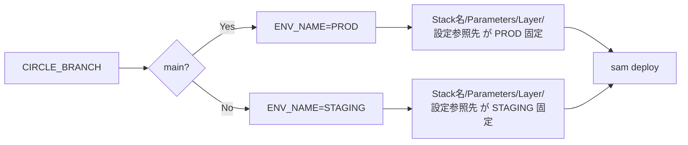

# Day 12：ブランチで自動的に STAGING / PROD を切り替える

---

## はじめに

Lambda のデプロイで最も多い事故は、

* 本番に誤って STAGING 用の設定を流した
* STAGING に本番の Layer を適用してしまった
* デプロイ先の Stack 名を間違えた（検証のつもりが本番更新）

など、**環境の取り違え**です。

そしてこの手の事故は、
「気をつける」「チェックリストで防ぐ」では再発します。

根絶する最も簡単な方法が、
**“ブランチ名で環境を自動判定し、人が環境を選べないようにする”** 仕組みです。

---

## 前提：ブランチ戦略を「環境」と一致させる

まず前提として、運用ルールをこのように固定します。

* `main` への変更＝**本番（PROD）**
* `main` 以外（feature / develop 等）＝**検証（STAGING）**

これを CI/CD 側が強制すれば、
「環境を選ぶ UI」「手入力の ENV」自体が不要になります。

---

## 実装例（CircleCI）：ブランチで ENV_NAME を決める

```bash
if [ "${CIRCLE_BRANCH}" = "main" ]; then
  export ENV_NAME="PROD"
else
  export ENV_NAME="STAGING"
fi

echo "Using environment: ${ENV_NAME}"
```

ポイントは **ENV_NAME を “出力して終わり” にしない**ことです。
この値を **Stack 名、SAM Parameters、参照する Layer、設定取得先**まで一気通貫で反映させると、事故がほぼ消えます。

---

## SAM へのパラメータ注入：EnvName を “中心キー” にする

```bash
sam deploy \
  --parameter-overrides EnvName=${ENV_NAME} \
  --no-fail-on-empty-changeset
```

`template.yaml` 側は最低限これで受け取れます。

```yaml
Parameters:
  EnvName:
    Type: String
    AllowedValues:
      - STAGING
      - PROD
```

**AllowedValues** を入れるだけで、想定外の値（typo など）をテンプレ側で弾けます。地味ですが事故防止に効きます。

---

## 事故が “ほぼゼロ” になる設計（重要）

ENV_NAME を受け取るだけだと、まだ事故は残ります。
「人が間違えても壊れない」状態にするには、次の 3 点まで連動させるのが実務パターンです。

### 1) Stack 名を環境で固定する（取り違え防止の本丸）

```bash
STACK_NAME="myapp-${ENV_NAME,,}"  # prod / staging にしたい場合
sam deploy --stack-name "${STACK_NAME}" ...
```

Stack 名が環境で分かれていれば、
**STAGING のつもりで PROD を更新する**事故が構造的に起きにくくなります。

### 2) “設定の参照先” を環境で分ける（SSM/Secrets の混線を防ぐ）

例えば SSM Parameter Store を使うなら、パスを環境で分けます。

* `/myapp/STAGING/db/url`
* `/myapp/PROD/db/url`

Lambda 側は `EnvName` でパスを組み立てる、あるいは `Globals` の環境変数で渡します。

```yaml
Globals:
  Function:
    Environment:
      Variables:
        ENV_NAME: !Ref EnvName
        PARAM_PREFIX: !Sub "/myapp/${EnvName}"
```

### 3) Layer / リソース参照も “環境で固定” する（最もやりがちな事故）

STAGING には STAGING の Layer、PROD には PROD の Layer。
これをテンプレ側で **Conditions** にして固定すると安全です。

```yaml
Conditions:
  IsProd: !Equals [!Ref EnvName, "PROD"]

Resources:
  MyFunction:
    Type: AWS::Serverless::Function
    Properties:
      # 例：環境別で参照する Layer ARN を切替
      Layers:
        - !If
          - IsProd
          - arn:aws:lambda:ap-northeast-1:123456789012:layer:my-layer-prod:10
          - arn:aws:lambda:ap-northeast-1:123456789012:layer:my-layer-staging:42
```

ここまでやると、**人間が “Layer を貼り間違える余地” がなくなります。**

---

## CircleCI 側を「再利用可能な形」にする（実務向け）

上の bash を毎回コピペすると、いつかズレます。
CircleCI の `commands:` に切り出すと運用が安定します。

```yaml
commands:
  set_env_from_branch:
    steps:
      - run:
          name: Set ENV_NAME from branch
          command: |
            if [ "${CIRCLE_BRANCH}" = "main" ]; then
              echo 'export ENV_NAME=PROD' >> $BASH_ENV
            else
              echo 'export ENV_NAME=STAGING' >> $BASH_ENV
            fi
            source $BASH_ENV
            echo "Using environment: ${ENV_NAME}"
```

以降の job はこれを呼ぶだけにします。

---

## 図解：環境切替フロー（全体像）

元の図は分かりやすいので、**“どこに効くか”**まで線を伸ばすとさらに良くなります。



---


## まとめ

* 環境事故の最大原因は「人が環境を選べる」こと
* `main` なら PROD、それ以外は STAGING を **CI が自動決定**すればヒューマンエラーが消える
* `EnvName` を中心に **Stack 名・設定参照先・Layer**まで連動させると、実務で壊れない
* 次回は Lambda の「本番デプロイ戦略」（段階リリース／ロールバック／承認フローなど）へ

---

## 付録：CircleCI config.yml 完成形サンプル（ENV 切替 + OIDC Role 切替）

### 想定

* ブランチ `main` → `PROD`
* それ以外 → `STAGING`
* AWS IAM Role は環境別に分離

  * `AWS_ROLE_ARN_PROD`
  * `AWS_ROLE_ARN_STAGING`
* `sam deploy` の `--stack-name` と `--parameter-overrides EnvName=...` を強制

> 注意：下記は “動く骨格” に寄せています。あなたの既存 orbs / jobs 構成に合わせて、`aws-cli/setup` 等は読み替えてください。

```yaml
version: 2.1

orbs:
  aws-cli: circleci/aws-cli@5.1.1

executors:
  sam-machine:
    machine:
      image: ubuntu-2204:2023.10.1
    resource_class: medium

commands:
  set_env_from_branch:
    description: "Derive ENV_NAME and AWS_ROLE_ARN from branch"
    steps:
      - run:
          name: Set ENV_NAME / AWS_ROLE_ARN
          command: |
            if [ "${CIRCLE_BRANCH}" = "main" ]; then
              echo 'export ENV_NAME=PROD' >> "$BASH_ENV"
              echo 'export AWS_ROLE_ARN=${AWS_ROLE_ARN_PROD}' >> "$BASH_ENV"
            else
              echo 'export ENV_NAME=STAGING' >> "$BASH_ENV"
              echo 'export AWS_ROLE_ARN=${AWS_ROLE_ARN_STAGING}' >> "$BASH_ENV"
            fi

            # 以降の step で参照できるように読み込み
            source "$BASH_ENV"

            # サニティチェック（未設定事故を明確に落とす）
            test -n "${ENV_NAME}"
            test -n "${AWS_ROLE_ARN}"

            echo "ENV_NAME=${ENV_NAME}"
            echo "AWS_ROLE_ARN=${AWS_ROLE_ARN}"

  assume_role_with_oidc:
    description: "Assume AWS role via OIDC (no static keys)"
    steps:
      - aws-cli/setup:
          role_arn: ${AWS_ROLE_ARN}
          role_session_name: "circleci-<< pipeline.id >>"
          session_duration: "900"
      - run:
          name: Verify caller identity
          command: |
            aws sts get-caller-identity

  sam_deploy:
    description: "Deploy with forced env mapping"
    parameters:
      region:
        type: string
        default: "ap-northeast-1"
      stack_base:
        type: string
        default: "myapp"
    steps:
      - run:
          name: Deploy with SAM
          command: |
            source "$BASH_ENV"

            STACK_NAME="<< parameters.stack_base >>-${ENV_NAME,,}"
            echo "STACK_NAME=${STACK_NAME}"

            sam deploy \
              --region "<< parameters.region >>" \
              --stack-name "${STACK_NAME}" \
              --capabilities CAPABILITY_IAM \
              --no-confirm-changeset \
              --no-fail-on-empty-changeset \
              --parameter-overrides EnvName="${ENV_NAME}"

jobs:
  deploy:
    executor: sam-machine
    steps:
      - checkout
      - set_env_from_branch
      - assume_role_with_oidc
      - sam_deploy:
          region: "ap-northeast-1"
          stack_base: "lambda-function-sample"

workflows:
  deploy_pipeline:
    jobs:
      - deploy
```

### この構成で「事故が消える」理由

* **ENV_NAME と Role をブランチで確定**し、手入力や選択 UI を排除
* **PROD/STAGING で別 Role**なので、仮にデプロイコマンドを誤っても “権限が足りずに落ちる” 可能性が上がる
* `STACK_NAME` も環境連動で固定するため、**同名 Stack 上書き事故**が起きにくい

