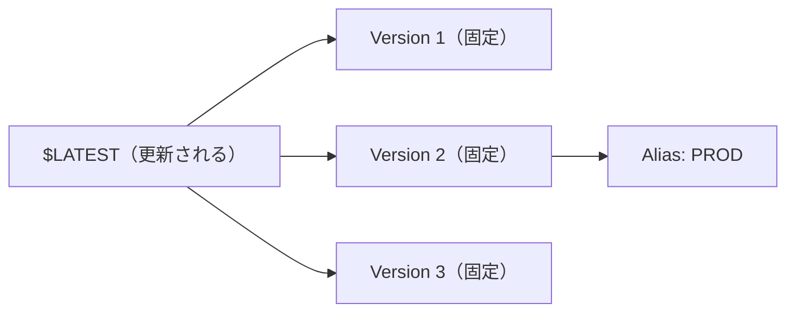

# Day 13：Lambda のデプロイ戦略（Alias / Version / Canary / Rollback）

 ---

## はじめに

Lambda を本番運用する上で、やってはいけないことがあります。

**$LATEST を直接（無指定で）本番が呼び出すこと。**

理由：

* どのコードが動いているか追跡しづらい（再現性が落ちる）
* 事故が起きても即座に戻せない（ロールバックが重い）
* 「本番は何が動いているか」がチームで合意できない

この記事では、Lambda 本番運用のための **Version / Alias / Canary / Rollback** を、実務の使い方に寄せて整理します。

---

## まず結論：本番運用の最小ルール

最低限これだけで “運用が壊れにくく” なります。

* **本番は Alias（例：`PROD`）を呼ぶ**
* デプロイは **Version を発行（Publish）**して、その Version に Alias を向ける
* リリースは **Canary/Linear** で段階的に流す
* 監視（Alarm）を紐づけて **自動ロールバック**できるようにする

---

## Version とは？

Version は **不変（immutable）**なスナップショットです。
一度作った Version は、コードも設定も基本的に固定で「後から書き換えない」前提で扱います。

重要な補足：

* Lambda は通常、デプロイするとまず **`$LATEST` が更新**されます
* その後、**Publish（バージョン発行）**をすると Version（例：`1`, `2`, `3`…）が作られます
* SAM の `AutoPublishAlias` を使うと、デプロイのたびに publish されやすくなります（実務ではこの形が多い）

イメージ：

```text
(更新される) $LATEST
   └─ publish → (固定される) Version 1
   └─ publish → (固定される) Version 2
```

---

## Alias とは？

Alias は **「固定の名前で特定の Version を指す参照（ポインタ）」**です。

例：

```text
PROD    → Version 10
STAGING → Version 13
```

Alias の価値はシンプルで、「本番は常に `PROD` を呼ぶ」と決めれば、

* 本番が動く対象が明確になる
* 更新は alias の付け替え（or トラフィックシフト）になる
* 戻すのも alias を戻すだけになる

---

## 図解：Version と Alias の関係（修正版）

※ mermaid のコードフェンスを正しい形に直しています。



---

## “本番で $LATEST が危険” の正体

`$LATEST` は **常に書き換わる**ので、実務だと次の事故が起きます。

* 「昨日動いていたもの」と「今動いているもの」が一致しない
* バグ混入時に “戻す操作” が重い（再デプロイ or 手動復旧になりがち）
* 監査・障害報告で「どの版か」を説明できない

逆に **Version + Alias** を前提にすると、障害対応が次のように単純化します。

* 「PROD は今 Version 42」
* 「戻すなら PROD を 41 に戻す」

---

## Canary / Linear デプロイとは？

段階的に “新しい Version へトラフィックを寄せる” デプロイ方式です。
一気に 100% 切り替えず、失敗を小さくできます。

代表例：

* Canary：少量（例 10%）を流して、問題なければ 100% に
* Linear：一定割合で徐々に増やす（例 10% ずつ）

SAM では `DeploymentPreference` で指定できます。

```yaml
DeploymentPreference:
  Type: Canary10Percent5Minutes
```

---

## SAM での実装例（AutoPublishAlias + DeploymentPreference）

ここが「初心者〜中級者が一番つまづく」実装ポイントなので、完成形の最小例を載せます。

```yaml
Resources:
  MyFunc:
    Type: AWS::Serverless::Function
    Properties:
      FunctionName: my-func
      Runtime: python3.12
      Handler: app.lambda_handler
      CodeUri: src/
      AutoPublishAlias: PROD   # ここが “Version発行 + Alias更新” の肝
      DeploymentPreference:
        Type: Canary10Percent5Minutes
```

ポイント：

* `AutoPublishAlias` を入れると、デプロイごとに **新しい Version が作られ**、Alias が更新されます
* `DeploymentPreference` を入れると、**段階リリース**になります（裏側は CodeDeploy）

---

## 監視（Alarm）と “自動ロールバック” を必ずセットにする

Canary/Linear の強みは「問題が起きたら途中で止めて戻れる」ことです。
そのために、**CloudWatch Alarm を紐づける**のが実務ではほぼ必須です。

（最小イメージ：エラー率や 5xx、Duration の急増などを監視）

```yaml
DeploymentPreference:
  Type: Canary10Percent5Minutes
  Alarms:
    - !Ref MyFuncErrorAlarm
```

これを入れておくと、

* 10% リリース中に Alarm が発火
* 自動でロールバック（元の Version に戻す）

という “壊れない” 挙動に寄せられます。

---

## Rollback が一瞬でできる（Alias を戻すだけ）

Alias を戻すだけで、即座に以前の Version に戻せます。

```bash
aws lambda update-alias \
  --function-name MyFunc \
  --name PROD \
  --function-version 9
```

運用のコツ：

* 「直前の安定版 Version」をメモしておく（デプロイログに残す）
* 可能なら “安定版” の alias（例：`PROD_STABLE`）を別で持つのも有効です

---

## 実務向け Tips（事故を減らす運用設計）

* **Alias 命名を固定化**する（`PROD` / `STAGING` を原則にして迷いを消す）
* 本番トラフィックがある構成では、**Canary + Alarm**までを 1 セットで導入する
* 「本番は alias を必ず指定する」をチーム規約化（レビュー観点に入れる）
* ロールバック手順を「コマンド 1 本」まで落としておく（上の `update-alias`）

---

## まとめ

* **$LATEST の本番利用は禁止（追跡性・再現性・復旧性が落ちる）**
* **Alias で本番バージョンを固定**し、Version を前提に運用する
* **Canary/Linear で安全に段階リリース**する
* **Alarm 連携で自動ロールバック**まで入れると運用品質が一段上がる
* Day12 の「環境切替」と Day13 の「安全な出し方」は、実務フローとして自然に接続する

---

## 付録：CircleCI → SAM デプロイで Alias を環境別に切り替える（完成形）

Day12 の方針（ブランチで STAGING/PROD を自動切替）を、Day13 の **Version / Alias / Canary / Rollback** に直結させるには、デプロイ時に **Alias 名（= AutoPublishAlias）を環境別に切り替える**のが最も分かりやすい実装です。

ここでは次のルールにします。

* `main` ブランチ：`PROD`
* `main` 以外：`STAGING`

### 1) SAM テンプレート側（AliasName を Parameter 化）

`AutoPublishAlias` は固定値でも動きますが、**環境で切り替えるなら Parameter 化**が安全です。

```yaml
AWSTemplateFormatVersion: '2010-09-09'
Transform: AWS::Serverless-2016-10-31

Parameters:
  AliasName:
    Type: String
    Default: STAGING
    AllowedValues:
      - STAGING
      - PROD

Resources:
  MyFunc:
    Type: AWS::Serverless::Function
    Properties:
      FunctionName: my-func
      Runtime: python3.12
      Handler: app.lambda_handler
      CodeUri: src/
      AutoPublishAlias: !Ref AliasName
      DeploymentPreference:
        Type: Canary10Percent5Minutes
```

ポイント：

* `sam deploy --parameter-overrides AliasName=PROD` のように、**デプロイ時に alias を決定**できます。
* `DeploymentPreference` を入れておけば、**Alias に対するトラフィックシフト**が有効になります（Day13 の主題と一致）。

---

### 2) CircleCI 側（ブランチから AliasName を決定して sam deploy）

最小の完成形として、ブランチ名から AliasName を決め、`sam deploy` に渡します。

```yaml
version: 2.1

jobs:
  deploy:
    docker:
      - image: public.ecr.aws/lambda/python:3.12
    environment:
      AWS_REGION: ap-northeast-1
      STACK_NAME: my-lambda-stack
    steps:
      - checkout

      # OIDC assume-role（Day11/Day12 の流れを踏襲）
      - aws-cli/setup:
          role_arn: ${AWS_ROLE_ARN}
          role_session_name: deploy
          session_duration: '900'
          region: ${AWS_REGION}

      - run:
          name: "Decide alias by branch"
          command: |
            if [ "${CIRCLE_BRANCH}" = "main" ]; then
              echo 'export ALIAS_NAME="PROD"' >> "${BASH_ENV}"
            else
              echo 'export ALIAS_NAME="STAGING"' >> "${BASH_ENV}"
            fi
            source "${BASH_ENV}"
            echo "CIRCLE_BRANCH=${CIRCLE_BRANCH}"
            echo "ALIAS_NAME=${ALIAS_NAME}"

      - run:
          name: "SAM build"
          command: |
            sam build --use-container

      - run:
          name: "SAM deploy (AutoPublishAlias switch)"
          command: |
            source "${BASH_ENV}"
            sam deploy \
              --no-confirm-changeset \
              --no-fail-on-empty-changeset \
              --capabilities CAPABILITY_IAM \
              --stack-name "${STACK_NAME}" \
              --region "${AWS_REGION}" \
              --parameter-overrides AliasName="${ALIAS_NAME}"
```

ポイント：

* `BASH_ENV` に export しておくと、後続 step でも確実に参照できます。
* `--parameter-overrides AliasName=...` により、**同一テンプレートで STAGING/PROD を切り替え可能**になります。

---

### 3) さらに実務向けにする場合（Stack 名も分ける）

「同じ Stack に STAGING と PROD が共存」する構成も可能ですが、実務では **Stack 自体も分ける**と事故が減ります。

* `main`：`my-lambda-prod`
* それ以外：`my-lambda-staging`

上の step に加えて、Stack 名も分岐させます。

```bash
if [ "${CIRCLE_BRANCH}" = "main" ]; then
  echo 'export ALIAS_NAME="PROD"' >> "${BASH_ENV}"
  echo 'export STACK_NAME="my-lambda-prod"' >> "${BASH_ENV}"
else
  echo 'export ALIAS_NAME="STAGING"' >> "${BASH_ENV}"
  echo 'export STACK_NAME="my-lambda-staging"' >> "${BASH_ENV}"
fi
```

こうしておくと、

* STAGING の変更が PROD のリソースに影響しにくい
* IAM や VPC、イベントソース（EventBridge/SQS/S3）も環境ごとに分離しやすい

というメリットが出ます。

---

### 4) ロールバック運用への接続（Day13 の締めとして効く一文）

この構成の良さは、障害時に **Alias を戻すだけ**で即復旧できる点です。

```bash
aws lambda update-alias \
  --function-name my-func \
  --name PROD \
  --function-version 41
```

Canary を使っている場合は、Alarm 連携により “途中で自動ロールバック” まで狙えます。

必要であれば、あなたの Day12 の “ブランチで STAGING/PROD を切り替える CircleCI 設計” に合わせて、Day13 の付録として **「CircleCI → SAM デプロイで AutoPublishAlias を環境別に切り替える完成形サンプル」**（`sam deploy --parameter-overrides AliasName=...` など）も追記できます。
