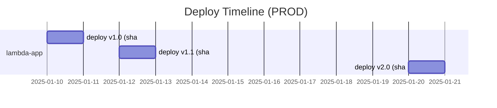

# Day 14：Deploy Marker で “いつ・何が・なぜ” 変わったかを可視化する

---

## はじめに

Lambda の障害調査で、現場が必ずぶつかる質問があります。

> いつデプロイした？
> 何が変わった？
> 今動いているバージョンはどれ？

この3点が曖昧なチームは、**障害復旧が遅く、再発も増えがち**です。原因は単純で、運用の“文脈”が残っていないからです。

* CloudWatch Logs は「何が起きたか」は分かる
* しかし「いつ何を入れ替えたか（変更の事実）」が抜ける
* 結果、調査が “ログの海を泳ぐ作業” になる

そこで使えるのが **Deploy Marker（デプロイの記録＝変更の事実を残す仕組み）** です。CircleCI では `circleci run release plan` / `update` で **Deploys UI 上にデプロイ履歴を残し、ステータスも追跡**できます。 ([CircleCI][1])

---

## Day 13 とのつながり（この回の位置づけ）

Day 13 では **Alias / Version / Canary / Rollback** といった「安全に出すための仕組み」を扱いました。
ただし、どれだけ安全に出しても、障害時にこう言われると詰みます。

* 「今 PROD の Alias はどの Version を向いてるの？」
* 「それって、いつ切り替えた？」
* 「切り替えた理由（チケット/変更内容）は？」

**Day 13 が “出し方（戦略）”** なら、
**Day 14 は “出した事実と理由（運用の証跡）”** を作る回です。

---

## Deploy Marker とは？

Deploy Marker は、デプロイの瞬間に

* どの環境へ（environment）
* どのコンポーネントを（component）
* どのバージョンに（target version）
* 成功したか/失敗したか（status）

を **外部（CircleCI の Deploys UI）に記録する**仕組みです。 ([CircleCI][2])

CircleCI のドキュメント上も、`circleci run release plan` を入れると Deploys UI に **pending** として表示され、後続で `update` して状態を更新する流れになっています。 ([CircleCI][3])

---

## 何がうれしいのか（“ログ”ではなく“タイムライン”が手に入る）

Deploy Marker が効くのは、障害時に「変更の事実」をすぐ押さえられる点です。

* **どのコミット（SHA）が本番に入っているか**
* **Layer の更新がいつ入ったか**（＝依存関係変更の特定が速い）
* デプロイ直後の **エラー急増** を「変更イベント」と関連づけられる
* 将来的に AIOps（AI差分分析）をする際、**変更点の“文脈”がデータとして残る**

要するに、障害対応で最初にやるべき「変更有無の切り分け」が、数分で終わるようになります。

---

## 設計の要点：environment-name / component-name / target-version を “運用語彙”にする

`circleci run release plan` は、（少なくとも）次の3つを揃えると運用品質が上がります。 ([CircleCI][3])

### environment-name：運用上の環境名に合わせる

例：

* `PROD`
* `STAGING`

Day 12（ブランチで PROD/STAGING 切り替え）と合わせるなら、ブランチ判定で `ENV_NAME` を決めるのが自然です。

### component-name：見たい粒度で切る

例：

* `lambda-app`（アプリ単位）
* `receipt-pdf-to-jpeg`（関数単位）
* `layer/aws-s3-utils-layer`（依存単位）

「障害時にどの粒度で履歴を追いたいか」で決めるのがポイントです。

### target-version：人間が“同定”できる値にする

最小は `CIRCLE_SHA1` で十分です。
一方、Day 13 と強く繋げるなら、次のどれかに寄せるのがおすすめです。

* `git SHA`（監査・再現性が高い）
* `Lambda Version`（Alias が指すバージョンと一致させたいとき）
* `artifact version`（例: `v1.2.3`）

---

## CircleCI 実装例（plan → deploy → update）

ご提示の例は方向性として良いです。ただし **実運用では `update` まで入れて「成功/失敗」を確定**させるのが重要です。 ([CircleCI][4])

### 例：config.yml（概念例）

```yaml
jobs:
  deploy:
    docker:
      - image: cimg/base:stable
    steps:
      - checkout

      # 1) Deploy Marker: plan（pending を作る）
      - run:
          name: "Plan deploy marker"
          command: |
            circleci run release plan "Lambda Deploy" \
              --environment-name="${ENV_NAME}" \
              --component-name="lambda-app" \
              --target-version="${CIRCLE_SHA1}"

      # 2) ここで本体のデプロイ（SAM / CloudFormation など）
      - run:
          name: "Deploy"
          command: |
            sam deploy --no-confirm-changeset --no-fail-on-empty-changeset

      # 3) Deploy Marker: update（成功を確定）
      - run:
          name: "Update deploy marker (success)"
          command: |
            circleci run release update \
              --environment-name="${ENV_NAME}" \
              --component-name="lambda-app" \
              --target-version="${CIRCLE_SHA1}" \
              --status="success"
```

ポイント：

* `plan` は **デプロイ実行前**（＝やる宣言）
* `update` は **デプロイ実行後**（＝結果確定）
* 失敗時の `update --status="failed"` も入れると、タイムラインが“監査ログ”になります

※ `plan` で Deploys UI に pending が作られ、`update` で状態を追跡するという流れ自体が CircleCI のガイドに沿っています。 ([CircleCI][3])

---

## 図解：デプロイタイムライン（Qiita で崩れにくい Mermaid）

ご提示の `timeline` は Mermaid 側では存在しますが、環境によっては **Experimental 扱い**になりレンダリングが不安定なことがあります（Qiita 側の制限もあり得ます）。 ([Qiita][5])
そのため、Qiita では比較的安定な **gantt** を使った表現が無難です。



---

## “なぜ変えた？”を残す（Deploy Marker を運用品質にする一工夫）

Deploy Marker は「いつ・何を」は強い一方で、「なぜ」を放置すると半分しか効きません。
そこで実務では、最低限どれかを **target-version か deploy-name 側に寄せる**のが定石です。

例：

* `target-version = ${CIRCLE_SHA1}` は固定
* 代わりに `deploy-name` にチケットや要約を入れる（可能なら） ([CircleCI][3])
* もしくはデプロイジョブのログに **“変更理由ブロック”** を必ず出す（後から追える）

「監査・引き継ぎ・障害対応」の観点で、**“なぜ”が残るだけで復旧速度が変わる**ことが多いです。

---

## まとめ

* Deploy Marker は、デプロイの“運用文脈”を作る（いつ・何が・結果） ([CircleCI][2])
* Day 13 の **Alias/Version/Canary/Rollback** を、障害時に追える形にするのが Day 14
* `plan → deploy → update` をセットで入れると、調査が「ログ」から「タイムライン」になる ([CircleCI][4])

---

## 付録A：ブランチ別に `ENV_NAME` を PROD/STAGING に切り替える（Day12 接続）

Day12 の「ブランチで STAGING / PROD を切り替える」を Deploy Marker でも一貫させます。ポイントは **“ENV_NAME を1箇所で決め、以後は参照するだけ”**にすることです。

### CircleCI：`BASH_ENV` に書き出す最小パターン

```yaml
jobs:
  deploy:
    docker:
      - image: cimg/base:stable
    steps:
      - checkout

      - run:
          name: "Select environment (main => PROD, others => STAGING)"
          command: |
            if [ "${CIRCLE_BRANCH}" = "main" ]; then
              echo 'export ENV_NAME="PROD"' >> "$BASH_ENV"
              echo 'export ALIAS_NAME="prod"' >> "$BASH_ENV"
            else
              echo 'export ENV_NAME="STAGING"' >> "$BASH_ENV"
              echo 'export ALIAS_NAME="staging"' >> "$BASH_ENV"
            fi

      - run:
          name: "Plan deploy marker"
          command: |
            circleci run release plan "Lambda Deploy" \
              --environment-name="${ENV_NAME}" \
              --component-name="lambda-app" \
              --target-version="${CIRCLE_SHA1}"
```

* `ENV_NAME` は Deploy Marker / SAM deploy / 通知 などで共通利用
* `ALIAS_NAME` も同時に決めておくと Day13 の Alias 運用に直結します

---

## 付録B：`target-version` を Lambda Version（Alias の実体）に寄せる（Day13 接続）

Day13 の「Alias / Version / Canary / Rollback」を本番運用で回すと、障害時に本当に知りたいのは **“今、Alias が指している Function Version 番号”**です。

* Git SHA は「ソースの同定」には強い
* Lambda Version は「今動いている実体の同定」にはさらに強い
* よって **Deploy Marker の `target-version` を Lambda Version に揃える**と、タイムラインが“運用の言葉”になります

### 実装方針（おすすめ）

1. `plan` は従来どおり Git SHA で打つ（変更宣言として十分）
2. デプロイ完了後、Alias が指す Version を AWS CLI で取得
3. `update` は Version 番号で確定する（＝「今の実体はこれ」を残す）

### CircleCI（SAMデプロイ後に Alias→Version を取得して update）

```yaml
      - run:
          name: "Deploy"
          command: |
            sam deploy --no-confirm-changeset --no-fail-on-empty-changeset

      - run:
          name: "Resolve Lambda Version from Alias"
          command: |
            FUNCTION_NAME="your-lambda-function-name"   # 例: receipt-pdf-to-jpeg
            # ALIAS_NAME は付録Aで prod / staging を設定済み想定
            FUNCTION_VERSION=$(aws lambda get-alias \
              --function-name "${FUNCTION_NAME}" \
              --name "${ALIAS_NAME}" \
              --query 'FunctionVersion' \
              --output text)

            echo "Resolved FunctionVersion=${FUNCTION_VERSION}"
            echo "export FUNCTION_VERSION=${FUNCTION_VERSION}" >> "$BASH_ENV"

      - run:
          name: "Update deploy marker (success: Lambda Version)"
          command: |
            # “なぜ”は deploy-name 側や別ログに残すのが実務的です
            circleci run release update \
              --environment-name="${ENV_NAME}" \
              --component-name="lambda-app" \
              --target-version="${FUNCTION_VERSION}" \
              --status="success"
```

### 運用上の注意（実務で効くポイント）

* **Canary / Rollback を Alias 操作で行う**なら、`target-version=FunctionVersion` が最短で効きます
* ただし Git SHA も捨てたくない場合は、次のどちらかに寄せるのが安定です

  * `deploy-name` に SHA 短縮やチケット番号を入れる
  * CloudWatch Logs / リリースノートに SHA を必ず出す（監査・追跡用）

---

## 付録C：Layer 更新（Day10）も同一タイムラインに載せる命名規約（component-name 設計）

Day10 の「Layer を CI/CD で自動更新」に進むと、障害調査で必ず出るのがこれです。

* 「アプリを触ってないのに壊れた」
* 「Layer が上がったのが原因では？」

これを即断するには、**アプリのデプロイ履歴と Layer の更新履歴を同じタイムラインに並べる**のが最も強いです。

### 推奨：component-name の命名規約

**“対象の種類/名前”**で揃えると、後から検索・比較が容易になります。

* Lambda 関数：`lambda/<function-name>`

  * 例：`lambda/receipt-pdf-to-jpeg`
* Layer：`layer/<layer-name>`

  * 例：`layer/aws-s3-utils-layer`
* （任意）スタック：`stack/<stack-name>`

  * 例：`stack/lambda-function-receipt`

### Layer の `target-version` は「Version番号」か「LayerVersionArn」

運用で読みやすいのは **Version番号**です（例：`19`）。
監査や一意性重視なら **LayerVersionArn** でも良いです。

#### ARN から Version 番号を抜く（例）

```bash
LAYER_ARN="arn:aws:lambda:ap-northeast-1:123456789012:layer:aws-s3-utils-layer:19"
LAYER_VER="${LAYER_ARN##*:}"   # => 19
echo "${LAYER_VER}"
```

### CircleCI：アプリの Deploy Marker に加えて Layer の Marker も打つ

Layer を更新するパイプライン（Day10）と、アプリを更新するパイプライン（Day14）を同一運用に寄せると、タイムラインが一気に強くなります。

```yaml
      - run:
          name: "Get latest Layer ARN (example)"
          command: |
            LAYER_NAME="aws-s3-utils-layer"
            REGION="ap-northeast-1"
            LAYER_ARN=$(aws lambda list-layer-versions \
              --layer-name "${LAYER_NAME}" \
              --region "${REGION}" \
              --query 'LayerVersions[0].LayerVersionArn' \
              --output text)

            LAYER_VER="${LAYER_ARN##*:}"
            echo "Layer ARN=${LAYER_ARN}"
            echo "Layer Version=${LAYER_VER}"
            echo "export LAYER_ARN=${LAYER_ARN}" >> "$BASH_ENV"
            echo "export LAYER_VER=${LAYER_VER}" >> "$BASH_ENV"

      - run:
          name: "Plan deploy marker (Layer)"
          command: |
            circleci run release plan "Layer Update" \
              --environment-name="${ENV_NAME}" \
              --component-name="layer/aws-s3-utils-layer" \
              --target-version="${LAYER_VER}"

      # ここで Layer を更新してデプロイする（SAM / publish-layer-version 等）
      - run:
          name: "Deploy (Layer + App)"
          command: |
            sam deploy --no-confirm-changeset --no-fail-on-empty-changeset

      - run:
          name: "Update deploy marker (Layer: success)"
          command: |
            circleci run release update \
              --environment-name="${ENV_NAME}" \
              --component-name="layer/aws-s3-utils-layer" \
              --target-version="${LAYER_VER}" \
              --status="success"
```

### こうしておくと何が速くなるか

* “アプリ変更” と “依存変更（Layer）” を **時間軸で即比較**できる
* 「Layer 上げた直後にエラー増えた」などが **推測ではなく事実**になる
* AIOps（差分分析）をする際、**「何が変わったか」の手掛かりが最初から揃う**


[1]: https://circleci.com/docs/guides/deploy/configure-deploy-markers "Configure deploy markers"
[2]: https://circleci.com/docs/guides/deploy/deployment-overview "Deployment and deploy management overview"
[3]: https://circleci.com/docs/guides/toolkit/environment-cli-usage-guide "CircleCI environment CLI usage guide"
[4]: https://circleci.com/docs/guides/deploy/set-up-rollbacks "Rollback a deployment"
[5]: https://qiita.com/fattonton1/items/afb89a0348dfd91dc990?utm_source=chatgpt.com "ササっとフローが書きたいときはmermaidが良さげ"
