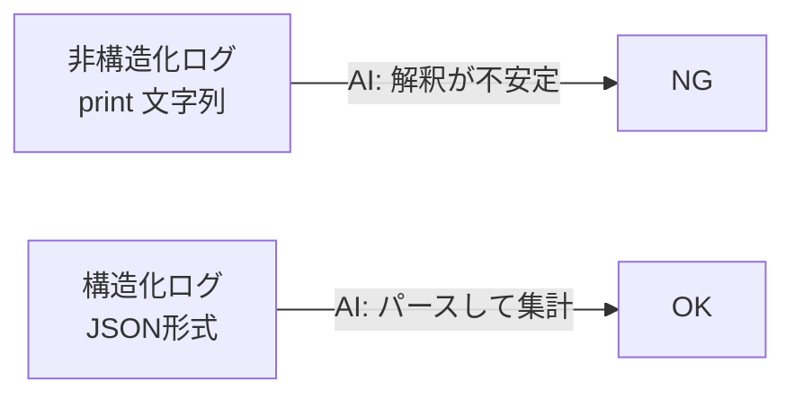

# Day 15：構造化ログで “AI が読めるログ” を作る（AIOps時代の標準）

---

## はじめに

Lambda のログは CloudWatch Logs に出力されます。
しかし次のような “人間向けログ（非構造化ログ）” ばかりだと、**AI も、ログクエリも、集計も** 途端に難しくなります。

```text
処理開始
ファイル読み込み成功
変換完了
```

AIOps（AI を利用した運用自動化）をやるなら、ログは **“読み物” ではなく “データ”** にする必要があります。
その第一歩が **構造化ログ（JSON形式）** です。

この記事では、Lambda 初心者〜中級者向けに

* なぜ構造化ログが必須なのか
* どんな項目を入れるべきか（ログ設計）
* Python での実装パターン
* CloudWatch Logs Insights での分析方法
* Day14 の Deploy Marker と “同じ軸” で繋げるコツ

をまとめます。

---

## 非構造化ログの限界（なぜ AI が困るのか）

非構造化ログは、次の問題を必ず起こします。

* **検索はできても集計できない**（件数、平均、割合が辛い）
* “成功” がどの成功か曖昧（どの処理・どの入力・どのバージョンか不明）
* 障害時に **再現条件**（環境・リリース・依存バージョン）が追えない
* AI に食わせても **事実抽出が不安定**（文の揺れ、表現揺れ、言語混在）

逆に言うと、ログを JSON にして **キーを固定**すれば、AI は “読む” のではなく “パースして集計” できます。

---

## 構造化ログの例（最小形）

ご提示の方向性は正しいです。以下は “最小形” の例です。

```python
import json
import logging

logger = logging.getLogger()
logger.setLevel(logging.INFO)

logger.info(json.dumps({
    "event": "file_processed",
    "duration_ms": 1234,
    "layer_version": 18,
    "status": "success"
}, ensure_ascii=False))
```

ポイントは **「辞書をそのまま info() に渡す」より「JSON文字列として出す」** 方が安定することです。
（環境やフォーマッタ次第で、辞書が Python 表現のまま出てしまい、Insights 側で扱いにくくなるため）

---

## “AI が読めるログ” の設計（まず固定すべきキー）

初心者が最初に迷うのは「何を入れるべき？」です。結論から言うと、まずは **次の 6 つ**を固定すると実務で強いです。

### 1. event（何が起きたか）

* 例：`"event": "file_processed"` / `"event": "validation_failed"`

### 2. status（成功/失敗）

* 例：`"status": "success" | "error"`

### 3. duration_ms（どれくらいかかったか）

* 性能劣化・タイムアウト予兆の検知に直結します

### 4. request_id（1回の実行を一意に識別）

Lambda なら `context.aws_request_id` が即使えます。

### 5. release / version（どのデプロイか）

Day14 の Deploy Marker と繋げるために重要です（後述）。

### 6. input_id（何を処理したか）

S3 なら `bucket` / `key` / `etag` など。PII になり得るので注意（後述）。

---

## Day14（Deploy Marker）と繋がる “同一タイムライン” 設計

Day14 で “いつ・何が・なぜ変わったか” を可視化しました。
Day15 ではログに **同じ識別子（リリース情報）** を入れることで、

* Deploy Marker（リリースイベント）
* CloudWatch Logs（実行イベント）

を **1本の時系列**として辿れるようにします。

例えば、ログに次を入れるのが実務で強いです。

* `environment`（例：`PROD-PY-3.12` / `STAGING-PY-3.12`）
* `component`（例：`app` / `layer`）
* `target_version`（例：`25.12.0`）
* `git_sha`（例：短縮 SHA）
* `layer_arn` / `layer_version`（依存の実体）

これらは **CI から環境変数として Lambda に注入**しておくと運用が安定します。
（CircleCI → SAM deploy のパラメータ or Lambda 環境変数に落とすイメージ）

---

## 実装：Lambda 向け “ログ共通関数” を作る（初心者に一番効く）

各所でバラバラに書くと、すぐにキーが崩れます。
まずは “共通で付与する項目” をまとめてしまうのが近道です。

```python
import json
import os
import time
import logging

logger = logging.getLogger()
logger.setLevel(logging.INFO)

ENV_NAME = os.getenv("ENV_NAME", "UNKNOWN")
COMPONENT = os.getenv("COMPONENT", "app")
TARGET_VERSION = os.getenv("TARGET_VERSION", "0.0.0")
GIT_SHA = os.getenv("GIT_SHA", "unknown")

def log_event(level: str, *, event: str, context=None, **fields):
    base = {
        "event": event,
        "status": fields.pop("status", "info"),
        "env": ENV_NAME,
        "component": COMPONENT,
        "target_version": TARGET_VERSION,
        "git_sha": GIT_SHA,
    }
    if context is not None:
        base["request_id"] = getattr(context, "aws_request_id", None)

    base.update(fields)

    msg = json.dumps(base, ensure_ascii=False)
    getattr(logger, level)(msg)

def handler(event, context):
    start = time.time()
    try:
        # ...処理...
        log_event("info",
                  event="file_processed",
                  context=context,
                  status="success",
                  duration_ms=int((time.time() - start) * 1000),
                  layer_version=18)
        return {"ok": True}
    except Exception as e:
        log_event("error",
                  event="file_processed",
                  context=context,
                  status="error",
                  duration_ms=int((time.time() - start) * 1000),
                  error_type=type(e).__name__,
                  error_message=str(e))
        raise
```

この形にしておくと、

* 必須キーが揺れない
* 例外時にも最低限の情報が残る
* “あとで AI に渡す” ことを前提にログが整う

というメリットが出ます。

---

## 図解：非構造化ログ vs 構造化ログ



---

## CloudWatch Logs Insights での分析（構造化ログの強さ）

JSON にすると、Insights で “検索” ではなく “集計” ができます。

### 直近の処理結果を並べる

```sql
fields @timestamp, @message
| sort @timestamp desc
| limit 20
```

### JSON を前提に、項目で見る（event / duration）

（ログが JSON の場合、環境によっては自動抽出されます。抽出されない場合は `parse` を使います）

```sql
fields @timestamp
| parse @message '"event":"'*'"' as event
| parse @message '"duration_ms":'*',' as duration_ms
| sort @timestamp desc
| limit 20
```

### 平均処理時間を出す（性能劣化の検知に直結）

```sql
fields @timestamp
| parse @message '"event":"'*'"' as event
| parse @message '"duration_ms":'*',' as duration_ms
| filter event = "file_processed"
| stats avg(toNumber(duration_ms)) as avg_ms, max(toNumber(duration_ms)) as max_ms, count(*) as cnt by bin(5m)
| sort bin(5m) desc
```

### “特定バージョンだけ失敗が増えた” を見抜く（Day14 連携の核心）

```sql
fields @timestamp
| parse @message '"status":"'*'"' as status
| parse @message '"target_version":"'*'"' as target_version
| stats count(*) as total, sum(status="error") as errors by target_version
| sort errors desc
```

---

## 事故を防ぐための注意点（初心者が踏みがちな罠）

### 1) ログに個人情報・機密情報を入れない

* S3 キーやファイル名に個人名が入る設計だと、そのままログに出すのは危険です
* 対策：ハッシュ化、末尾だけ出す、分類IDだけ出す

### 2) 1ログが巨大化しない

CloudWatch Logs には **1イベントあたりサイズ上限**があります。
大きい JSON を吐くと “肝心なログが落ちる” が起きます。

### 3) event 名を増やしすぎない

event が無秩序に増えると、逆に集計しづらくなります。
最初は **ドメインの主要イベント数個**に絞るのが現実的です。

---

## まとめ

* 構造化ログ（JSON）は AIOps の基盤
* “AI が読める” とは **文章を読む** のではなく **キーでパースできる** という意味
* `event / status / duration_ms / request_id / target_version` をまず固定すると強い
* Day14 の Deploy Marker と同じ識別子（env / version）をログに入れると、変更と障害が一本の時系列で追える

---

## 付録：CircleCI → SAM デプロイで ENV_NAME / TARGET_VERSION / GIT_SHA を Lambda 環境変数へ注入する

構造化ログを「AI が読める」レベルにするには、ログ本文だけでなく **“どのデプロイ成果物で実行されたか”** を必ず埋め込むのが重要です。
ここでは CircleCI から `sam deploy` 実行時に、Lambda 環境変数として

* `ENV_NAME`（例：`PROD-PY-3.12` / `STAGING-PY-3.12`）
* `TARGET_VERSION`（例：`25.12.0`）
* `GIT_SHA`（例：短縮 SHA）

を注入する例を示します。

---

### 1) SAM template.yaml 側（環境変数の“受け口”を作る）

`Parameters` で受け取り、`Globals`（または対象 Function）で `Environment.Variables` に渡します。

```yaml
AWSTemplateFormatVersion: '2010-09-09'
Transform: AWS::Serverless-2016-10-31

Parameters:
  EnvName:
    Type: String
    Default: STAGING-PY-3.12
  TargetVersion:
    Type: String
    Default: 0.0.0
  GitSha:
    Type: String
    Default: unknown

Globals:
  Function:
    Runtime: python3.12
    Environment:
      Variables:
        ENV_NAME: !Ref EnvName
        TARGET_VERSION: !Ref TargetVersion
        GIT_SHA: !Ref GitSha

Resources:
  MyFunction:
    Type: AWS::Serverless::Function
    Properties:
      FunctionName: my-lambda
      Handler: app.lambda_handler
      CodeUri: src/
```

> 既に Globals を使っている場合でも、この追記は安全に載せられます。Function ごとに変えたい場合は `MyFunction.Properties.Environment.Variables` に書いてください。

---

### 2) CircleCI config.yml 側（値を組み立てて sam deploy に渡す）

ブランチで `ENV_NAME` を切り替え、`TARGET_VERSION` と `GIT_SHA` をセットして `--parameter-overrides` に流します。

```yaml
jobs:
  deploy:
    docker:
      - image: public.ecr.aws/lambda/python:3.12
    steps:
      - checkout

      - run:
          name: "Set deployment metadata (ENV_NAME / TARGET_VERSION / GIT_SHA)"
          command: |
            set -euo pipefail

            # ブランチで環境を切替（Day12 の設計）
            if [ "${CIRCLE_BRANCH}" = "main" ]; then
              export ENV_NAME="PROD-PY-3.12"
            else
              export ENV_NAME="STAGING-PY-3.12"
            fi

            # 例：タグ運用なら tag、そうでなければ手動指定/CI変数など
            # ここでは例として日付系の疑似バージョンにしています
            export TARGET_VERSION="${TARGET_VERSION:-25.12.0}"

            # Git SHA（短縮）
            export GIT_SHA="$(git rev-parse --short HEAD)"

            echo "ENV_NAME=${ENV_NAME}"
            echo "TARGET_VERSION=${TARGET_VERSION}"
            echo "GIT_SHA=${GIT_SHA}"

      - run:
          name: "sam deploy"
          command: |
            set -euo pipefail

            sam deploy \
              --stack-name "my-lambda-${ENV_NAME}" \
              --region "ap-northeast-1" \
              --capabilities CAPABILITY_IAM \
              --no-fail-on-empty-changeset \
              --no-confirm-changeset \
              --parameter-overrides \
                "EnvName=${ENV_NAME}" \
                "TargetVersion=${TARGET_VERSION}" \
                "GitSha=${GIT_SHA}"
```

---

### 3) ログ出力側（注入した値を“必ず”ログに載せる）

アプリ側は環境変数から読み取り、構造化ログの共通フィールドに含めます（本文の共通関数案と同じ考え方）。

```python
import os

ENV_NAME = os.getenv("ENV_NAME", "UNKNOWN")
TARGET_VERSION = os.getenv("TARGET_VERSION", "0.0.0")
GIT_SHA = os.getenv("GIT_SHA", "unknown")

# 例：log_event() の base に常時含める
base = {
  "env": ENV_NAME,
  "target_version": TARGET_VERSION,
  "git_sha": GIT_SHA,
}
```

---

### この付録の狙い（Day14 と繋がる点）

* Day14（Deploy Marker）で記録した **環境名・バージョン・理由** と
* Day15（構造化ログ）で出る **実行ログ** が

`ENV_NAME / TARGET_VERSION / GIT_SHA` をキーに **同じ軸で突合**できるようになります。
これにより「このバージョンからエラー率が増えた」「この SHA の変更で処理時間が悪化した」を、AI でも Insights でも追える状態になります。
