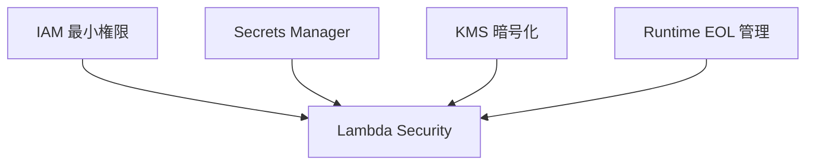

# Day 16：Lambda セキュリティ実務（IAM / KMS / Secrets / EOL）

---

## はじめに

Lambda は OS を管理しないため「セキュリティが簡単」と誤解されがちですが、実務ではむしろ **IAM・暗号化・依存管理・ランタイム EOL** の理解が欠かせません。

とくに Lambda のセキュリティは、次の 4 本柱で設計すると事故が減ります。

* IAM（最小権限）
* KMS（暗号化と鍵管理）
* Secrets（機密情報の安全な参照）
* EOL（ランタイムの寿命管理）

この記事では、この **4本柱を“実務で使える粒度”** に落とし込みます。

---

## 1. IAM（最小権限）こそ Lambda の命

Lambda の攻撃面積は **実行ロール（Execution Role）** が決めます。
「コードが安全」でも「権限が広い」と、侵害時の被害が一気に広がります。

### 1-1. 基本戦略（最小権限の作り方）

* **必要な API だけ** Allow（読み・書き・一覧・削除を分ける）
* `Resource: "*"` は原則避ける（やむを得ない場合は **Condition** で縛る）
* S3 は **バケット ARN とオブジェクト ARN が別**（ここで事故が起きがち）
* CloudWatch Logs は「出力に必要な最小限」に統一（AWS 管理ポリシーの活用も検討）

### 1-2. よくある誤り：S3 の Resource 指定

S3 はアクションによって Resource の形が違います。
`GetObject/PutObject` など **オブジェクト操作は `/*` が必要**。一方で `ListBucket` は **バケット ARN（`/*` なし）** を要求します。([AWS ドキュメント][1])

#### 悪い例（ありがち）

```json
{
  "Effect": "Allow",
  "Action": ["s3:GetObject"],
  "Resource": "arn:aws:s3:::mybucket"
}
```

#### 良い例（最低限を正しく分ける）

```json
{
  "Version": "2012-10-17",
  "Statement": [
    {
      "Sid": "ListBucketPrefixOnly",
      "Effect": "Allow",
      "Action": ["s3:ListBucket"],
      "Resource": "arn:aws:s3:::mybucket",
      "Condition": {
        "StringLike": { "s3:prefix": ["app-prefix/*"] }
      }
    },
    {
      "Sid": "ObjectRWInPrefix",
      "Effect": "Allow",
      "Action": ["s3:GetObject", "s3:PutObject"],
      "Resource": "arn:aws:s3:::mybucket/app-prefix/*"
    }
  ]
}
```

ポイントはこの 2 つです。

* **ListBucket はバケット ARN**（`arn:aws:s3:::mybucket`）
* **Object 操作はオブジェクト ARN**（`arn:aws:s3:::mybucket/.../*`）([AWS ドキュメント][1])

---

## 2. Secrets Manager で機密情報を安全に扱う

Lambda コード内にパスワード・API キー・トークンを書いてはいけません。
環境変数に“値そのもの”を入れるのも、運用や監査の観点で避けたい設計です。

### 2-1. 正しい構成（運用しやすい形）

* Secrets Manager に **機密情報（値）** を格納
* Lambda の環境変数には **SecretId（名前/ARN）だけ** を持たせる
* 実行時に Secrets Manager から取得（必要ならキャッシュ）

AWS は Secrets Manager 利用の際、**Lambda Extensions によるキャッシュ**（Parameters and Secrets Lambda Extension）や、**Powertools などのキャッシュ戦略**を推奨しています。毎回 API を叩くと遅く・高くなりがちなので、ここは実務で効きます。([AWS ドキュメント][2])

### 2-2. コード例（最小）

```python
import boto3, json, os

sm = boto3.client("secretsmanager")

def get_db_password() -> str:
    secret_id = os.environ["DB_SECRET_ID"]  # "prod/db" など（値は入れない）
    resp = sm.get_secret_value(SecretId=secret_id)
    secret = json.loads(resp["SecretString"])
    return secret["password"]
```

補足：
「KMS で復号して使う」という表現は間違いではありませんが、**Lambda が直接 KMS を呼び出して復号する**というより、**Secrets Manager が KMS を使って保管し、GetSecretValue で利用可能な形で返す**と捉えるのが実装上わかりやすいです。([AWS ドキュメント][2])

### 2-3. 秘密情報運用の落とし穴（実務あるある）

* **ログに secret を出してしまう**（例外ログ、デバッグログ）
* ローテーション後も **キャッシュが残る**（TTL 設計が必要）
* VPC 内 Lambda で NAT なしの場合、Secrets Manager へ出られない
  → **Interface VPC Endpoint（PrivateLink）** を使う設計が王道([AWS ドキュメント][3])

---

## 3. KMS による暗号化（環境変数・S3・ログ）

KMS を使うと、データ暗号化の「鍵」を制御できます。
Lambda では主に次を守るのに使います。

* **環境変数**
* **S3 出力データ（SSE-KMS）**
* **ログや監査データ（取り扱い方針が厳しい場合）**

### 3-1. Lambda 環境変数の暗号化：デフォルト＋必要なら CMK

Lambda の環境変数は暗号化されますが、要件によっては **カスタマー管理 KMS キー（CMK）** を選びます（鍵のポリシーや監査要件で必要になるケース）。([AWS ドキュメント][4])

CMK を使う場合は、権限設計もセットです。たとえばドキュメント上でも `kms:CreateGrant` などが登場します（「誰がその鍵を Lambda に使わせるか」）。([AWS ドキュメント][5])

### 3-2. VPC 内で “インターネットに出さず” に KMS を使う

厳格なネットワーク要件がある環境では、KMS も **Interface VPC Endpoint** で閉域化できます。([AWS ドキュメント][6])

---

## 4. Runtime EOL（End of Life）の管理

Lambda のランタイムは **数年ごとに強制移行が必要**です。
EOL を放置すると次が起きます。

* セキュリティ監査・スキャンに引っかかる
* 新規作成や更新が制限される（ある日突然 “更新できない”）
* 依存ライブラリが非対応化して壊れる

### 4-1. 重要：Python 3.9 は“まさに今” EOL

AWS の runtime 一覧では、**Python 3.9 の標準サポート終了日が 2025 年 12 月 15 日** とされています（この記事執筆時点の翌日です）。さらに段階的に「新規作成不可」「更新不可」へ進みます。([AWS ドキュメント][7])

（ここは読者に刺さるので、日付を明記して注意喚起するのが効果的です）

### 4-2. ベストプラクティス（CI/CD に組み込む）

* ランタイム更新を **年1回の定例作業**にする
* Layer の `requirements.txt` も同時に更新（依存がボトルネックになりやすい）
* “更新が必要” を検知する仕組みを入れる

  * 例：Runtime 一覧を定期確認し、EOL が近いものをチケット化する（運用設計）

---

## 補足：デプロイ経路もセキュリティ境界（コード署名）

「CI/CD からデプロイできる」こと自体が強力なので、要件によっては **コード署名（Code Signing）** を検討します。
Lambda は **署名された成果物だけを受け付ける** ようにでき、デプロイ時に検証されます（実行性能への影響は基本なし）。([AWS ドキュメント][8])

---

## Day15 との繋がり：可観測性を“安全に”する

Day15 で扱った構造化ログ・運用可視化は、**セキュリティとセット**で完成します。

* 構造化ログに **秘密情報を絶対に出さない**（例外ログも含む）
* デプロイマーカーや運用ログを S3 に置くなら **IAM 最小権限＋暗号化（SSE-KMS）** を前提にする
* 「誰が」「いつ」「どの経路で」デプロイしたかを追えるようにしつつ、権限は絞る（監査対応の基礎）

この流れで Day17 以降（自動検知・通知・AIOps）へ繋げると、運用設計として一貫します。

---

## 図解：Lambda セキュリティの4本柱



---

## 実務チェックリスト（これだけは落とさない）

* [ ] 実行ロールは **最小権限**（`Action` と `Resource` の粒度を下げた）
* [ ] S3 は **ListBucket と Object 操作の Resource を分離**した
* [ ] Secrets は **値をコード/環境変数に埋め込んでいない**
* [ ] Secrets 取得は **キャッシュ戦略**を持つ（Extensions / TTL）
* [ ] KMS（CMK）を使うなら **キー利用の権限設計**も実施した([AWS ドキュメント][5])
* [ ] ランタイム EOL を追跡し、更新を年次イベント化した([AWS ドキュメント][7])
* [ ] ログに secret/個人情報が出ない（例外・デバッグ含む）
* [ ]（要件次第で）デプロイ経路をコード署名で保護([AWS ドキュメント][8])

---

## まとめ

* Lambda は **IAM / KMS / Secrets / EOL** の 4 本柱で守る
* OS がないからこそ **IAM が最重要**
* Secrets Manager と（要件に応じた）KMS 設計はセットで考える([AWS ドキュメント][2])
* EOL 管理は「気合」ではなく **CI/CD と運用ルーチン**に落とす([AWS ドキュメント][7])

---

## 付録：SAM テンプレで Secrets / KMS / IAM を最小構成で書く（Parameters / Conditions 付き）

ポイントは次のとおりです。

* **Secrets の値は一切テンプレに書かない**（ARN/名前だけを Parameter で渡す）
* **KMS（CMK）は必要なときだけ有効化**（`UseCustomerManagedKms` で切替）
* **IAM は最小権限**（S3 は `ListBucket` と `Get/PutObject` を分離＋prefix 制限）
* **環境差分は Parameter + Condition で吸収**（例：PROD のみ保護強め、など）

### template.yaml（サンプル）

```yaml
AWSTemplateFormatVersion: "2010-09-09"
Transform: AWS::Serverless-2016-10-31
Description: Day16 Appendix - Minimal Security SAM (IAM / KMS / Secrets) with Params & Conditions

Parameters:
  AppName:
    Type: String
    Default: sample-secure-lambda
    Description: Logical app name used for resource naming

  EnvName:
    Type: String
    Default: STAGING
    AllowedValues: [STAGING, PROD]
    Description: Deployment environment name

  DataBucketName:
    Type: String
    Description: S3 bucket name used by the function

  DataPrefix:
    Type: String
    Default: app-prefix
    Description: S3 prefix under the bucket (no leading slash). Example: app-prefix

  DBSecretArn:
    Type: String
    Description: Secrets Manager secret ARN (store the actual credentials in Secrets Manager)

  UseCustomerManagedKms:
    Type: String
    Default: "false"
    AllowedValues: ["true", "false"]
    Description: If true, create & use a customer managed KMS key for Lambda env var encryption

Conditions:
  IsProd: !Equals [!Ref EnvName, "PROD"]
  UseCMK: !Equals [!Ref UseCustomerManagedKms, "true"]

Globals:
  Function:
    Runtime: python3.12
    Timeout: 30
    MemorySize: 256
    Tracing: Active
    Environment:
      Variables:
        ENV_NAME: !Ref EnvName
        DATA_BUCKET: !Ref DataBucketName
        DATA_PREFIX: !Ref DataPrefix
        DB_SECRET_ARN: !Ref DBSecretArn  # 値は入れない（ARN/名前のみ）

Resources:
  # （任意）環境変数の暗号化を “CMK” にしたい場合だけ作る
  LambdaEnvKmsKey:
    Type: AWS::KMS::Key
    Condition: UseCMK
    Properties:
      Description: !Sub "${AppName}-${EnvName} Lambda env var encryption key"
      EnableKeyRotation: true
      KeyPolicy:
        Version: "2012-10-17"
        Statement:
          # まずはアカウント管理者にフル権限（ここから IAM ポリシーで利用権限を委譲する設計）
          - Sid: AllowAccountRootFullAccess
            Effect: Allow
            Principal:
              AWS: !Sub "arn:aws:iam::${AWS::AccountId}:root"
            Action: "kms:*"
            Resource: "*"

  LambdaEnvKmsAlias:
    Type: AWS::KMS::Alias
    Condition: UseCMK
    Properties:
      AliasName: !Sub "alias/${AppName}-${EnvName}-lambda-env"
      TargetKeyId: !Ref LambdaEnvKmsKey

  AppFunctionRole:
    Type: AWS::IAM::Role
    Properties:
      RoleName: !Sub "${AppName}-${EnvName}-role"
      AssumeRolePolicyDocument:
        Version: "2012-10-17"
        Statement:
          - Effect: Allow
            Principal:
              Service: lambda.amazonaws.com
            Action: sts:AssumeRole
      Policies:
        - PolicyName: !Sub "${AppName}-${EnvName}-least-priv"
          PolicyDocument:
            Version: "2012-10-17"
            Statement:
              # CloudWatch Logs（最低限）
              - Sid: LogsWrite
                Effect: Allow
                Action:
                  - logs:CreateLogGroup
                  - logs:CreateLogStream
                  - logs:PutLogEvents
                Resource: "*"

              # S3：ListBucket はバケットARN、Object操作は object ARN（prefix配下）に限定
              - Sid: S3ListPrefixOnly
                Effect: Allow
                Action: s3:ListBucket
                Resource: !Sub "arn:aws:s3:::${DataBucketName}"
                Condition:
                  StringLike:
                    s3:prefix:
                      - !Sub "${DataPrefix}/*"

              - Sid: S3ObjectRWInPrefix
                Effect: Allow
                Action:
                  - s3:GetObject
                  - s3:PutObject
                Resource: !Sub "arn:aws:s3:::${DataBucketName}/${DataPrefix}/*"

              # Secrets Manager：対象 Secret だけ GetSecretValue
              - Sid: SecretsReadOnly
                Effect: Allow
                Action:
                  - secretsmanager:GetSecretValue
                Resource: !Ref DBSecretArn

              # CMK を使う場合：Lambda が起動時に環境変数を復号するため kms:Decrypt が必要
              - Sid: KmsDecryptForEnvVars
                Effect: Allow
                Action:
                  - kms:Decrypt
                Resource: !If [UseCMK, !GetAtt LambdaEnvKmsKey.Arn, !Ref "AWS::NoValue"]

  AppFunction:
    Type: AWS::Serverless::Function
    Properties:
      FunctionName: !Sub "${AppName}-${EnvName}"
      CodeUri: src/
      Handler: app.lambda_function.lambda_handler
      Role: !GetAtt AppFunctionRole.Arn
      # CMK を使う場合だけ設定（環境変数の暗号化キー）
      KmsKeyArn: !If [UseCMK, !GetAtt LambdaEnvKmsKey.Arn, !Ref "AWS::NoValue"]

      # 例：PROD だけ “保守的” にする差分（必要に応じて拡張）
      ReservedConcurrentExecutions: !If [IsProd, 10, !Ref "AWS::NoValue"]

Outputs:
  FunctionName:
    Value: !Ref AppFunction
  FunctionRoleArn:
    Value: !GetAtt AppFunctionRole.Arn
  EnvKmsKeyArn:
    Value: !If [UseCMK, !GetAtt LambdaEnvKmsKey.Arn, ""]
```

### デプロイ例（STAGING / PROD、CMK あり・なし）

```bash
# STAGING（CMKなし：AWS管理の暗号化に寄せる）
sam deploy \
  --stack-name sample-secure-lambda-stg \
  --capabilities CAPABILITY_IAM \
  --parameter-overrides \
    AppName=sample-secure-lambda \
    EnvName=STAGING \
    DataBucketName=my-bucket \
    DataPrefix=app-prefix \
    DBSecretArn=arn:aws:secretsmanager:ap-northeast-1:123456789012:secret:prod/db-xxxx \
    UseCustomerManagedKms=false

# PROD（CMKあり：環境変数暗号化を CMK に切替）
sam deploy \
  --stack-name sample-secure-lambda-prod \
  --capabilities CAPABILITY_IAM \
  --parameter-overrides \
    AppName=sample-secure-lambda \
    EnvName=PROD \
    DataBucketName=my-bucket \
    DataPrefix=app-prefix \
    DBSecretArn=arn:aws:secretsmanager:ap-northeast-1:123456789012:secret:prod/db-xxxx \
    UseCustomerManagedKms=true
```

### 実装側の最小コード（Secret の ARN を環境変数で受ける）

```python
import os, boto3, json

sm = boto3.client("secretsmanager")

def lambda_handler(event, context):
    secret_arn = os.environ["DB_SECRET_ARN"]
    resp = sm.get_secret_value(SecretId=secret_arn)
    secret = json.loads(resp["SecretString"])
    # secret["username"], secret["password"] を使う
    return {"ok": True}
```


[1]: https://docs.aws.amazon.com/ja_jp/AmazonS3/latest/userguide/example-policies-s3.html "Amazon S3 のアイデンティティベースのポリシー例"
[2]: https://docs.aws.amazon.com/lambda/latest/dg/with-secrets-manager.html "Use Secrets Manager secrets in Lambda functions"
[3]: https://docs.aws.amazon.com/secretsmanager/latest/userguide/vpc-endpoint-overview.html "Using an AWS Secrets Manager VPC endpoint"
[4]: https://docs.aws.amazon.com/lambda/latest/dg/configuration-envvars-encryption.html "Securing Lambda environment variables"
[5]: https://docs.aws.amazon.com/ja_jp/lambda/latest/dg/configuration-envvars-encryption.html "Lambda 環境変数の保護"
[6]: https://docs.aws.amazon.com/ja_jp/kms/latest/developerguide/kms-vpc-endpoint.html "VPC エンドポイント経由で AWS KMS に接続する"
[7]: https://docs.aws.amazon.com/ja_jp/lambda/latest/dg/lambda-runtimes.html "Lambda ランタイム"
[8]: https://docs.aws.amazon.com/ja_jp/lambda/latest/dg/configuration-codesigning.html "コード署名を使用して Lambda でコードの整合性を検証する"
