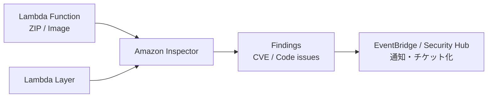

# Day 17：Inspector for Lambda（CVE & 脆弱性管理の自動化）

---

## はじめに

Lambda のセキュリティで見落とされがちな点が1つあります。

**脆弱性の多くは Lambda “本体”ではなく、関数ZIP / Layer / コンテナ内の依存ライブラリに宿る**という現実です。 ([AWS ドキュメント][2])

特に Python では以下のようなケースが起きやすいです。

* Pillow の古いバージョンに脆弱性
* PyPDF の RCE 脆弱性
* requests の重大CVE
* boto3 のバージョン不整合（依存との噛み合わせ事故）

これらを手動レビューするのは現実的ではありません。
そこで使うのが **Amazon Inspector（Inspector for Lambda）** です。

---

## Inspector for Lambda とは？

Amazon Inspector は、Lambda 関数と Layer を含む AWS ワークロードを継続的に評価し、**依存関係（パッケージ）由来のCVE** を自動検出します。 ([AWS ドキュメント][3])

Inspector の Lambda スキャンは大きく2種類あります。 ([AWS ドキュメント][3])

* **Lambda 標準スキャン（Standard scanning）**
  関数ZIP/Layerに含まれる「依存パッケージ」を見て、CVE（パッケージ脆弱性）を検出。 ([AWS ドキュメント][2])
* **Lambda コードスキャン（Code scanning）**
  依存だけでなく、アプリのコード自体を解析し、データ漏えい・インジェクション・弱い暗号などの“コード脆弱性”を検出。 ([AWS ドキュメント][4])

> 注意：コードスキャンは脆弱性箇所を示すためにコード断片（スニペット）を扱う仕様で、ハードコードされた認証情報などが含まれ得ます。運用ルール（Secretsをコードに入れない等）とセットで導入しましょう。 ([AWS ドキュメント][4])

---

## 対象範囲（何がスキャンされる？）

### 標準スキャンの主対象

* 関数ZIPに同梱した依存パッケージ
* Layer に含めた依存パッケージ ([AWS ドキュメント][2])

### スキャン対象にならない/なりにくい条件（重要）

* **過去90日で「呼び出し」または「更新」されていない関数は自動的に除外**（呼び出される/更新されると復帰） ([AWS ドキュメント][3])
* スキャン対象は原則 **`$LATEST`**（運用上は、Alias/Version運用でも「デプロイ時に $LATEST が更新される」ため問題になりにくいが、認識しておく） ([AWS ドキュメント][3])
* **Customer Managed Key（CMK）で暗号化したLambdaはスキャン非対応**という制約があるため、Day16 の KMS 設計と衝突し得ます（どこでCMKを使うか要整理）。 ([AWS ドキュメント][3])

---

## 仕組み（図解）



Inspector の検出結果は EventBridge イベントとして扱えるため、SNS・Chatbot・チケット起票などに繋げて「放置しない」運用にできます。 ([AWS ドキュメント][1])

---

## Inspector 結果の例（パッケージ脆弱性）

例として、Finding には CVSS・EPSS・Fix の有無など、優先度付けに必要な材料が含まれます。 ([AWS ドキュメント][5])

```json
{
  "packageName": "pillow",
  "installedVersion": "9.0.1",
  "vulnerabilityId": "CVE-2022-22817",
  "severity": "HIGH",
  "status": "ACTIVE",
  "fixAvailable": "YES"
}
```

---

## 導入手順（最短）

### 1) まずは「標準スキャン」を有効化

コンソールからでも、API/CLIでも有効化できます。スキャンタイプは `LAMBDA` / `LAMBDA_CODE` を指定します。 ([AWS ドキュメント][6])

（CLI例）

```bash
aws inspector2 enable --resource-types LAMBDA --region ap-northeast-1
# コードスキャンまでやる場合
aws inspector2 enable --resource-types LAMBDA LAMBDA_CODE --region ap-northeast-1
```

([AWS ドキュメント][7])

### 2) 重大度 HIGH/CRITICAL は EventBridge で即通知

AWS公式の推奨パターン（HIGH/CRITICAL & ACTIVE のみ通知）： ([AWS ドキュメント][1])

```json
{
  "source": ["aws.inspector2"],
  "detail-type": ["Inspector2 Finding"],
  "detail": {
    "severity": ["HIGH", "CRITICAL"],
    "status": ["ACTIVE"]
  }
}
```

---

## 運用ベストプラクティス（「回る」形にする）

1. **Layer を一元管理する（Day8〜Day10の設計が効く）**
   「どの関数がどのLayerか」が崩れていると、Finding を直しても横展開できません。

2. **優先順位は “Severityだけ” で決めない**
   Inspector には CVSS/EPSS/FixAvailable などがあり、実務では
   「CRITICALでも修正版なし」「MEDIUMでもEPSS高・外部入力あり」などが起きます。 ([AWS ドキュメント][5])

3. **除外（Suppress）ではなく “根拠ある例外” にする**
   どうしても対応不能なものは、まず “なぜ対応不能か” を残す（期限・代替策・影響範囲）。
   ノイズが多い関数はタグでスキャン除外も可能です（例：標準スキャン除外）。 ([AWS ドキュメント][8])

4. **週次の棚卸しをルール化（放置が最大の敵）**
   「毎週チェック」自体は良いですが、実務では **Security Hub での集約や通知** とセットにすると継続しやすいです。 ([AWS ドキュメント][1])

---

## Day16 との繋がり

Day16 で扱った IAM / KMS / Secrets / EOL は「侵入されにくくする」設計でした。
Day17 はその次の段階で、**侵入の入口になりがちな依存ライブラリのCVEを“継続的に”潰す**回し方です。 ([AWS ドキュメント][3])

特に KMS は注意で、**CMK を使うと Inspector の Lambda スキャン対象外になるケース**があるため、「どこをCMKで暗号化するか」を運用前に決めておくと事故が減ります。 ([AWS ドキュメント][3])

---

## まとめ

* Lambda の脆弱性は **関数ZIP/Layer/コンテナの依存**に集中しやすい ([AWS ドキュメント][2])
* Inspector の **標準スキャン**でCVE（パッケージ脆弱性）を自動検出できる ([AWS ドキュメント][3])
* **EventBridge/Security Hub連携**で通知・チケット化まで自動化すると、運用が止まらない ([AWS ドキュメント][1])

---


## 付録A：SAM/CloudFormation で EventBridge→SNS 通知を最小構成で作る

Inspector の Finding は EventBridge イベントとして受け取れるため、EventBridge ルール → SNS を最小構成で作るのが手堅いです。 ([AWS ドキュメント][11])

> ポイント
>
> * まずは **HIGH/CRITICAL + ACTIVE** に絞って通知（ノイズを抑える）
> * SNS はメールで受けるのが最短（後から Chatbot/Slack に拡張しやすい）

### template.yaml（最小構成）

```yaml
AWSTemplateFormatVersion: "2010-09-09"
Transform: AWS::Serverless-2016-10-31
Description: Inspector2 findings -> EventBridge -> SNS notification (minimal)

Parameters:
  NotificationEmail:
    Type: String
    Description: "SNS notification email (subscription confirmation required)"
  EnableNotify:
    Type: String
    AllowedValues: ["true", "false"]
    Default: "true"

Conditions:
  IsNotifyEnabled: !Equals [!Ref EnableNotify, "true"]

Resources:
  InspectorFindingTopic:
    Type: AWS::SNS::Topic
    Condition: IsNotifyEnabled
    Properties:
      TopicName: !Sub "inspector-findings-${AWS::StackName}"

  InspectorFindingSubscription:
    Type: AWS::SNS::Subscription
    Condition: IsNotifyEnabled
    Properties:
      TopicArn: !Ref InspectorFindingTopic
      Protocol: email
      Endpoint: !Ref NotificationEmail

  # EventBridge が SNS に Publish できるようにする
  InspectorFindingTopicPolicy:
    Type: AWS::SNS::TopicPolicy
    Condition: IsNotifyEnabled
    Properties:
      Topics:
        - !Ref InspectorFindingTopic
      PolicyDocument:
        Version: "2012-10-17"
        Statement:
          - Sid: AllowEventBridgePublish
            Effect: Allow
            Principal:
              Service: events.amazonaws.com
            Action: "sns:Publish"
            Resource: !Ref InspectorFindingTopic

  InspectorFindingRule:
    Type: AWS::Events::Rule
    Condition: IsNotifyEnabled
    Properties:
      Name: !Sub "inspector-findings-${AWS::StackName}"
      Description: "Notify Inspector2 findings (HIGH/CRITICAL + ACTIVE)"
      EventPattern:
        source:
          - "aws.inspector2"
        detail-type:
          - "Inspector2 Finding"
        detail:
          status:
            - "ACTIVE"
          severity:
            - "HIGH"
            - "CRITICAL"
      Targets:
        - Id: SnsTarget
          Arn: !Ref InspectorFindingTopic
          # そのまま投げると読みづらいので、最低限整形（任意）
          InputTransformer:
            InputPathsMap:
              severity: "$.detail.severity"
              title: "$.detail.title"
              type: "$.detail.type"
              resourceType: "$.detail.resources[0].type"
              resourceId: "$.detail.resources[0].id"
              vulnId: "$.detail.packageVulnerabilityDetails.vulnerabilityId"
              packageName: "$.detail.packageVulnerabilityDetails.vulnerablePackages[0].name"
              packageVer: "$.detail.packageVulnerabilityDetails.vulnerablePackages[0].version"
              fixAvail: "$.detail.packageVulnerabilityDetails.fixAvailable"
            InputTemplate: |
              "Inspector Finding: <severity>
              - title: <title>
              - type: <type>
              - resource: <resourceType> / <resourceId>
              - vulnerability: <vulnId>
              - package: <packageName> (<packageVer>)
              - fixAvailable: <fixAvail>"

Outputs:
  SnsTopicArn:
    Condition: IsNotifyEnabled
    Value: !Ref InspectorFindingTopic
```

### 使い方（運用メモ）

* デプロイ後、SNS のメール購読は **受信メール側で Confirm が必要**です（ここを忘れると通知が来ません）。
* Inspector の EventBridge 連携自体は公式に案内されています。 ([AWS ドキュメント][11])

---

## 付録B：Inspector の「除外タグ運用」＋「台帳（いつ/誰が/なぜ）」設計

結論から言うと、除外は便利ですが強力すぎます。
**「除外＝スキャンしない」** なので、運用ルールと台帳がないと“見えない脆弱性”を増やします。

### 1) 除外タグの仕様（公式）

Inspector は Lambda 関数にタグを付与して、スキャンから除外できます（スキャン種別でタグが異なる）。 ([AWS ドキュメント][12])

* **標準スキャン除外（Standard scanning）**

  * Key: `InspectorExclusion`
  * Value: `LambdaStandardScanning` ([AWS ドキュメント][12])
* **コードスキャン除外（Code scanning）**

  * Key: `InspectorCodeExclusion`
  * Value: `LambdaCodeScanning` ([AWS ドキュメント][13])

> 実務の推奨：
>
> * まずは **抑制（Suppress）** を検討（「スキャンは継続しつつ、ノイズだけ消す」）
> * どうしてもアクション不能な場合のみ **除外タグ** を付与

抑制は Inspector のサプレッションルール／フィルタで実現できます（CloudFormation なら `AWS::InspectorV2::Filter` の `SUPPRESS`）。 ([AWS ドキュメント][14])

---

### 2) 台帳（Ledger）設計：最小で「監査に耐える」項目

おすすめは **Git 管理（YAML）** です。PR のレビュー履歴がそのまま監査証跡になります。

例：`security/inspector-exclusions.yaml`

```yaml
version: 1
exclusions:
  - target:
      type: lambda
      function_name: "my-prod-function"
      function_arn: "arn:aws:lambda:ap-northeast-1:123456789012:function:my-prod-function"
      scan_type: "standard"   # standard | code
    tag:
      key: "InspectorExclusion"
      value: "LambdaStandardScanning"
    reason:
      summary: "依存がベンダ提供で更新不可。誤検知ではなく既知リスクとして受容。"
      ticket: "SEC-1234"
      compensating_controls:
        - "WAFで該当パス遮断"
        - "機密データ非取り扱い（データ分類: internal）"
    owner:
      team: "platform"
      approved_by: "security-reviewer"
      applied_by: "ci-bot"
    dates:
      applied_at: "2025-12-14"
      expires_at: "2026-03-31"  # 期限を必須化（棚卸し強制）
      next_review_at: "2026-01-31"
```

#### 台帳に“期限”を入れる理由

除外は「付けたら終わり」になりがちなので、期限（`expires_at`）を必須にして **棚卸しを仕組み化**します。

---

### 3) 運用ルール（おすすめのガードレール）

* **手動付与は禁止**：タグ変更は PR 経由（IaC か、タグ付け用スクリプトの PR）
* **台帳がない除外タグは禁止**：CI で検知して落とす
* **期限切れは自動でアラート**：週次で台帳をチェックし、期限超過を通知

---

### 4) CI で「除外タグ」と「台帳」の整合性をチェックする（例）

擬似コードですが、運用イメージが伝わるので記事に入れると強いです。

```bash
#!/usr/bin/env bash
set -euo pipefail

LEDGER="security/inspector-exclusions.yaml"

# 例：InspectorExclusion / InspectorCodeExclusion を持つ関数を列挙
aws lambda list-functions --query 'Functions[].FunctionArn' --output text \
| tr '\t' '\n' \
| while read -r arn; do
    tags_json=$(aws lambda list-tags --resource "$arn" --output json)
    if echo "$tags_json" | jq -e '.Tags.InspectorExclusion=="LambdaStandardScanning"' >/dev/null \
      || echo "$tags_json" | jq -e '.Tags.InspectorCodeExclusion=="LambdaCodeScanning"' >/dev/null; then
        # 台帳に arn が存在しないなら失敗（例：yqで検索）
        if ! yq -e ".exclusions[].target.function_arn == \"$arn\"" "$LEDGER" >/dev/null; then
          echo "ERROR: Exclusion tag found but not recorded in ledger: $arn"
          exit 1
        fi
    fi
  done
```

---

### 5) 「除外」より「抑制」を使う判断基準

* **抑制（SUPPRESS）**：スキャンは継続し、表示や通知だけ抑える（ノイズ対策向き） ([AWS ドキュメント][14])
* **除外タグ**：スキャン自体を止める（“本当に対応不能”な場合の最終手段） ([AWS ドキュメント][12])

CloudFormation で抑制する場合は `AWS::InspectorV2::Filter` を使い、`FilterAction: SUPPRESS` と `FilterCriteria`（例：`VulnerabilityId` や `LambdaFunctionName`、`ResourceTags` など）を組み合わせられます。 ([AWS ドキュメント][5])


[11]: https://docs.aws.amazon.com/ja_jp/inspector/latest/user/findings-managing-automating-responses.html?utm_source=chatgpt.com "Amazon EventBridge を使用して Amazon Inspector の検出 ..."
[12]: https://docs.aws.amazon.com/ja_jp/inspector/latest/user/scanning_resources_lambda_exclude_functions.html?utm_source=chatgpt.com "Lambda 標準スキャンから関数の除外 - Amazon Inspector"
[13]: https://docs.aws.amazon.com/inspector/latest/user/scanning_resources_lambda_code_exclude_functions.html?utm_source=chatgpt.com "Excluding functions from Lambda code scanning"
[14]: https://docs.aws.amazon.com/inspector/latest/user/findings-managing-supression-rules.html?utm_source=chatgpt.com "Suppressing Amazon Inspector findings"
[15]: https://docs.aws.amazon.com/AWSCloudFormation/latest/TemplateReference/aws-resource-inspectorv2-filter.html "AWS::InspectorV2::Filter - AWS CloudFormation"


[1]: https://docs.aws.amazon.com/inspector/latest/user/findings-managing-automating-responses.html "Creating custom responses to Amazon Inspector findings with Amazon EventBridge - Amazon Inspector"
[2]: https://docs.aws.amazon.com/ja_jp/inspector/latest/user/scanning_resources_lambda.html "Amazon Inspector Lambda 標準スキャン"
[3]: https://docs.aws.amazon.com/inspector/latest/user/scanning-lambda.html "Scanning AWS Lambda functions with Amazon Inspector - Amazon Inspector"
[4]: https://docs.aws.amazon.com/inspector/latest/user/scanning_resources_lambda_code.html "Amazon Inspector Lambda code scanning - Amazon Inspector"
[5]: https://docs.aws.amazon.com/inspector/latest/user/findings-understanding-severity.html "Understanding severity levels for your Amazon Inspector findings - Amazon Inspector"
[6]: https://docs.aws.amazon.com/inspector/latest/user/activate-scans.html "Activating a scan type - Amazon Inspector"
[7]: https://docs.aws.amazon.com/cli/latest/reference/inspector2/enable.html "enable — AWS CLI 2.32.14 Command Reference"
[8]: https://docs.aws.amazon.com/inspector/latest/user/scanning_resources_lambda_exclude_functions.html "Excluding functions from Lambda standard scanning - Amazon Inspector"
