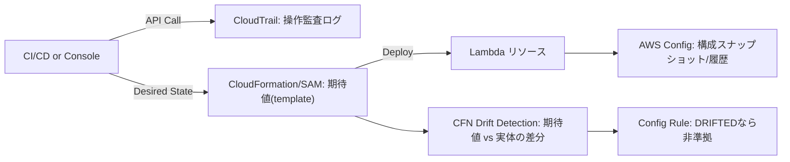

# Day 18：CloudTrail / Config による変更監査と Drift 検出

---

## はじめに

Lambda を本番運用する上で絶対に必要な能力があります。

**「誰が・いつ・何を変更したか」を説明できること。**

これができないと、障害調査もコンプライアンスも破綻します。
また、Day17 の Inspector で「脆弱性が出た」時も同じで、

* いつ Layer / 依存ライブラリが更新されたのか
* 誰の操作（or どの CI/CD ロール）だったのか
* 変更前後で何が変わったのか

を説明できないと、**対策（修正・ロールバック・再発防止）が進みません**。
この “変更の事実” を支えるのが **CloudTrail（操作履歴）** と **AWS Config（設定監査）** です。


## CloudTrail：API 操作の完全監査ログ

CloudTrail は AWS の API 呼び出しをイベントとして記録し、
**「いつ」「誰が（どのロールで）」「どこから」「何を」** を追跡できます。Lambda も CloudTrail と統合されており、コンソール操作も API 呼び出しとして記録されます。 ([AWS ドキュメント][2])

記録例（イメージ）：

```json
{
  "eventName": "UpdateFunctionConfiguration",
  "userIdentity": { "type": "AssumedRole" },
  "requestParameters": { "timeout": 300 }
}
```

CloudTrail で分かること：

* 誰が更新したか（AssumedRole / IAM User / AWS Service など）
* どの API を叩いたか（UpdateFunctionCode / UpdateFunctionConfiguration など）
* いつ実行したか、どこから実行したか（IP など）
* 変更リクエストのパラメータ（requestParameters）

### Lambda 運用で “見に行く頻度が高い” CloudTrail イベント

障害や事故調査の現場でよく見るのは、次の系統です。

* **コード変更**：`UpdateFunctionCode`（イメージ更新含む） ([AWS ドキュメント][3])
* **設定変更**：`UpdateFunctionConfiguration`（環境変数・タイムアウト・メモリ・VPC 等）
* **権限/公開範囲**：`AddPermission`（リソースベースポリシー変更） ([AWS ドキュメント][4])
* **運用上の上限制御**：`PutFunctionConcurrency`（予約同時実行など） ([AWS ドキュメント][4])

ここを押さえるだけでも、「突然遅くなった」「突然失敗する」「突然呼ばれなくなった」の調査が進みます。

### 注意：eventName が “微妙に違う” ことがある

Lambda の CloudTrail は、イベント名に日付・バージョン情報が付くことがあります（例：`AddPermission20150331v2`）。
パーサーやアラートの条件式で `eventName` を固定一致していると取りこぼすので、**プレフィックス一致**や正規化を推奨します。 ([AWS ドキュメント][5])


## “改ざんされていないログ” にする（監査の地盤固め）

CloudTrail は「記録されている」だけでは不十分で、監査では **改ざん耐性**も問われます。

CloudTrail には **ログファイル整合性検証（Log file integrity validation）**があり、配信後にログが変更・削除されていないかを検知できます（SHA-256 ハッシュと署名を使う仕組み）。 ([AWS ドキュメント][6])

実務の落とし穴は、「ログはあるが、保持・改ざん対策・参照権限が曖昧」という状態です。
監査に耐える最小ラインは以下です。

* CloudTrail を **S3 に集約**（保管・長期保持の土台）
* **整合性検証を有効化**
* 閲覧権限を運用ロールに限定（“見られない人が見られない”ことも統制）


## CloudTrail Lake：検索性を上げる選択肢

「S3 に溜まったログを Athena で…」でも可能ですが、運用で頻出する “いつ誰が何を” を高速に追うなら、CloudTrail Lake のイベントデータストアで SQL クエリできる構成も選択肢になります（管理イベント/データイベント等を格納してクエリ）。 ([AWS ドキュメント][7])

※本記事の主旨は「監査能力の獲得」なので、まずは CloudTrail 基盤を固め、必要に応じて Lake を追加する理解で十分です。


## AWS Config：設定の現在値と変更履歴を追跡

AWS Config は、サポート対象リソースについて **作成・変更・削除を検知し、構成アイテム（CI）として継続記録**します。 ([AWS ドキュメント][8])
つまり CloudTrail が「操作ログ」なら、Config は「**設定状態の時系列**」です。

### なぜ Config が強力なのか

* 設定の変更点が追える（いつ何がどう変わったか）
* 過去状態を比較できる（変更前の構成を再現しやすい）
* “あるべき状態” をルールで定義し、**非準拠を検知**できる ([AWS ドキュメント][9])

### Config の基本コンポーネント（用語を最短で押さえる）

* **Configuration Recorder**：何を記録するか（対象リソース）を決める
* **Delivery Channel**：記録した CI を S3/SNS 等へ配送する経路
* **Rules**：準拠判定（例：特定タグ必須、公開禁止、暗号化必須…）

まずは「Recorder が動いていないと何も始まらない」を覚えておくと詰まりにくいです。


## Drift 検出：IaC 時代の必須機能（誤解しやすいポイントを整理）

ここは混同が多いので、実務目線で整理します。

### 1) CloudFormation の Drift Detection（スタックの期待値 vs 実体）

SAM でデプロイしているなら、裏側は CloudFormation スタックです。
CloudFormation は **テンプレートで定義された期待値**と**実際の設定**を比較して、ドリフトを検出できます。 ([AWS ドキュメント][1])

例：

* 環境変数がコンソールから手動変更された
* タイムアウトが手で変更された
* IAM ポリシーが一部差し替えられた

こうした「IaC 外での変更」を “差異” として扱えるのが Drift Detection です。

### 2) AWS Config は “継続監査” と “非準拠管理” が主戦場

AWS Config 単体は「あなたの Git の template.yaml」を直接読んで差分を取るというより、
**記録とルール評価**で継続監査します。 ([AWS ドキュメント][8])

ただし、CloudFormation のドリフトについては、AWS Config 側に **cloudformation-stack-drift-detection-check** というマネージドルールがあり、スタックが DRIFTED なら NON_COMPLIANT として扱えます。 ([AWS ドキュメント][10])

> まとめると
>
> * “差分を検出する機能” は CloudFormation が担当
> * “検出結果を運用（通知・準拠管理・集計）に乗せる” のが Config の価値

という分担が分かりやすいです。


## CloudTrail × Config：事故調査の実務フロー（最短手順）

障害が起きたとき、現場で欲しいのは「再現性のある調査手順」です。

### Step 1：CloudTrail で「誰が・いつ・どの API」を叩いたか特定

Lambda は CloudTrail に統合されているため、まず CloudTrail で変更イベントを追います。 ([AWS ドキュメント][2])
特に `UpdateFunctionCode / UpdateFunctionConfiguration / AddPermission` あたりから当たるのが定石です。 ([AWS ドキュメント][4])

### Step 2：Config で「現在の設定」と「過去の設定」を比較

CloudTrail は “操作” の記録、Config は “状態” の記録です。
**今の環境変数は何か、先週は何だったか**のような比較は Config が得意です。 ([AWS ドキュメント][9])

### Step 3：IaC 運用なら CloudFormation Drift Detection も走らせる

「手でいじられた」を疑うなら、スタックの Drift Detection を実行して差異を確定させます。 ([AWS ドキュメント][1])
継続監視したいなら Config のマネージドルールで “非準拠” として拾う設計が実務的です。 ([AWS ドキュメント][10])


## 図解：CloudTrail / Config / CloudFormation Drift の役割分担




## まとめ

* **CloudTrail**＝「誰が・いつ・何をしたか」（操作ログ）

  * Lambda の API 操作も記録される ([AWS ドキュメント][2])
  * eventName の揺れ（サフィックス）には注意 ([AWS ドキュメント][5])
  * ログ整合性検証で監査耐性が上がる ([AWS ドキュメント][6])
* **AWS Config**＝「設定の現在値と履歴」（状態ログ） ([AWS ドキュメント][8])
* **Drift 検出**は CloudFormation が差分検出を担い、Config はそれを運用（準拠管理）に載せられる ([AWS ドキュメント][1])

運用チームはこの 2（+ CloudFormation）をセットで扱えると、障害調査・監査・再発防止が一段ラクになります。

---

## 付録A：最小構成の設計例

### A. CloudTrail の“最低限”チェックリスト

* 証跡（Trail）を作り、S3 に配信
* 整合性検証を有効化 ([AWS ドキュメント][11])
* （必要なら）CloudWatch Logs へも出して EventBridge/SIEM 連携

### B. Config の“最低限”チェックリスト

* Recorder を有効化し、記録対象を選ぶ（全リソース or 必要なタイプのみ） ([AWS ドキュメント][8])
* Delivery Channel を設定し、S3/SNS に配送できるようにする ([AWS ドキュメント][12])
* CloudFormation のドリフトを “非準拠” に落とすなら `cloudformation-stack-drift-detection-check` を追加 ([AWS ドキュメント][10])

### C. 変更が起きたら即通知（例：UpdateFunctionConfiguration を SNS へ）

「ログを見に行く」のではなく、**変化が起きた瞬間に通知**されると運用は安定します。
（EventBridge で CloudTrail イベントを拾って SNS へ、という構成が典型です）

> 補足：この付録は “最小構成の考え方” を示すものです。
> 実運用ではアカウント分離（監査用アカウントへ集約）や閲覧権限設計も合わせて検討してください。


## 付録B：Deploy Marker の `GIT_SHA` と CloudTrail の `eventTime` を突合する運用（Day14 接続）

[Day14][13] の Deploy Marker は「**この SHA がいつデプロイされたか**」を示す“運用側の真実”です。
一方 CloudTrail は「**誰が・どのロールで・どの API を叩いたか**」の“監査側の真実”です。
この2つを突合できると、障害調査が一気に速くなります。

### 1) Deploy Marker に最低限入れておくフィールド

例（JSON 1行、どこかに保存する想定）：

```json
{"env":"prod","component":"lambda:receipt-pdf-to-jpeg","git_sha":"a1b2c3d","deployed_at":"2025-12-14T08:12:34Z","actor":"circleci","workflow":"deploy-prod","job":"sam-deploy"}
```

ポイントは **`deployed_at` を UTC（Z）で統一**することです。CloudTrail の `eventTime` も UTC のため、時刻ズレで迷子になりにくくなります。

### 2) CloudTrail で「その時刻前後の Lambda 変更」を引く

Deploy Marker の `deployed_at` を中心に、±5〜10分で CloudTrail を検索します。

```bash
aws cloudtrail lookup-events \
  --lookup-attributes AttributeKey=EventName,AttributeValue=UpdateFunctionCode \
  --start-time 2025-12-14T08:05:00Z \
  --end-time   2025-12-14T08:20:00Z
```

`lookup-events` は直近の管理イベント検索に使える公式手段です。 ([AWS ドキュメント][1])

実務では `UpdateFunctionConfiguration`（環境変数/メモリ/タイムアウト等）も同様に見ます。
「Deploy Marker はあるのに CloudTrail が出ない」場合は、**変更経路が CloudFormation（SAM）経由**であることが多いので、スタック更新に関するイベントも併せて確認すると筋が通ります。

### 3) “誰の変更か” を確定させる（RoleSessionName を見る）

CI/CD ロールで実行されていれば、CloudTrail 上で **AssumedRole のセッション名**まで追えます。
これが次の「命名規約」につながります（[Day11][14] 接続）。


## 付録C：AssumedRole セッション名の命名規約（CircleCI job / workflow を埋める）（Day11 接続）

CloudTrail で「誰が変更したか」を追う際、CI/CD の場合は `userIdentity` が AssumedRole になります。
ここで効くのが **RoleSessionName** です。RoleSessionName は CloudTrail に露出し、誰の何の実行かを識別するために使える、と STS の仕様でも明示されています。 ([AWS ドキュメント][2])

### 制約（ここだけは守る）

RoleSessionName には制約があります。

* 長さ：2〜64 文字
* 使える文字：英数字・アンダースコア・`+=,.@-`（スペース不可） ([AWS ドキュメント][2])

CircleCI の `aws-cli/setup` は `role_session_name` を指定できます。 ([CircleCI][3])

### 推奨フォーマット（短く、確実に 64 文字以内）

長くしすぎると壊れるので、**“短いが追跡できる”**　に寄せます。

* `ci-<env>-<wf>-<job>-<sha7>`
* 例：`ci-prod-deploy-prod-sam-deploy-a1b2c3d`

※ job 名に `/` や空白が混ざる可能性があるなら、`-` に置換してから使うのが安全です。

### CircleCI 設定例（BASH_ENV で組み立てて渡す）

```yaml
steps:
  - run:
      name: Build role session name
      command: |
        WF="${CIRCLE_WORKFLOW_ID:0:8}"
        JOB="${CIRCLE_JOB//\//-}"
        SHA="${CIRCLE_SHA1:0:7}"
        echo "export ROLE_SESSION_NAME=ci-${ENV_NAME}-${WF}-${JOB}-${SHA}" >> "$BASH_ENV"

  - aws-cli/setup:
      role_arn: ${AWS_ROLE_ARN}
      region: ${AWS_REGION}
      role_session_name: ${ROLE_SESSION_NAME}
      session_duration: "900"
```

これで CloudTrail 側から見たときに、

* 「prod の deploy workflow の sam-deploy job が」
* 「どの SHA をデプロイした操作なのか」

が **RoleSessionName だけで即座に分かる**状態になります。

### さらに監査を強くする（任意）

「セッション名の命名規約を守らせる」なら、信頼ポリシーで `sts:RoleSessionName` 条件キーにより強制できます（運用統制として有効）。 ([AWS ドキュメント][4])


## 付録D：CloudTrail Lake で `RoleSessionName` と Deploy Marker を “同一クエリ” で追う（Day19 接続）

「Deploy Marker の `deployed_at` と `git_sha`」と、「CloudTrail の `eventTime` と `RoleSessionName`」を**同じ SQL で突合**できると、監査・障害調査が“検索ゲーム”から“再現手順”になります。

CloudTrail Lake では、イベントデータストア（EDS）は **1つのイベントカテゴリしか持てません**（Management と Integration を混在できない）。その代わり、**複数 EDS を SQL JOIN で横断クエリ**できます。 ([AWS ドキュメント][1])


### 1) 構成（EDS を 2 つ用意する）

* **EDS_A（CloudTrail Management イベント用）**
  Lambda の `UpdateFunctionCode` / `UpdateFunctionConfiguration` 等を格納
* **EDS_B（Integration イベント用 / ActivityAuditLog）**
  Deploy Marker を “カスタムイベント” として格納（CI から投入）

Integration（外部イベント）を取り込むには、CloudTrail Lake の **Integration（チャネル）**を作り、`PutAuditEvents`（AWS CLI なら `cloudtrail-data put-audit-events`）でイベントを投入します。 ([AWS ドキュメント][2])


### 2) CI/CD から Deploy Marker を CloudTrail Lake に投入する（例）

CircleCI の deploy job の最後に、Deploy Marker を **Integration EDS**へ送ります（例：`eventSource` を自前ドメインにする）。

```bash
aws cloudtrail-data put-audit-events \
  --region ap-northeast-1 \
  --channel-arn "$CHANNEL_ARN" \
  --audit-events \
  id="$(date +%s)-${CIRCLE_SHA1:0:7}",eventData='{
    "version":"0.01",
    "eventTime":"'"${DEPLOYED_AT_UTC}"'",
    "eventSource":"deploymarker.example.internal",
    "eventName":"DeployMarker",
    "userIdentity":{
      "type":"CustomUserIdentity",
      "principalId":"circleci"
    },
    "requestParameters":{
      "env":"'"${ENV_NAME}"'",
      "component":"lambda:'"${COMPONENT}"'",
      "git_sha":"'"${CIRCLE_SHA1}"'",
      "workflow":"'"${CIRCLE_WORKFLOW_ID}"'",
      "job":"'"${CIRCLE_JOB}"'"
    }
  }'
```

`PutAuditEvents` の投入仕様（1リクエスト最大 100 イベント/最大 1MB、チャネル ARN が必要など）は公式手順に沿います。 ([AWS ドキュメント][2])


### 3) CloudTrail Lake の “同一クエリ” で突合する（EDS JOIN）

CloudTrail Lake は Trino SQL をサポートし、**EDS ID をテーブル名として JOIN**できます。 ([AWS ドキュメント][3])
以下は、Deploy Marker（Integration EDS）を起点に、±10分の範囲で Lambda 変更イベント（Management EDS）を突合し、**AssumedRole のセッション名（RoleSessionName 相当）**まで引く例です。

> 使い方：`EDS_MGMT` と `EDS_MARKER` をあなたの EDS ID に置換

```sql
WITH markers AS (
  SELECT
    eventTime                         AS deployed_at,
    element_at(requestParameters,'env')       AS env,
    element_at(requestParameters,'component') AS component,
    element_at(requestParameters,'git_sha')   AS git_sha
  FROM EDS_MARKER
  WHERE eventSource = 'deploymarker.example.internal'
    AND eventName   = 'DeployMarker'
    AND eventTime  >= now() - INTERVAL '7' DAY
),
lambda_changes AS (
  SELECT
    eventTime,
    eventName,
    eventSource,
    userIdentity.arn AS actor_arn,
    -- arn:aws:sts::<acct>:assumed-role/<RoleName>/<SessionName>
    split_part(userIdentity.arn, '/', 3) AS role_session_name,
    recipientAccountId
  FROM EDS_MGMT
  WHERE eventSource = 'lambda.amazonaws.com'
    AND eventName IN ('UpdateFunctionCode','UpdateFunctionConfiguration','AddPermission')
    AND eventTime >= now() - INTERVAL '7' DAY
)
SELECT
  m.env,
  m.component,
  m.git_sha,
  m.deployed_at,
  c.eventTime          AS api_time,
  c.eventName,
  c.role_session_name,
  c.actor_arn
FROM markers m
JOIN lambda_changes c
  ON c.eventTime BETWEEN m.deployed_at - INTERVAL '10' MINUTE
                    AND m.deployed_at + INTERVAL '10' MINUTE
ORDER BY m.deployed_at DESC, c.eventTime DESC
LIMIT 200;
```

この突合ができると、障害調査で次が一撃になります。

* 「この `git_sha` をデプロイした CI 実行はどれか」
* 「同じ時間帯に `UpdateFunctionConfiguration` を叩いたのは誰（どのセッション名）か」
* 「手動変更が混ざっていないか（想定外の role_session_name がいないか）」


### 4) Day19 への繋ぎ（“検知・通知” に落とす）

* CloudTrail Lake のクエリを **定期実行**（CLI の `start-query` / `get-query-results`）し、結果があれば SNS/Slack へ通知
* あるいは「想定外の `role_session_name` が出た」「Deploy Marker があるのに変更イベントが無い」などを **検知条件**にする ([AWS ドキュメント][4])


[1]: https://docs.aws.amazon.com/AWSCloudFormation/latest/UserGuide/detect-drift-stack.html "Detect drift on an entire CloudFormation stack"
[2]: https://docs.aws.amazon.com/lambda/latest/dg/logging-using-cloudtrail.html "Logging AWS Lambda API calls using AWS CloudTrail"
[3]: https://docs.aws.amazon.com/lambda/latest/api/API_UpdateFunctionCode.html "UpdateFunctionCode - AWS Lambda"
[4]: https://docs.aws.amazon.com/ja_jp/lambda/latest/dg/permissions-user-function.html "Lambda 関数へのアクセス権をユーザーに付与する"
[5]: https://docs.aws.amazon.com/ja_jp/lambda/latest/dg/logging-using-cloudtrail.html "AWS CloudTrail を使用した AWS Lambda API コールの ..."
[6]: https://docs.aws.amazon.com/awscloudtrail/latest/userguide/cloudtrail-log-file-validation-intro.html "Validating CloudTrail log file integrity"
[7]: https://docs.aws.amazon.com/ja_jp/awscloudtrail/latest/userguide/query-event-data-store.html "CloudTrail Lake イベントデータストア"
[8]: https://docs.aws.amazon.com/config/latest/developerguide/select-resources.html "Recording AWS Resources with AWS Config"
[9]: https://docs.aws.amazon.com/config/latest/developerguide/how-does-config-work.html "How AWS Config Works"
[10]: https://docs.aws.amazon.com/config/latest/developerguide/cloudformation-stack-drift-detection-check.html "cloudformation-stack-drift-detection-check - AWS Config"
[11]: https://docs.aws.amazon.com/awscloudtrail/latest/userguide/cloudtrail-log-file-validation-enabling.html "Enabling log file integrity validation for CloudTrail"
[12]: https://docs.aws.amazon.com/config/latest/developerguide/manage-delivery-channel.html?utm_source=chatgpt.com "Working with the Delivery Channel - AWS Config"
[13]: https://github.com/blogs-mamono210/advent_calendar_2025/blob/main/awslambda/day14.md "Day 14：Deploy Marker で “いつ・何が・なぜ” 変わったかを可視化する"
[14]: https://github.com/blogs-mamono210/advent_calendar_2025/blob/main/awslambda/day11.md "Day 11：CircleCI × OIDC × SAM で壊れないデプロイを作る"
[15]: https://docs.aws.amazon.com/cli/latest/userguide/cli_cloudtrail_code_examples.html "AWS CLI CloudTrail code examples（lookup-events）"
[16]: https://docs.aws.amazon.com/ja_jp/IAM/latest/UserGuide/troubleshoot_saml.html "RoleSessionName 文字が無効です（制約・使用可能文字）"
[17]: https://docs.aws.amazon.com/ja_jp/IAM/latest/UserGuide/reference_policies_iam-condition-keys.html "IAM および AWS STS の条件コンテキストキー（sts:RoleSessionName）"
[18]: https://circleci.com/docs/guides/permissions-authentication/openid-connect-tokens/ "Using OpenID Connect tokens in jobs（aws-cli/setup role_session_name）"
[19]: https://docs.aws.amazon.com/awscloudtrail/latest/userguide/cloudtrail-lake.html "CloudTrail Lake（EDSカテゴリ/複数EDS JOIN/Trino SQL）"
[20]: https://docs.aws.amazon.com/awscloudtrail/latest/APIReference/API_PutAuditEvents.html "PutAuditEvents（上限・入力仕様）"
[21]: https://docs.aws.amazon.com/awscloudtrail/latest/userguide/lake-queries-cli.html "Run and manage CloudTrail Lake queries with the AWS CLI（start-query/get-query-results）"
