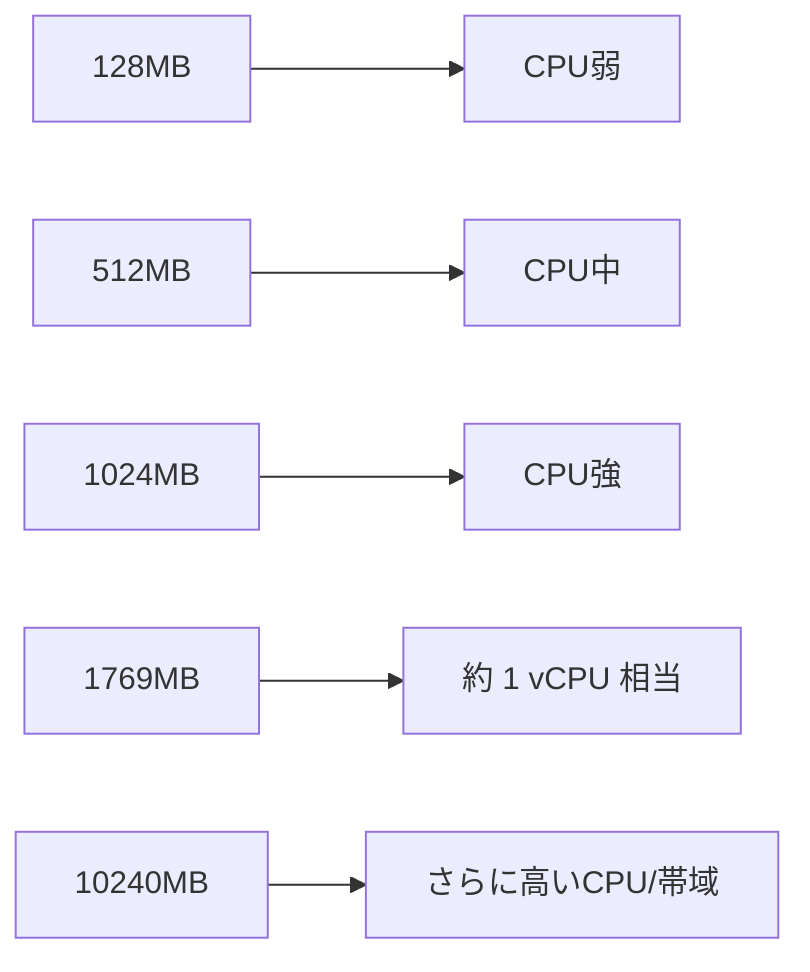
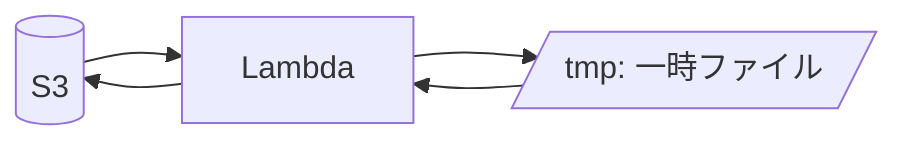
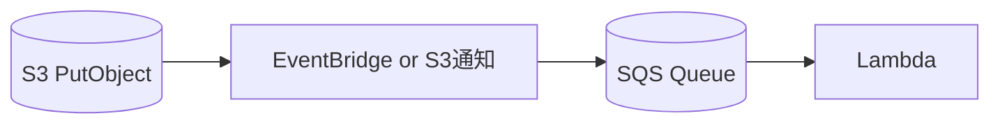

# Day 19：Lambda 性能最適化（メモリ × CPU × 並列数）

---

## はじめに

Lambda の性能改善で最も効果が出やすい施策は、ほとんどのケースで **メモリ設定の見直し** です。

理由はシンプルで、Lambda は **メモリを増やすと CPU が比例して増え**、さらに **ネットワーク帯域やディスク I/O なども増える** ためです。結果として、実行時間（Duration）が大きく短縮されることが多く、**速くなるのにコストが下がる** ことすらあります。 ([AWS ドキュメント][1])

この記事では、思いつきではなく **計測→比較→意思決定** の順で、Lambda を科学的にチューニングする方法を整理します。

---

## メモリ＝CPU の関係（最重要）

AWS の公式ドキュメントでも明記されている通り、Lambda は **設定メモリに比例して CPU パワーが割り当てられます**。 ([AWS ドキュメント][1])
また、**1,769MB で概ね 1 vCPU 相当** という目安も公開されています。 ([AWS ドキュメント][1])



### “メモリを上げると高くなる” だけではない

料金は主に「メモリ量 × 実行時間（ms）」で決まります。つまり、メモリを上げて実行時間が十分に短くなれば、**トータルコストが同等か下がる** 可能性があります。 ([Amazon Web Services, Inc.][2])

---

## 最適メモリ設定を見つける方法（再現可能な手順）

### 1) まず測るべき指標（CloudWatch）

最低限、次を見ます。

* **Duration**（平均だけでなく p95/p99 も意識）
* **Max Memory Used**（メモリ不足/過剰の判断材料）
* **Throttles / ConcurrentExecutions**（並列起因の遅延や失敗を検知）
* （ストリーム/キューなら）IteratorAge / ApproximateAge など

### 2) 比較の仕方（おすすめの刻み）

初回は細かくやりすぎず、段階的に。

* 256 → 512 → 1024 → 1769 → 2048 → 3072（必要なら 4096…）

**判断基準**は次のどちらかを先に決めるとブレません。

* **性能優先**：p95/p99 が最小の設定を採用
* **コスト優先**：GB-second が最小の設定を採用（Duration が多少遅くてもよい）

### 3) 自動で “最適点” を出す（便利ツール）

手動比較が面倒なら、Step Functions で複数メモリを自動試験してグラフ化する **AWS Lambda Power Tuning** を使うと、判断が一気に楽になります。 ([GitHub][3])
（「コスト最小」「速度最短」「バランス」のモードで最適値を探索できます。）

---

## /tmp の活用で I/O を高速化（エフェメラルストレージ）

/tmp は **実行環境ごとの一時領域（エフェメラルストレージ）** です。PDF 分割や画像変換など、一時ファイルが多い処理で効果が出ます。

* デフォルト **512MB**
* 設定で最大 **10,240MB（10GB）** まで拡張可能 ([AWS ドキュメント][4])



### 注意点（初心者がハマるところ）

* **永続ではない**（環境が破棄されれば消える）
* **並列実行で共有されない**（同時実行数分だけ実行環境が分かれる）
* “キャッシュとして使える場合もある” が、**前提にしない**（あくまでベストエフォート）

---

## 並列数（Concurrency）設計：速くするほど事故りやすい

性能最適化は、実は **並列数の制御** とセットです。メモリを上げて 1件が速くなると、上流からのイベントが増えたときに **一気に同時実行が増えて下流を壊す** ことがあります。

### 1) Reserved Concurrency で “暴走” を止める

関数ごとに **予約済み同時実行数（Reserved Concurrency）** を設定できます。
これにより「この関数は最大 N 並列まで」という上限を作れます。 ([AWS ドキュメント][5])

* 例：S3 イベントで一時的に大量起動 → 下流の RDS が枯渇 → 全体障害
  → Reserved Concurrency で上限を作り、**遅延はするが壊れない** に寄せる

### 2) アカウントの同時実行枠も意識する

デフォルトで **リージョンあたり合計 1,000 同時実行** という枠があり、関数同士で取り合いになります（増枠申請は可能）。 ([AWS ドキュメント][6])

---

## 「S3 → Lambda 大量イベント」を安全に処理する定番パターン

S3 直トリガーは簡単ですが、スパイクに弱くなりがちです。大量処理では、次の形にすると制御しやすいです。



* **SQS** を挟むと「投入量」と「処理量」を分離でき、バックプレッシャーをかけられます
* Reserved Concurrency と組み合わせると、下流を守りつつ安定運用しやすい

---

## Day 18 との繋がり（監査・変更追跡）

Day 18 の「誰が・いつ・何を変更したか」を追える設計は、性能最適化で特に効きます。

性能チューニングで触る代表例：

* MemorySize
* Ephemeral Storage（/tmp 容量）
* Reserved Concurrency
* （必要に応じて）Provisioned Concurrency

これらは “設定を少し変えただけ” でも、**レイテンシ・失敗率・コスト** が変化します。
したがって Day 18 の流れに沿って、**変更をデプロイマーカーや変更履歴として必ず残す** と、後から「いつから遅くなった？」「誰の変更？」を即答できます。

---

## まとめ

* **メモリ設定の見直し**は、Lambda 性能改善で最も効果が出やすい（CPU も比例して増える） ([AWS ドキュメント][1])
* 料金は「メモリ × 実行時間」で決まるため、**速くして安くなる** こともある ([Amazon Web Services, Inc.][2])
* /tmp（エフェメラルストレージ）は **512MB→最大10GB** に拡張でき、I/O が多い処理で効く ([AWS ドキュメント][4])
* 並列数は **Reserved Concurrency** で制御し、スパイクで下流を壊さない ([AWS ドキュメント][5])
* Day 18 の監査設計と合わせて、**性能チューニングの変更履歴を残す** と運用が破綻しない

---


## 付録：CloudWatch Logs Insights で `REPORT` 行から指標を集計する（クエリ例）

CloudWatch メトリクス（Duration/MaxMemoryUsed）を見るだけでも十分ですが、実務では **ログから「実行の内訳」まで掘れる** と原因特定が速くなります。

Lambda の CloudWatch Logs には、各呼び出しの末尾に次のような `REPORT` 行が出ます。

* `Duration:` 実行時間（ms）
* `Billed Duration:` 課金対象時間（ms）
* `Max Memory Used:` 最大メモリ使用量（MB）
* `Init Duration:` 初期化時間（ms。コールドスタート時のみ出る）

この `REPORT` 行を Logs Insights で集計すると、**p95/p99 やコールドスタート影響** を定量化できます。

---

### 1) `Duration / MaxMemoryUsed / Init Duration` を1つのクエリで集計（推奨）

> 目的：平均だけでなく、p95/p99 とコールドスタート比率を同時に把握する

```sql
fields @timestamp, @message
| filter @message like /^REPORT RequestId:/
| parse @message /Duration: (?<duration_ms>[\d.]+) ms/ 
| parse @message /Billed Duration: (?<billed_ms>\d+) ms/
| parse @message /Max Memory Used: (?<max_mem_mb>\d+) MB/
| parse @message /Init Duration: (?<init_ms>[\d.]+) ms/
| stats
    count() as invocations,
    avg(duration_ms) as avg_duration_ms,
    pct(duration_ms, 95) as p95_duration_ms,
    pct(duration_ms, 99) as p99_duration_ms,
    max(duration_ms) as max_duration_ms,
    avg(max_mem_mb) as avg_max_mem_mb,
    max(max_mem_mb) as peak_max_mem_mb,
    count(init_ms) as cold_starts,
    100.0 * count(init_ms) / count() as cold_start_rate_pct,
    avg(init_ms) as avg_init_ms,
    pct(init_ms, 95) as p95_init_ms
  by bin(5m)
| sort @timestamp desc
```

**読み方（最低限）**

* `p95_duration_ms / p99_duration_ms` が高い → “たまに遅い” を疑う（下流待ち・スロットリング・コールドスタートなど）
* `cold_start_rate_pct` が高い → Provisioned Concurrency 検討、もしくは初期化処理の軽量化（import/初期化/接続）
* `peak_max_mem_mb` が MemorySize の 80% 付近 → OOM 予防でメモリ増を優先

---

### 2) コールドスタート（Init Duration）だけを可視化する

> 目的：コールドスタートが「発生頻度」なのか「重さ」なのかを切り分ける

```sql
fields @timestamp, @message
| filter @message like /^REPORT RequestId:/ and @message like /Init Duration:/
| parse @message /Init Duration: (?<init_ms>[\d.]+) ms/
| stats
    count() as cold_starts,
    avg(init_ms) as avg_init_ms,
    pct(init_ms, 95) as p95_init_ms,
    pct(init_ms, 99) as p99_init_ms,
    max(init_ms) as max_init_ms
  by bin(10m)
| sort @timestamp desc
```

---

### 3) “遅い実行だけ” を抽出して原因調査に繋げる（しきい値でフィルタ）

> 目的：p99 が悪いときに、どのリクエストが遅いかをログから追える状態にする

```sql
fields @timestamp, @message
| filter @message like /^REPORT RequestId:/
| parse @message /RequestId: (?<request_id>[0-9a-fA-F-]+)/ 
| parse @message /Duration: (?<duration_ms>[\d.]+) ms/
| parse @message /Max Memory Used: (?<max_mem_mb>\d+) MB/
| parse @message /Init Duration: (?<init_ms>[\d.]+) ms/
| filter duration_ms > 1000
| sort duration_ms desc
| limit 50
```

この一覧で `request_id` を拾い、同じ RequestId のログ（アプリログ/例外/外部API待ち）に辿ると、原因が特定しやすくなります。

---

### 4) 補足：ロググループの指定（運用のコツ）

* 対象は通常 `/aws/lambda/<function-name>` のロググループです
* **別名（Alias）や環境別**に関数名が変わる運用なら、Logs Insights の検索対象ロググループを間違えないのが重要です
* Day18（変更追跡）の文脈と合わせて、メモリ/同時実行/エフェメラルストレージの変更を行ったタイミングで、この集計結果も一緒に残すと「いつから遅くなったか」が即答できます

---


[1]: https://docs.aws.amazon.com/lambda/latest/dg/configuration-memory.html "Configure Lambda function memory"
[2]: https://aws.amazon.com/lambda/pricing/ "AWS Lambda Pricing"
[3]: https://github.com/alexcasalboni/aws-lambda-power-tuning "alexcasalboni/aws-lambda-power-tuning"
[4]: https://docs.aws.amazon.com/ja_jp/lambda/latest/dg/configuration-ephemeral-storage.html "Lambda 関数のエフェメラルストレージを設定する"
[5]: https://docs.aws.amazon.com/lambda/latest/dg/configuration-concurrency.html "Configuring reserved concurrency for a function"
[6]: https://docs.aws.amazon.com/lambda/latest/dg/lambda-concurrency.html "Understanding Lambda function scaling"
