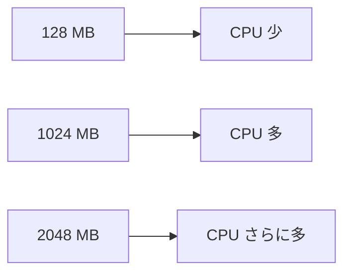
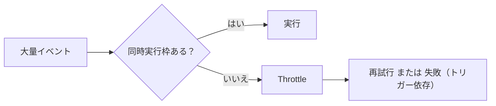

# Day 2：Lambda 実行環境の正しい理解（Cold Start / CPU / tmp / 同時実行）

## はじめに
Lambda の性能やトラブルの多くは **実行環境の理解不足** によって起きます。

- メモリを増やすと CPU が増える  
- /tmp（エフェメラルストレージ）は「設定で」最大 10GB まで増やせる  
- コールドスタートには発生条件と対策がある  
- 同時実行数は無限ではなく、スロットリングが起きる  

この記事では「Lambda の中で何が起きているのか」を、初心者〜中級者向けに **“実務で使える粒度”**で整理します。

---

## Lambda 実行環境の内部構造（ざっくり結論）
Lambda は “軽量コンテナのような実行環境（Execution Environment）” 上で動作します。

- 初回実行（またはスケールアウト時）に環境を新規作成 → **Cold Start**
- 次回以降、環境が残っていれば再利用 → **Warm Start**

```mermaid
flowchart LR
  A[イベント] --> B{環境再利用?}
  B -->|Yes| C[Warm Start]
  B -->|No| D[Cold Start]
  C --> E[関数実行]
  D --> E
````

ポイントは、**“同じ環境が使い回されることがある”** という点です。
この性質が、性能最適化（キャッシュ・接続再利用）にも、事故（/tmp の残骸、グローバル変数の持ち越し）にもつながります。

---

## 実行の3フェーズ：Init / Invoke /（終了）

Lambda の内部は大きく分けて次のフェーズで理解できます。

1. **Init**：実行環境作成、ランタイム起動、依存読み込み、グローバル初期化
2. **Invoke**：ハンドラーが呼ばれて実処理（イベントごと）
3. **（終了）**：環境が破棄される（タイミングは制御できない）

```mermaid
flowchart TB
  A["Init: ランタイム起動 / import / グローバル初期化"] --> B["Invoke: handler(event, context)"]
  B --> C{"環境は残る？"}
  C -->|はい| B
  C -->|いいえ| D["破棄"]
```

この構造を知ると、実務でよくある次の疑問が解けます。

* 「同じ処理なのに、たまに遅いのはなぜ？」 → Init が乗っている（Cold Start）
* 「DB 接続を毎回張ると遅い？」 → 接続を Init 側で作って再利用できる
* 「/tmp のファイルが残ってる？」 → 環境が残っている間は残り得る

---

## Cold Start が起きるタイミング（悪者にしない）

Cold Start は “常に起きる” わけではありません。典型例は以下です。

* 関数がしばらく呼ばれていない（環境が消えた）
* 突然トラフィックが増えて **並列に新しい環境が必要**になった
* デプロイ直後（新しいコードの環境が必要）
* （設定次第で）VPC 接続や初期化が重い

「Cold Start をゼロにする」より、まずは **発生しやすい条件を潰して、影響を小さくする**のが現実的です。

### 実務で効く対策（優先度順）

* **Init を軽くする**：import を減らす、重い初期化を避ける
* **外部接続を再利用する**：DB/HTTP クライアントをグローバルに置く
* **パッケージサイズを小さくする**：不要依存を削る、Layer を使う
* **Provisioned Concurrency / SnapStart** を検討する（要件次第）

---

## メモリを増やすと CPU も増える（最重要）

Lambda の性能最適化の核心はこれです。

* メモリ設定を上げると、**CPU（とネットワーク性能も）比例して増える**
* 処理時間が短くなり、結果として **料金が下がる**こともある



### まず見るべきログ：REPORT 行

CloudWatch Logs には実行ごとに概ね次のような行が出ます（言語・設定で多少差あり）。

* Duration（実行時間）
* Billed Duration（課金時間）
* Max Memory Used（最大メモリ使用量）

この **Max Memory Used がメモリの上限に近い**なら、まずメモリを増やすのが手堅い改善策です。
逆に Max Memory Used が低いのに遅いなら、CPU 目的でメモリを増やす価値があります。

---

## /tmp（エフェメラルストレージ）を使いこなす

/tmp は **ローカルの高速ストレージ**で、次の用途に向きます。

* 画像処理（サムネ作成、変換）
* PDF 変換、結合、ページ分割
* 一時ファイルの大量作成（中間生成物）

重要な注意点：

* デフォルトは小さく、**設定で最大 10GB まで拡張**できる（ただし増やすと課金対象になる）
* 実行環境が再利用される間は、**/tmp のファイルが残ることがある**
* 永続ストレージではない（環境が消えれば消える）

### 小技：/tmp を “キャッシュ置き場” にする

外部から毎回ダウンロードする辞書・モデル・テンプレ等は、/tmp に置いておくと Warm 時に速くなることがあります。

ただし「サイズ管理」と「掃除（古いファイル削除）」は忘れずに。

---

## 同時実行数（スケール）とスロットリング

Lambda はスケールしますが **無制限ではありません**。

* アカウント×リージョンで同時実行の上限（クォータ）がある
* 上限を超えると **Throttle（抑制）**される
* Reserved Concurrency で “関数ごとの上限/下限” を作れる



### 実務でハマりやすい例

* S3 に大量ファイル投入 → 関数が一気に起動 → 同時実行枠を食い尽くす
* 重要な関数まで巻き込まれて遅延 → Reserved Concurrency で守る

---

## “実行環境を意識した” コーディングの基本

初心者が最初に押さえると効果が大きいのはこの2つです。

### 1) 重い初期化は handler の外へ

```python
import boto3

s3 = boto3.client("s3")  # 可能なら Init 側で作って再利用

def lambda_handler(event, context):
    # ここは Invoke（毎回呼ばれる）
    return {"ok": True}
```

### 2) ログに “観測ポイント” を残す

* 何を処理しているか（入力サイズ、件数）
* どこで時間を使っているか（変換、アップロード、外部 API）
* /tmp 使用量（重い処理なら特に）

観測できると、メモリ調整・並列数調整・設計見直しが一気にやりやすくなります。

---

## つまずいた時のチェックリスト（5項目）

最後に、実務で「遅い/失敗する/詰まる」時に見る順番です。

1. **CloudWatch Logs の REPORT 行**（Duration / Max Memory Used）
2. **メモリを上げて改善するか**（CPU不足の可能性）
3. **Cold Start の比率**（初回だけ遅い？常に遅い？）
4. **/tmp の容量不足・後始末不足**（大きい変換処理で頻出）
5. **同時実行数の上限・Throttle**（メトリクスで確認）

---

## まとめ

* 実行環境（Init/Invoke）を理解すると Lambda の挙動が読める
* **メモリ＝CPU** は最重要（性能とコストの両方に効く）
* /tmp は高速だが永続ではない。必要なら容量を設定で増やす
* 同時実行は無限ではなく、Throttle 対策が必要


[1]: https://docs.aws.amazon.com/ja_jp/lambda/latest/dg/configuration-ephemeral-storage.html?utm_source=chatgpt.com "Lambda 関数のエフェメラルストレージを設定する"
[2]: https://docs.aws.amazon.com/lambda/latest/dg/lambda-runtime-environment.html?utm_source=chatgpt.com "Understanding the Lambda execution environment lifecycle"
[3]: https://docs.aws.amazon.com/lambda/latest/dg/lambda-concurrency.html?utm_source=chatgpt.com "Understanding Lambda function scaling"
[4]: https://docs.aws.amazon.com/lambda/latest/dg/configuration-memory.html?utm_source=chatgpt.com "Configure Lambda function memory"
