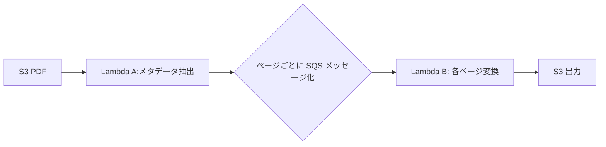

# Day 20：PDF / 画像処理の最適化（tmp10GB × Layer × fan-out）

---

## はじめに
Lambda は CPU と `/tmp` が強力なため、  
**PDF処理・画像処理に非常に向いています。**

ただし、設計を誤ると次の典型トラブルが発生します。

- メモリ不足（OOM）
- Timeout
- `/tmp` 不足
- I/O が遅くてコストが高い（S3 往復が支配的）
- 並列化しすぎて下流（S3/DB）が詰まり、逆に遅くなる

この記事では **tmp10GB × Layer × fan-out** を軸に、PDF/画像処理を「高速・安定・運用可能」にする実務テクをまとめます。

---

## Day 19 との繋がり（性能最適化の適用先）
Day 19 では「メモリ（=CPU）× 並列数」で性能を作る話をしました。  
Day 20 はそれを **PDF/画像処理という重いワークロードに“具体適用”** します。

- 画像変換は **CPU（=メモリ）に比例して速くなる** ことが多い
- 巨大PDFは **1回でやると Timeout** → fan-out で分割
- 中間生成物は **/tmp に置くと速い**（S3 往復を減らす）

---

## tmp 10GB の使い方（非常に重要）
Lambda の `/tmp` はエフェメラルストレージ（実行環境ごとの一時領域）です。  
容量は **512MB〜10,240MB（=10GB）** の範囲で設定できます。 :contentReference[oaicite:3]{index=3}

### 1) SAM で 10GB を明示的に設定する
`/tmp` を 10GB 前提で設計するなら、テンプレに書いて“意図を固定”します。

```yaml
Resources:
  PdfWorkerFunction:
    Type: AWS::Serverless::Function
    Properties:
      Runtime: python3.12
      MemorySize: 2048
      Timeout: 60
      EphemeralStorage:
        Size: 10240   # 10GB
````

※ 512MB までは従来通りで、追加分は課金対象です（コスト最適化観点で「本当に必要な容量」に寄せるのが重要）。 ([Amazon Web Services, Inc.][4])

### 2) /tmp 設計の鉄則（事故を防ぐ）

* **“永続”ではない**：同じ実行環境が再利用されれば残ることもありますが、保証はありません（キャッシュ用途はOK、保存用途はNG）。 ([AWS ドキュメント][5])
* 大きい生成物は **メモリではなく /tmp** に逃がす（OOM回避）
* ファイル名に `request_id` を入れて衝突を避ける（コンテナ再利用時に地味に効く）
* 生成後は必要に応じて削除（ディスク枯渇と情報残留を防ぐ）

```python
import os, uuid, shutil

req = str(uuid.uuid4())
workdir = f"/tmp/work-{req}"
os.makedirs(workdir, exist_ok=True)

try:
    temp_path = f"{workdir}/page_1.png"
    # ... generate file ...
finally:
    shutil.rmtree(workdir, ignore_errors=True)
```

---

## Layer にライブラリを入れて高速化（＋運用の安定化）

Pillow / pypdf / pypdfium2 などは、関数本体に同梱するとサイズが膨らみがちです。
Layer 化すると次のメリットがあります。

* デプロイパッケージが小さくなり、CI/CD が軽くなる
* 依存ライブラリを **関数群で共有** できる
* 依存更新を “Layer のバージョン” として追跡しやすい（監査にも強い）

### Layer の基本ルール（ここで詰まりがち）

* **Lambda は Amazon Linux 上で動く**ので、バイナリ依存（C拡張など）は Linux 互換でビルドが必要
* **関数と同じ Python バージョン** で作る（ズレると ImportError になりがち） ([AWS ドキュメント][2])
* zip 直下に `python/` ディレクトリが必要 ([AWS ドキュメント][2])

ディレクトリ例（OK）：

```
layer/
  python/
    PIL/
    pypdf/
    pypdfium2/
```

### 最短のビルド方針（実務向け）

macOS 等でビルドして事故るより、**Lambda に近い Linux コンテナで固める**のが安全です（C拡張対策）。 ([AWS ドキュメント][6])

---

## fan-out（並列化）で巨大 PDF を高速処理

「巨大PDFを 1 Lambda で全部処理」は、ほぼ必ず限界が来ます。
**1ページ（または Nページ）単位に分割して並列化**すると、安定性とスループットが跳ね上がります。



メリット：

* Timeout がほぼ消える（1タスクが小さくなる）
* スループットが桁違い
* 失敗ページだけ再処理できる（運用が楽）

### SQS fan-out を“運用可能”にする最低条件

* **冪等性**：同じページ変換が複数回走っても壊れない（上書きOK、同名出力OK等）
* **DLQ**：毒メッセージ（壊れたPDF等）を隔離する
* **並列数制御**：予約済み同時実行（Reserved Concurrency）で下流を守る
* **BatchSize 調整**：標準キューは最大 10,000、FIFO は最大 10（要件に合わせる） ([AWS ドキュメント][3])

（例）メッセージ設計（最小）：

```json
{
  "bucket": "input-bucket",
  "key": "docs/sample.pdf",
  "page": 12,
  "output_prefix": "out/sample/",
  "request_id": "..."
}
```

---

## I/O がボトルネックになる場合の対策

PDF/画像処理は「変換アルゴリズム」よりも、実は **S3 往復の I/O が支配的**になりがちです。

### 1) boto3 の接続を再利用（基本だけど効く）

`boto3.client()` を handler 外で作って接続を使い回す（コネクション確立コスト削減）。

### 2) “全部ダウンロード”を疑う

* ページ単位処理なら、可能なら **Range GET** などで無駄な転送を減らす（設計の余地）
* 逆に、分割が細かすぎると「S3 への小さいアクセスが大量」になり、別の遅さが出る
  → 1メッセージ=1ページがベストとは限らない（Nページ単位も検討）

### 3) /tmp 上でまとめて処理してからアップロード

* 生成途中の画像を都度 S3 に置くより、/tmp で完結させて最後にまとめて出す方が速いケースが多い

---

## まとめ

* PDF/画像処理は Lambda の得意分野（CPU と /tmp が効く）
* `/tmp` は **512MB〜10GB** まで設定できるので、設計に合わせて明示する ([AWS ドキュメント][1])
* Layer 化は「速さ」だけでなく **運用（更新・追跡・共有）** を強くする ([AWS ドキュメント][2])
* 巨大PDFは fan-out（SQS 等）で分割し、**並列数・冪等性・DLQ** まで含めて完成

---

## 付録A：SQS event source mapping の SAM 設定例（BatchSize / MaximumBatchingWindow / DLQ）

SQS トリガーの `BatchSize` / `MaximumBatchingWindowInSeconds` / `ScalingConfig.MaximumConcurrency` / `FunctionResponseTypes` は SAM の SQS イベントで設定できます。([AWS ドキュメント][11])
`MaximumBatchingWindowInSeconds` は 0〜300 秒の範囲で設定できます。([AWS ドキュメント][12])
また、**BatchSize が 10 を超える場合は MaximumBatchingWindowInSeconds を 1 秒以上**にする必要があります。([AWS ドキュメント][13])

DLQ は（SQS トリガーの場合）**EventSourceMapping ではなく、SQS キュー側の RedrivePolicy** で構成するのが基本です。([AWS ドキュメント][14])

> さらに実務では、**可視性タイムアウト（VisibilityTimeout）を関数 Timeout の 6 倍以上**にするのが推奨です（再試行やスロットリング時の安全マージン）。([AWS ドキュメント][14])

```yaml
Resources:
  # --- DLQ（失敗隔離）---
  PdfPageDlq:
    Type: AWS::SQS::Queue
    Properties:
      QueueName: pdf-page-dlq
      MessageRetentionPeriod: 1209600 # 14 days (任意)

  # --- メインキュー（DLQへリダイレクト）---
  PdfPageQueue:
    Type: AWS::SQS::Queue
    Properties:
      QueueName: pdf-page-queue
      # 可視性タイムアウトは「関数Timeoutの6倍以上」が推奨
      VisibilityTimeout: 360  # 例: 関数Timeout=60sなら 360s 以上
      RedrivePolicy:
        deadLetterTargetArn: !GetAtt PdfPageDlq.Arn
        maxReceiveCount: 3

  PdfPageWorkerFunction:
    Type: AWS::Serverless::Function
    Properties:
      FunctionName: pdf-page-worker
      Runtime: python3.12
      Handler: app.lambda_handler
      Timeout: 60
      MemorySize: 2048

      # tmp 10GB を使う想定ならここもセット（本文側で解説済み）
      EphemeralStorage:
        Size: 10240

      # SQS をポーリングする権限（実務で抜けがち）
      Policies:
        - SQSPollerPolicy:
            QueueName: !GetAtt PdfPageQueue.QueueName

      # 例：下流への過負荷を避けたい場合は ReservedConcurrency も検討
      # ReservedConcurrentExecutions: 20

      Events:
        PdfPages:
          Type: SQS
          Properties:
            Queue: !GetAtt PdfPageQueue.Arn

            # 1回の起動で処理するメッセージ数（=ページ数）
            BatchSize: 50

            # バッチを溜める最大待ち時間（0〜300秒）
            MaximumBatchingWindowInSeconds: 5

            # “部分失敗”を返して、失敗したメッセージだけ再試行させる
            FunctionResponseTypes:
              - ReportBatchItemFailures

            # イベントソース単位で最大同時実行数を制御（下流保護）
            ScalingConfig:
              MaximumConcurrency: 10
```

補足（重要）：

* `ScalingConfig.MaximumConcurrency` を使う場合、**関数側の Reserved Concurrency がそれ未満だとスロットル**され得ます（複数 SQS マッピングがあるなら合計に注意）。([AWS ドキュメント][15])

---

## 付録B：「何GBの /tmp が必要か」見積もり早見（ページ数×dpi×色深度）

### 1) まずは “非圧縮（最悪ケース）” で見積もる

PDF を「ページ→画像（ラスタライズ）」する場合、**非圧縮の1枚あたりサイズ**は概算で以下です（A4想定）。

* A4（8.27in × 11.69in）
* `幅px ≒ 8.27 × dpi`、`高さpx ≒ 11.69 × dpi`
* `Raw(MiB/ページ) ≒ 幅px × 高さpx × (bytes/px) / 1024^2`

色深度（目安）：

* Gray8：1 byte/px（モノクロ）
* RGB8：3 bytes/px（カラー）
* RGBA8：4 bytes/px（透過付き）

### 2) 早見表（A4、非圧縮 Raw）

| dpi | モード           |   解像度(px) | Raw/ページ(MiB) |
| --: | ------------- | --------: | -----------: |
| 150 | Gray8 (1B/px) | 1240×1754 |          2.1 |
| 150 | RGB8 (3B/px)  | 1240×1754 |          6.2 |
| 150 | RGBA8 (4B/px) | 1240×1754 |          8.3 |
| 200 | Gray8 (1B/px) | 1654×2338 |          3.7 |
| 200 | RGB8 (3B/px)  | 1654×2338 |         11.1 |
| 200 | RGBA8 (4B/px) | 1654×2338 |         14.8 |
| 300 | Gray8 (1B/px) | 2481×3507 |          8.3 |
| 300 | RGB8 (3B/px)  | 2481×3507 |         24.9 |
| 300 | RGBA8 (4B/px) | 2481×3507 |         33.2 |
| 400 | Gray8 (1B/px) | 3308×4676 |         14.8 |
| 400 | RGB8 (3B/px)  | 3308×4676 |         44.3 |
| 400 | RGBA8 (4B/px) | 3308×4676 |         59.0 |
| 600 | Gray8 (1B/px) | 4962×7014 |         33.2 |
| 600 | RGB8 (3B/px)  | 4962×7014 |         99.6 |
| 600 | RGBA8 (4B/px) | 4962×7014 |        132.8 |

### 3) /tmp 必要量の“実務式”（安全係数つき）

`/tmp` は「最終出力（JPEG/PNG）」だけでなく、途中生成物（中間ファイル、複数バージョン、ページ抽出物など）が載ります。
そのため、まずは次で見積もるのが安全です。

* `必要/tmp ≒ Raw(MiB/ページ) × 同時に保持するページ数 × 安全係数(2〜4) + 余裕(数百MiB)`

ここでの「同時に保持するページ数」は、実装次第で変わりますが、fan-out + SQS では概ね：

* 1メッセージ=1ページなら **SQS の BatchSize が同時ページ数の上限**
* 1起動で N ページまとめて処理するなら、その N が同時ページ数

例：

* **300dpi / RGB / BatchSize=50 / 安全係数=3**
  `24.9MiB × 50 × 3 ≒ 3,735MiB（≒3.7GiB） + 余裕`
  → `/tmp` を 5〜10GB に寄せる判断が合理的
* **600dpi / RGBA / 1ページ処理 / 安全係数=4**
  `132.8MiB × 1 × 4 ≒ 531MiB + 余裕`
  → 1ページfan-outなら 1〜2GB でも戦えることが多い（ただし抽出物が多いPDFは別）

注意：

* JPEG/PNG は圧縮されるため **最終出力ファイル自体は Raw より小さい**ことが多い一方、ライブラリや処理段階によっては一時的に Raw 相当を複数持つことがあります（「安全係数」を入れる理由）。
* `BatchSize > 10` を使うなら、**MaximumBatchingWindowInSeconds を 1 以上**にする点も忘れずに（設定不整合で詰まりやすい）。([AWS ドキュメント][13])


[11]: https://docs.aws.amazon.com/ja_jp/serverless-application-model/latest/developerguide/sam-property-function-sqs.html "SQS - AWS Serverless Application Model"
[12]: https://docs.aws.amazon.com/lambda/latest/api/API_CreateEventSourceMapping.html?utm_source=chatgpt.com "CreateEventSourceMapping - AWS Lambda"
[13]: https://docs.aws.amazon.com/ja_jp/lambda/latest/dg/services-sqs-configure.html?utm_source=chatgpt.com "Amazon SQS イベントソースマッピングの作成と管理"
[14]: https://docs.aws.amazon.com/AWSSimpleQueueService/latest/SQSDeveloperGuide/sqs-configure-lambda-function-trigger.html?utm_source=chatgpt.com "Configuring an Amazon SQS queue to trigger an AWS ..."
[15]: https://docs.aws.amazon.com/lambda/latest/dg/services-sqs-scaling.html?utm_source=chatgpt.com "Configuring scaling behavior for SQS event source mappings"


[1]: https://docs.aws.amazon.com/ja_jp/lambda/latest/dg/configuration-ephemeral-storage.html?utm_source=chatgpt.com "Lambda 関数のエフェメラルストレージを設定する"
[2]: https://docs.aws.amazon.com/lambda/latest/dg/python-layers.html?utm_source=chatgpt.com "Working with layers for Python Lambda functions"
[3]: https://docs.aws.amazon.com/lambda/latest/dg/services-sqs-parameters.html?utm_source=chatgpt.com "Lambda parameters for Amazon SQS event source mappings"
[4]: https://aws.amazon.com/jp/blogs/news/aws-lambda-now-supports-up-to-10-gb-ephemeral-storage/?utm_source=chatgpt.com "AWS Lambda で最大 10 GB のエフェメラルストレージを ..."
[5]: https://docs.aws.amazon.com/lambda/latest/dg/configuration-ephemeral-storage.html?utm_source=chatgpt.com "Configure ephemeral storage for Lambda functions"
[6]: https://docs.aws.amazon.com/powertools/python/latest/build_recipes/cross-platform/?utm_source=chatgpt.com "Cross-Platform Build Considerations - Powertools for ..."
