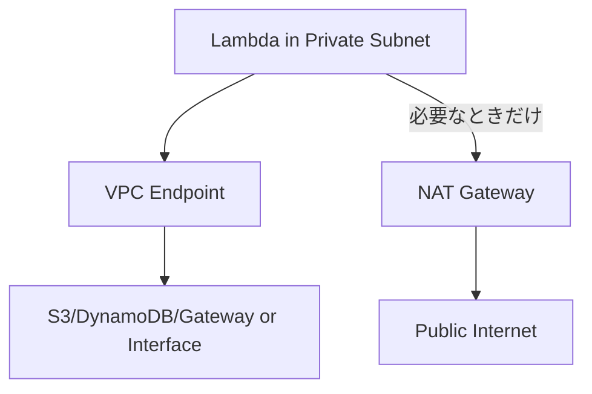

# Day 21：VPC Lambda の真実（ENI / コールドスタート / 最速化）

---

## はじめに

Lambda を VPC 内で実行すると、次の問題が頻発します。

* コールドスタートが劇的に遅くなる
* ENI（Elastic Network Interface）周りで待たされる／タイムアウトする
* NAT Gateway コストが増える
* サブネットの IP が枯渇してスケールしない

しかし、これらは「VPC Lambda の仕組みを理解していない」ことが原因で起きがちです。
正しく設計すれば、**VPC Lambda は十分に高速・安定**して運用できます。

なお前回 Day20 では **tmp10GB × Layer × fan-out（並列展開）**を扱いました。
この “fan-out” を **VPC 内**でやると、CPU/IO より先に **ネットワーク側（ENI/IP/NAT/接続数）が詰まる**ことがあります。Day21 は、その落とし穴を回避する回です。

---

## まず結論：VPC に入れるかどうかが勝負

VPC Lambda の最適化は、突き詰めると次の 2 択です。

* **VPC が不要なら、入れない**（これが最速・最安）
* **必要なら、最小の範囲で入れる**（エンドポイント/サブネット/IP/出口設計まで含める）

「なんとなくセキュアだから」で VPC に入れると、遅く・高く・壊れやすくなります。

---

## VPC Lambda の内部動作（“ENI が鍵”は正しい。ただし理解が必要）

VPC に接続する Lambda は、サブネットとセキュリティグループを指定して **VPC 内へ入るためのネットワーク経路**を確保します。 ([AWS ドキュメント][2])

図解（イメージ）：

```mermaid
flowchart LR
  L[Lambda 実行環境] --> HP[Hyperplane / VPC への入口]
  HP --> ENI[ENI (サブネットに紐づく)]
  ENI --> VPC[VPC 内リソース]
  VPC --> DB[Aurora / Redis / Private API]
```

### よくある誤解：毎回 ENI を“作成”するから遅い？

昔（初期の VPC Lambda）はその理解で概ね合っていましたが、**2019 年以降、Lambda の VPC Networking は大きく改善**されています。
起動性能の改善と ENI 利用効率の向上が段階的に展開され、VPC 接続の「常に激遅」という状況は緩和されています。 ([Amazon Web Services, Inc.][1])

ただし、それでも VPC では次が効いてきます：

* **サブネットの IP キャパシティ**
* **VPC の出口（NAT / VPC Endpoint）**
* **同時実行増加時のネットワーク初期化コスト**
* **外部への接続数（特に DB）**

つまり、VPC Lambda を速くするには「ENI をどうこう」より先に、**VPC を“ネットワーク設計として完成させる”**必要があります。

---

## 超重要：Public Subnet に入れてもインターネットへは出られない

初心者が最初にハマるポイントです。

* Lambda は VPC 内で **プライベート IP**しか持ちません
* そのため、**Public Subnet に置いても IGW 直通ではインターネットへ出られません**
* インターネットへ出るには、通常 **NAT Gateway（または NAT Instance）** が必要です ([Repost][3])

この誤解があると「VPC に入れたら外へ出られなくなった」が発生します。

---

## VPC Lambda が必要なケース（必要な時だけ入れる）

VPC が“必須”になりやすい代表例：

* Aurora / RDS（必要に応じて RDS Proxy）
* ElastiCache / Redis
* VPC 内の EC2 / ECS / EKS のプライベート API
* Private Subnet 内の社内 API（ALB/NLB 内部向け）

逆に、**S3 / DynamoDB など AWS マネージドサービスにアクセスするだけ**なら、VPC に入れずに済む設計も多いです（後述の VPC Endpoint と絡みます）。

---

## 最速化パターン 1：VPC Endpoint を優先し、NAT を“減らす/無くす”

VPC Lambda のコスト事故の大半は NAT Gateway です。

* NAT Gateway は **時間課金 + データ処理課金**が発生します（リージョン差あり） ([Amazon Web Services, Inc.][4])
* しかも高可用性のために AZ ごとに置くと、固定費が増えやすい

そこで基本戦略はこれです：

### 1) S3 / DynamoDB は Gateway Endpoint

S3 と DynamoDB は **Gateway VPC Endpoint** を使えます。
これは **インターネットゲートウェイや NAT を不要**にし、VPC 内からプライベートに到達できます。 ([AWS ドキュメント][5])

### 2) それ以外は Interface Endpoint（PrivateLink）

Secrets Manager / STS / SSM / ECR / KMS など、Lambda が呼びがちな AWS API は **Interface Endpoint**（PrivateLink）で閉域化できます。
Interface Endpoint は AZ ごとの時間課金・データ課金があるため、NAT と比較して「どちらが得か」は通信特性次第です。 ([Amazon Web Services, Inc.][6])

図解：



---

## 最速化パターン 2：サブネット設計で“IP 枯渇”を潰す

VPC Lambda のスケール停止は、意外と **IP 枯渇**が原因になります。
Lambda を VPC に入れる＝VPC 側のキャパシティ（IP）もスケール要件に入る、ということです。

実務で効く原則：

* **AZ を 2 つ以上**選ぶ（VPC 接続 Lambda は複数 AZ が推奨） ([AWS ドキュメント][7])
* Lambda 用サブネットは **小さすぎない CIDR**を切る（/28 など極小は避ける）
* fan-out（同時実行爆増）する関数は、**同時実行上限（Reserved Concurrency）**でネットワーク側を守る

---

## 最速化パターン 3：Provisioned Concurrency を“正しく”使う

レイテンシが厳しい API（同期）なら、Provisioned Concurrency（PC）は強力です。
AWS 公式としても、コールドスタートのレイテンシ低減に有効とされています。 ([AWS ドキュメント][8])

```bash
aws lambda put-provisioned-concurrency-config \
  --function-name MyFunc \
  --qualifier PROD \
  --provisioned-concurrent-executions 5
```

ポイント：

* **Day13（Alias / Version）**と相性が良い（PC は基本 Alias/Version に紐づけて運用）
* VPC でも効くが、コストは「常時起動分」も増えるため **対象は絞る**（会員 API、決済、管理画面など）

---

## 最速化パターン 4：DB 接続は “接続数” を制御する（Aurora は特に）

VPC Lambda × DB の遅延/障害は、ENI より **DB コネクション嵐**が原因のことも多いです。

* Lambda の同時実行が増える
* その分 DB 接続が増える
* DB が詰まり、結果としてタイムアウトが増える

ここは定石で守ります：

* **コネクションの再利用**（グローバルに client を置く）
* **RDS Proxy** の活用（Aurora/RDS の前段で吸収）
* 同時実行上限で“DB の許容量”に合わせる

---

## 運用チェックリスト（初心者〜中級者向け）

VPC Lambda で遅い/繋がらない時、まずここを見ます。

1. VPC が本当に必要か（不要なら外へ出す）
2. Public Subnet に入れて「出られるはず」と誤解していないか（NAT/Endpoint はあるか） ([Repost][3])
3. サブネットは 2AZ 以上か（片 AZ はリスク） ([AWS ドキュメント][7])
4. サブネット IP が枯渇していないか（スケール時に顕在化）
5. NAT Gateway のコストが増えていないか（まず Endpoint で逃がせないか） ([Amazon Web Services, Inc.][4])
6. DB 接続数が増えていないか（RDS Proxy / 同時実行制御）

---

## まとめ

* VPC Lambda の本質は「ENI」ではなく **“VPC をネットワークとして設計すること”**
* **VPC Endpoint 優先**で NAT 依存を減らす（コストと性能の両方に効く） ([AWS ドキュメント][5])
* **2AZ 以上 + IP 余裕**でスケール停止（IP 枯渇）を避ける ([AWS ドキュメント][7])
* 低レイテンシが必要なら **Provisioned Concurrency**（Day13 の Alias 運用とセット） ([AWS ドキュメント][8])
* 不要なら **VPC 外で動かす**のが最速・最安

---


## 付録A：Interface Endpoint を追加して STS / ECR / CloudWatch Logs / KMS まで NAT-less に寄せる構成例

### ねらい（何が NAT-less になるか）

* **CloudWatch Logs**：VPC 内からログ送信を閉域化（`com.amazonaws.${Region}.logs`） ([AWS ドキュメント][11])
* **KMS**：KMS API を閉域化（`com.amazonaws.${Region}.kms`） ([AWS ドキュメント][12])
* **STS**：一時クレデンシャル取得を閉域化（`com.amazonaws.${Region}.sts`） ([AWS ドキュメント][13])
* **ECR**：コンテナ/Lambda のイメージ取得を閉域化（`ecr.api` / `ecr.dkr`） ([AWS ドキュメント][13])
* **S3 Gateway**：ECR のイメージレイヤは S3 から取るため **S3 Gateway Endpoint が実質必須** ([AWS ドキュメント][14])

### template.yaml（追記分：VPCEndpoints セット）

```yaml
Resources:
  # Lambda 側 SG（例）
  LambdaSecurityGroup:
    Type: AWS::EC2::SecurityGroup
    Properties:
      GroupDescription: SG for Lambda in VPC
      VpcId: !Ref VpcId
      SecurityGroupEgress:
        - IpProtocol: tcp
          FromPort: 443
          ToPort: 443
          DestinationSecurityGroupId: !Ref EndpointSecurityGroup

  # Interface Endpoint 側 SG（Lambda からの 443 を許可）
  EndpointSecurityGroup:
    Type: AWS::EC2::SecurityGroup
    Properties:
      GroupDescription: SG for Interface VPC Endpoints
      VpcId: !Ref VpcId
      SecurityGroupIngress:
        - IpProtocol: tcp
          FromPort: 443
          ToPort: 443
          SourceSecurityGroupId: !Ref LambdaSecurityGroup

  # --- Gateway Endpoint: S3（ECR イメージレイヤ取得にも効く）---
  S3GatewayEndpoint:
    Type: AWS::EC2::VPCEndpoint
    Properties:
      VpcId: !Ref VpcId
      VpcEndpointType: Gateway
      ServiceName: !Sub "com.amazonaws.${AWS::Region}.s3"
      RouteTableIds: !Ref PrivateRouteTableIds

  # --- Interface Endpoints: CloudWatch Logs / KMS / STS / ECR ---
  CloudWatchLogsEndpoint:
    Type: AWS::EC2::VPCEndpoint
    Properties:
      VpcId: !Ref VpcId
      VpcEndpointType: Interface
      ServiceName: !Sub "com.amazonaws.${AWS::Region}.logs"
      SubnetIds: !Ref PrivateSubnetIds
      SecurityGroupIds: [!Ref EndpointSecurityGroup]
      PrivateDnsEnabled: true

  KmsEndpoint:
    Type: AWS::EC2::VPCEndpoint
    Properties:
      VpcId: !Ref VpcId
      VpcEndpointType: Interface
      ServiceName: !Sub "com.amazonaws.${AWS::Region}.kms"
      SubnetIds: !Ref PrivateSubnetIds
      SecurityGroupIds: [!Ref EndpointSecurityGroup]
      PrivateDnsEnabled: true

  StsEndpoint:
    Type: AWS::EC2::VPCEndpoint
    Properties:
      VpcId: !Ref VpcId
      VpcEndpointType: Interface
      ServiceName: !Sub "com.amazonaws.${AWS::Region}.sts"
      SubnetIds: !Ref PrivateSubnetIds
      SecurityGroupIds: [!Ref EndpointSecurityGroup]
      PrivateDnsEnabled: true

  EcrApiEndpoint:
    Type: AWS::EC2::VPCEndpoint
    Properties:
      VpcId: !Ref VpcId
      VpcEndpointType: Interface
      ServiceName: !Sub "com.amazonaws.${AWS::Region}.ecr.api"
      SubnetIds: !Ref PrivateSubnetIds
      SecurityGroupIds: [!Ref EndpointSecurityGroup]
      PrivateDnsEnabled: true

  EcrDkrEndpoint:
    Type: AWS::EC2::VPCEndpoint
    Properties:
      VpcId: !Ref VpcId
      VpcEndpointType: Interface
      ServiceName: !Sub "com.amazonaws.${AWS::Region}.ecr.dkr"
      SubnetIds: !Ref PrivateSubnetIds
      SecurityGroupIds: [!Ref EndpointSecurityGroup]
      PrivateDnsEnabled: true
```

#### 運用メモ（短く入れると実務感が出ます）

* CloudWatch Logs は `com.amazonaws.${Region}.logs` を選ぶ（Interface Endpoint） ([AWS ドキュメント][11])
* KMS は `com.amazonaws.${Region}.kms`（Private DNS を有効化すると通常の KMS ホスト名が VPCE に解決される） ([AWS ドキュメント][15])
* ECR は `ecr.api` と `ecr.dkr` の **2 つ**が必要で、さらに **S3 Gateway Endpoint** が必要（レイヤ取得が S3 のため） ([AWS ドキュメント][13])

---

## 付録B：Route53 Resolver / Private Hosted Zone と組み合わせた「社内 API 完全閉域」パターン

ここでは “社内 API” を **Internal ALB**（または NLB）配下に置き、DNS も含めて **VPC 内だけで解決・到達**させます。

### パターンB-1（AWS 内完結）：Private Hosted Zone + Internal ALB で閉域 API

* **Private Hosted Zone** は「関連付けた VPC 内」からのみ名前解決されます ([AWS ドキュメント][16])
* Route 53 は **Alias レコード**で ELB（ALB/NLB）へルーティングできます ([AWS ドキュメント][17])

#### 最小例（ALB は既存として、PHZ と Alias だけ）

```yaml
Parameters:
  VpcId:
    Type: AWS::EC2::VPC::Id
  InternalZoneName:
    Type: String
    Default: corp.internal
  AlbDnsName:
    Type: String
    Description: internal ALB の DNS 名（例: internal-xxx.ap-northeast-1.elb.amazonaws.com）
  AlbHostedZoneId:
    Type: String
    Description: ALB の CanonicalHostedZoneId

Resources:
  PrivateHostedZone:
    Type: AWS::Route53::HostedZone
    Properties:
      Name: !Ref InternalZoneName
      VPCs:
        - VPCId: !Ref VpcId
          VPCRegion: !Ref AWS::Region

  InternalApiRecord:
    Type: AWS::Route53::RecordSet
    Properties:
      HostedZoneId: !Ref PrivateHostedZone
      Name: !Sub "api.${InternalZoneName}"
      Type: A
      AliasTarget:
        DNSName: !Ref AlbDnsName
        HostedZoneId: !Ref AlbHostedZoneId
```

この形にすると、Lambda からは `https://api.corp.internal` のように **“社内名”**で呼べ、インターネットへ一切出ません（NAT も不要）。

---

### パターンB-2（ハイブリッド）：Route 53 Resolver で「オンプレDNS」と相互解決

社内環境（オンプレ/別ネットワーク）とも名前解決を揃えたい場合、Route 53 Resolver を使います。

* **Inbound Endpoint**：オンプレ → AWS（Private Hosted Zone の名前を引けるようにする） ([AWS ドキュメント][18])
* **Outbound Endpoint + ルール**：AWS → オンプレ（特定ドメインをオンプレ DNS へ転送） ([AWS ドキュメント][19])

#### 最小例（Inbound/Outbound Endpoint と Forward ルール）

```yaml
Parameters:
  VpcId:
    Type: AWS::EC2::VPC::Id
  ResolverSubnetIds:
    Type: List<AWS::EC2::Subnet::Id>
    Description: Resolver Endpoint 用サブネット（2AZ 推奨）
  OnPremDnsIp1:
    Type: String
  OnPremDnsIp2:
    Type: String
  OnPremDomain:
    Type: String
    Default: onprem.local

Resources:
  ResolverSecurityGroup:
    Type: AWS::EC2::SecurityGroup
    Properties:
      GroupDescription: SG for Route53 Resolver Endpoints
      VpcId: !Ref VpcId
      SecurityGroupIngress:
        - IpProtocol: udp
          FromPort: 53
          ToPort: 53
          CidrIp: 0.0.0.0/0
        - IpProtocol: tcp
          FromPort: 53
          ToPort: 53
          CidrIp: 0.0.0.0/0

  ResolverInboundEndpoint:
    Type: AWS::Route53Resolver::ResolverEndpoint
    Properties:
      Direction: INBOUND
      IpAddresses:
        - SubnetId: !Select [0, !Ref ResolverSubnetIds]
        - SubnetId: !Select [1, !Ref ResolverSubnetIds]
      SecurityGroupIds: [!Ref ResolverSecurityGroup]

  ResolverOutboundEndpoint:
    Type: AWS::Route53Resolver::ResolverEndpoint
    Properties:
      Direction: OUTBOUND
      IpAddresses:
        - SubnetId: !Select [0, !Ref ResolverSubnetIds]
        - SubnetId: !Select [1, !Ref ResolverSubnetIds]
      SecurityGroupIds: [!Ref ResolverSecurityGroup]

  ForwardToOnPremRule:
    Type: AWS::Route53Resolver::ResolverRule
    Properties:
      DomainName: !Ref OnPremDomain
      RuleType: FORWARD
      ResolverEndpointId: !Ref ResolverOutboundEndpoint
      TargetIps:
        - Ip: !Ref OnPremDnsIp1
          Port: 53
        - Ip: !Ref OnPremDnsIp2
          Port: 53

  ForwardRuleAssociation:
    Type: AWS::Route53Resolver::ResolverRuleAssociation
    Properties:
      ResolverRuleId: !Ref ForwardToOnPremRule
      VPCId: !Ref VpcId
```

**このパターンを成立させる要点（文章で 3 行だけ追記推奨）**

* オンプレ側 DNS に「`corp.internal`（Private Hosted Zone 側）を Resolver Inbound Endpoint の IP へ転送する」設定を入れる ([AWS ドキュメント][18])
* AWS 側は `onprem.local` を Outbound ルールでオンプレ DNS へ転送する ([AWS ドキュメント][19])
* これで “社内 API 名” が **AWS/オンプレの両方で同じ名前**になり、インターネットを経由しない


[11]: https://docs.aws.amazon.com/AmazonCloudWatch/latest/logs/cloudwatch-logs-and-interface-VPC.html? "Using CloudWatch Logs with interface VPC endpoints"
[12]: https://docs.aws.amazon.com/kms/latest/developerguide/vpce-create-endpoint.html "Create a VPC endpoint for AWS KMS"
[13]: https://docs.aws.amazon.com/vpc/latest/privatelink/aws-services-privatelink-support.html "AWS services that integrate with AWS PrivateLink - Amazon Virtual Private Cloud"
[14]: https://docs.aws.amazon.com/AmazonECR/latest/userguide/vpc-endpoints.html "Amazon ECR interface VPC endpoints (AWS PrivateLink)"
[15]: https://docs.aws.amazon.com/ja_jp/kms/latest/developerguide/vpce-create-endpoint.html? "AWS KMS の VPC エンドポイントを作成する"
[16]: https://docs.aws.amazon.com/Route53/latest/DeveloperGuide/hosted-zones-private.html "Working with private hosted zones - Amazon Route 53"
[17]: https://docs.aws.amazon.com/Route53/latest/DeveloperGuide/routing-to-elb-load-balancer.html "Routing traffic to an ELB load balancer - Amazon Route 53"
[18]: https://docs.aws.amazon.com/whitepapers/latest/hybrid-cloud-dns-options-for-vpc/route-53-resolver-endpoints-and-forwarding-rules.html "Route 53 Resolver endpoints and forwarding rules"
[19]: https://docs.aws.amazon.com/Route53/latest/DeveloperGuide/resolver-forwarding-outbound-queries.html "Forwarding outbound DNS queries to your network - Amazon Route 53"
[20]: https://docs.aws.amazon.com/ja_jp/AmazonECR/latest/userguide/vpc-endpoints.html "Amazon ECR インターフェイス VPC エンドポイント (AWS PrivateLink) - Amazon ECR"


[1]: https://aws.amazon.com/blogs/compute/announcing-improved-vpc-networking-for-aws-lambda-functions/ "Announcing improved VPC networking for AWS Lambda ..."
[2]: https://docs.aws.amazon.com/lambda/latest/dg/configuration-vpc.html "Giving Lambda functions access to resources in an ..."
[3]: https://repost.aws/knowledge-center/internet-access-lambda-function "Give internet access to a Lambda function in a VPC"
[4]: https://aws.amazon.com/vpc/pricing/ "Amazon VPC Pricing"
[5]: https://docs.aws.amazon.com/vpc/latest/privatelink/gateway-endpoints.html "Gateway endpoints - Amazon Virtual Private Cloud"
[6]: https://aws.amazon.com/privatelink/pricing/ "AWS PrivateLink Pricing - Amazon.com"
[7]: https://docs.aws.amazon.com/securityhub/latest/userguide/lambda-controls.html "Security Hub CSPM controls for AWS Lambda"
[8]: https://docs.aws.amazon.com/lambda/latest/dg/provisioned-concurrency.html "Configuring provisioned concurrency for a function"
