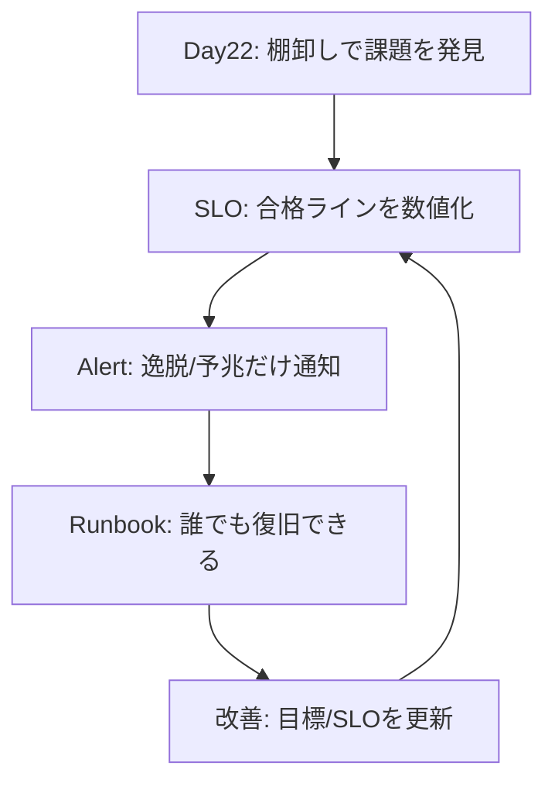

# Day 23：Lambda 運用設計のゴール（SLO・アラート・Runbook の三位一体）

---

構築、デプロイ、セキュリティ、性能最適化……と進んできましたが、**「作ったものは、いつか必ず壊れます」**。
Day23 では、本番稼働後に我々が枕を高くして寝るための「運用設計（監視と復旧）」について、SRE の原則を Lambda に適用する形で解説します。

### 1. まず結論：運用設計のゴール

やみくもにアラートメールを飛ばすのは運用ではありません。運用設計には明確なゴール（三位一体）があります。

1. **SLO（Service Level Objective）**

   * サービスの「合格ライン（品質）」を数値で宣言する。
   * 例：「99.9% 成功する」「3秒以内に終わる」
2. **アラート**

   * SLO から逸脱した（または逸脱の予兆がある）時**だけ**、適切な温度感で通知する。
   * 「CPU が跳ねたけどユーザー影響はない」なら、深夜に叩き起こしてはいけない。
3. **Runbook（手順書）**

   * 通知を受けた人が、寝起きでも迷わず復旧できる手順書を用意する。
   * **「アラートと Runbook は 1:1 で対になる」**のが鉄則です。

CloudWatch の Application Signals は、アカウントで有効化し（必要な計測設定が揃っている前提で）、メトリクスとトレースを収集してアプリケーションの状態を俯瞰できる仕組みです。SLO（可用性・レイテンシ）もここに載せて運用できます。([AWS ドキュメント][31])

---

### 2. SLO 設計：Lambda を“サービス”として定義する

Lambda は用途によって「何が健全か」の定義が全く異なります。初心者が迷わないための定義パターンを紹介します。

#### 2-1. 対象別の切り方

| パターン      | 監視すべき重要指標（SLI）                                                             | 備考                           |
| :-------- | :------------------------------------------------------------------------- | :--------------------------- |
| **API 系** | **可用性**（Availability） **レイテンシ**（Latency p95/p99）                        | ユーザーが待っている時間が全て。同期呼び出し。      |
| **非同期系**  | **処理遅延**（Age / Queue Depth）＋ **失敗検知**（DLQ / `DestinationDeliveryFailures`） | 「いつか終わればいい」が「いつまでも終わらない」はNG。 |
| **バッチ系**  | **完了時刻** **ジョブ成功率**                                                     | 指定時刻までに終わったかどうかが最重要。         |

#### 2-2. SLO の設定例（テンプレート）

最初から「100%」を目指してはいけません。**「現状の実力値 → 改善目標」**の順で設定します。

* **API 可用性 SLO**：月次 99.9%（ローリング 30 日）
* **API レイテンシ SLO**：p95 < 500ms を 99% 達成
* **非同期遅延 SLO**：キュー滞留（Age）< 5 分を 99% 達成
* **失敗 SLO（非同期）**：DLQ 送付 0、または `DestinationDeliveryFailures=0`

---

### 3. アラート設計：ノイズを減らし、判断を増やす

#### 3-1. 通知の原則

アラートには「緊急度」というタグ付けが必要です。

* **Page（即時対応・電話/PagerDuty）**

  * **定義**：ユーザー影響が現在進行形で出ている。SLO のエラーバジェットが急速に燃えている。
  * **アクション**：叩き起こされてでも、今すぐ止血する。
* **Ticket（翌営業日対応・Slack/Jira）**

  * **定義**：ユーザー影響はないが、予兆がある（スロットル微増、コスト異常、DLQ チラつき）。
  * **アクション**：原因を調査し、恒久対応する。

#### 3-2. Lambda で“まず押さえるべき”代表メトリクス

CloudWatch Metrics で最低限監視すべき項目です。これらは後述の Runbook に直結します。

* `Errors` / `Invocations`：エラー率（Errors ÷ Invocations）([AWS ドキュメント][32])
* `Duration`（p95/p99）：平均値ではなくパーセンタイルを見る ([AWS ドキュメント][32])
* `Throttles`：同時実行数不足。ユーザー影響に直結しやすい ([AWS ドキュメント][32])
* `ConcurrentExecutions`：上限（Quota）や Reserved Concurrency に迫っているか ([AWS ドキュメント][32])
* `AsyncEventAge` / `IteratorAge`：非同期/ストリーム処理の「遅延」の正体 ([AWS ドキュメント][32])
* `DeadLetterErrors` / `DestinationDeliveryFailures`：非同期処理の最終的な「死」 ([AWS ドキュメント][32])

---

### 4. Runbook 実践：アラートに“必ず”手順書を紐づける

「アラートが鳴った、さてどうしよう」とログを漁り始めるのは敗北です。
アラートの Description には **「この Runbook を見る」という URL が貼ってある状態**にしてください。

以下に、現場でそのまま使える「3大トラブル対応 Runbook」を公開します。これまでの連載（[Day14][14], [Day19][19], [Day20][20], [Day21][21]）の集大成です。

#### Runbook 1：Timeout（実行時間超過）対応

API の 504 エラーや、非同期処理の詰まりを引き起こす代表的な要因です。

**A. まず確認する（3分トリアージ）**

1. **直近デプロイの有無（[Day14][14]：Deploy Marker）**

   * 直近 60 分以内にコードや環境変数が変わっていれば、**即ロールバック（[Day13][13]）**。
2. **メトリクス相関（[Day19][19]：性能）**

   * `Duration` と同時に `MaxMemoryUsed` が張り付いていないか？（メモリ不足 → CPU不足）
   * `Throttles` が出ていないか？

**B. 暫定復旧（安全な順）**

1. **ロールバック**：原因調査より先に、前のバージョンに戻してサービスを復旧させる。
2. **メモリを上げる**：Lambda はメモリ＝CPU パワーです。1024MB → 2048MB に上げるだけで改善するケースも多いです（まず試す価値が高い）。
3. **タイムアウト値の延長**：これは「延命措置」です。根本解決にはならないため、チケットを切って後日 `Timeout` ログの直前を調査します。

**C. 恒久対応**

* 重い処理（PDF 生成など）の並列化・非同期化（[Day20][20]：最適化）。
* VPC 内リソース（DB 等）への接続遅延解消（[Day21][21]：VPC）。

---

#### Runbook 2：DLQ 増加（非同期・キュー系の失敗）対応

非同期処理（SQS/SNS/EventBridge）が失敗し、Dead Letter Queue（DLQ）にメッセージが溜まっている状態です。

**A. まず確認する（3分トリアージ）**

1. **DLQ の中身を見る**

   * これが全てです。1 件メッセージを取得し、body を確認します。
2. **失敗の分類**

   * **恒久エラー**：バグ、スキーマ不整合、データ欠損 → 再試行しても無駄。
   * **一時エラー**：DB タイムアウト、API スロットリング → 時間を置けば成功する。

**B. 暫定復旧**

1. **被害拡大防止**：上流（イベント流入）を止められるなら止める。
2. **隔離**：DLQ のメッセージを「調査用キュー」や S3 に退避させ、メイン処理への影響を切り離す。
3. **再処理（Redrive）**

   * 一時エラーなら、AWS コンソールの「DLQ Redrive」機能などでソースキューへ戻す。
   * 恒久エラーなら、修正パッチを当ててから戻すか、データを修正して投入する。

**C. 恒久対応**

* 「腐ったメッセージ」を捨てるか隔離するロジックの実装。
* 冪等性（Idempotency）の担保（[Day3][3]：イベント駆動）。

---

#### Runbook 3：VPC 内疎通不良（タイムアウト/接続エラー）対応

「何も変えていないのに急に繋がらなくなった」というケースの代表格です。

**A. まず確認する（3分トリアージ）**

1. **接続先はどこか？**

   * インターネット（NAT Gateway は生きているか？）
   * AWS サービス（VPC Endpoint はあるか？）
   * 社内リソース（Direct Connect / VPN は正常か？）
2. **変更管理（[Day14][14]）**

   * セキュリティグループ、ルートテーブル、ネットワーク ACL の変更履歴を確認。

**B. 暫定復旧**

1. **ロールバック**：ネットワーク設定を含む IaC の変更があれば戻す。
2. **VPC 外への退避**：もし VPC が必須でない処理（S3 操作だけなど）なら、一時的に VPC 設定を外して復旧させる（[Day21][21]：VPC（NAT-less / Endpoint））。

**C. 恒久対応**

* 接続先台帳の作成（どの関数がどこに繋ぐか）。
* VPC Endpoint の漏れがないか棚卸し（[Day21][21]）。

---

### 5. 全体像の整理

運用はサイクルです。一度決めたら終わりではなく、障害が起きるたびに Runbook を太らせ、SLO を見直します。

### まとめ

* **SLO** で「守るべきライン」を決める。
* **アラート**は「アクションが必要な時」だけ鳴らす。
* **Runbook** なきアラートはただの騒音。必ずセットで作る。

[1]: https://github.com/blogs-mamono210/advent_calendar_2025/blob/main/awslambda/day1.md "Day 1：AWS Lambda 超入門：最初の10分で仕組みと概要を理解する"
[2]: https://github.com/blogs-mamono210/advent_calendar_2025/blob/main/awslambda/day2.md "Day 2：Lambda 実行環境の正しい理解（Cold Start / CPU / tmp / 同時実行）"
[3]: https://github.com/blogs-mamono210/advent_calendar_2025/blob/main/awslambda/day3.md "Day 3：イベント駆動の基本（S3 / SQS / EventBridge）"
[4]: https://github.com/blogs-mamono210/advent_calendar_2025/blob/main/awslambda/day4.md "Day 4：IAM が分からないと Lambda は詰む（権限設計入門）"
[5]: https://github.com/blogs-mamono210/advent_calendar_2025/blob/main/awslambda/day5.md "Day 5：S3 → Lambda が動かない理由トップ10（完全保存版）"
[6]: https://github.com/blogs-mamono210/advent_calendar_2025/blob/main/awslambda/day6.md "Day 6：AWS SAM 入門（IaCでLambda管理）"
[7]: https://github.com/blogs-mamono210/advent_calendar_2025/blob/main/awslambda/day7.md "Day 7：template.yaml の設計原則（Globals / Parameters / Resources）"
[8]: https://github.com/blogs-mamono210/advent_calendar_2025/blob/main/awslambda/day8.md "Day 8：Lambda Layer 完全ガイド（依存管理とディレクトリ構造）"
[9]: https://github.com/blogs-mamono210/advent_calendar_2025/blob/main/awslambda/day9.md "Day 9：複数 Layer の統合設計（3分類で迷わない）"
[10]: https://github.com/blogs-mamono210/advent_calendar_2025/blob/main/awslambda/day10.md "Day 10：Lambda Layer の ARN 更新を CI/CD で自動化する（SAM へ安全に注入）"
[11]: https://github.com/blogs-mamono210/advent_calendar_2025/blob/main/awslambda/day11.md "Day 11：CircleCI × OIDC × SAM で壊れないデプロイを作る"
[12]: https://github.com/blogs-mamono210/advent_calendar_2025/blob/main/awslambda/day12.md "Day 12：ブランチで自動的に STAGING / PROD を切り替える"
[13]: https://github.com/blogs-mamono210/advent_calendar_2025/blob/main/awslambda/day13.md "Day 13：Lambda のデプロイ戦略（Alias / Version / Canary / Rollback）"
[14]: https://github.com/blogs-mamono210/advent_calendar_2025/blob/main/awslambda/day14.md "Day 14：Deploy Marker で “いつ・何が・なぜ” 変わったかを可視化する"
[15]: https://github.com/blogs-mamono210/advent_calendar_2025/blob/main/awslambda/day15.md "Day 15：構造化ログで “AI が読めるログ” を作る（AIOps時代の標準）"
[16]: https://github.com/blogs-mamono210/advent_calendar_2025/blob/main/awslambda/day16.md "Day 16：Lambda セキュリティ実務（IAM / KMS / Secrets / EOL）"
[17]: https://github.com/blogs-mamono210/advent_calendar_2025/blob/main/awslambda/day17.md "Day 17：Inspector for Lambda（CVE & 脆弱性管理の自動化）"
[18]: https://github.com/blogs-mamono210/advent_calendar_2025/blob/main/awslambda/day18.md "Day 18：CloudTrail / Config による変更監査と Drift 検出"
[19]: https://github.com/blogs-mamono210/advent_calendar_2025/blob/main/awslambda/day19.md "Day 19：Lambda 性能最適化（メモリ × CPU × 並列数）"
[20]: https://github.com/blogs-mamono210/advent_calendar_2025/blob/main/awslambda/day20.md "Day 20：PDF / 画像処理の最適化（tmp10GB × Layer × fan-out）"
[21]: https://github.com/blogs-mamono210/advent_calendar_2025/blob/main/awslambda/day21.md "Day 21：VPC Lambda の真実（ENI / コールドスタート / 最速化）"
[22]: https://github.com/blogs-mamono210/advent_calendar_2025/blob/main/awslambda/day22.md "Day 22：Well-Architected（Serverless Lens）で棚卸しする"

[31]: https://docs.aws.amazon.com/ja_jp/AmazonCloudWatch/latest/monitoring/CloudWatch-ServiceLevelObjectives.html "サービスレベル目標 (SLO) - Amazon CloudWatch"
[32]: https://docs.aws.amazon.com/lambda/latest/dg/monitoring-metrics-types.html "Types of metrics for Lambda functions - AWS Lambda"
