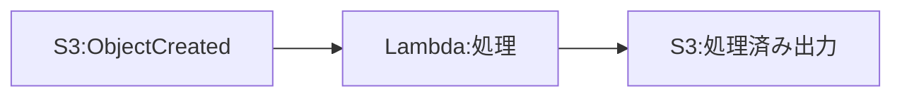
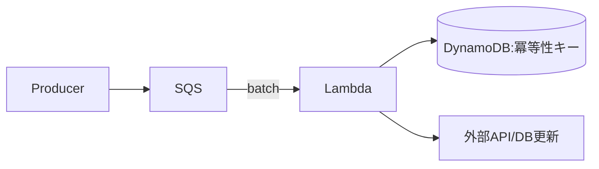
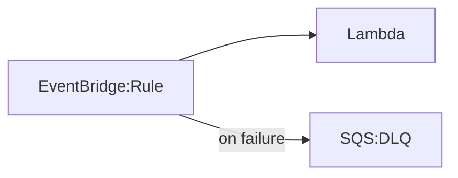
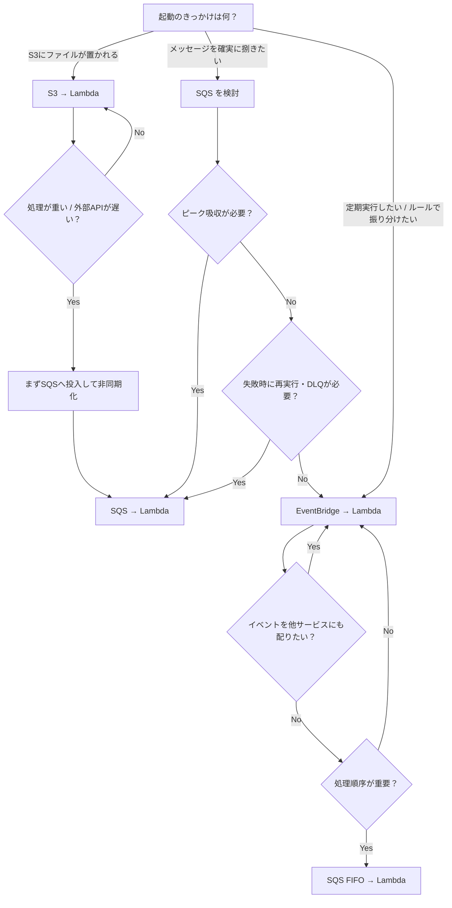
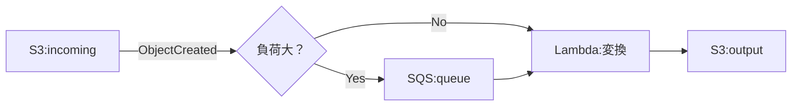
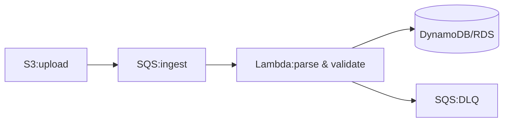
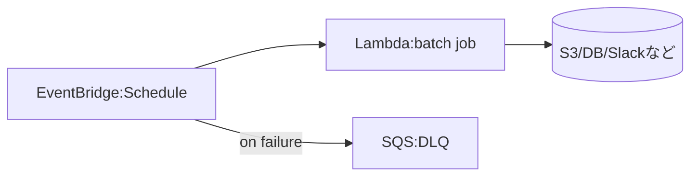

# Day 3：イベント駆動の基本（S3 / SQS / EventBridge）

---

### はじめに

Lambda の最大の特徴は **イベント駆動** であることです。

ただし、同じ“イベント”でも **S3 / SQS / EventBridge** では次が大きく違います。

* 失敗したときに **誰が・いつ・何回** リトライするか
* 同じイベントが **重複して届く可能性**があるか
* **順序**が守られるか
* どこまでを **Lambda 側で責任（冪等性・エラー分離）**として持つべきか

この記事では、Lambda で最も利用される 3つのイベントモデルを
「10分で理解できる要点だけ」に絞って整理します。

---

## 3つのイベントモデルを一言で言うと

* **S3 → Lambda**：ファイルが置かれたら処理する（オブジェクト中心）
* **SQS → Lambda**：メッセージを安全に捌く（キュー中心、再処理が前提）
* **EventBridge → Lambda**：イベントを集めて振り分ける（ルール中心、疎結合）

---

## S3 → Lambda の特徴（ファイルトリガー）

S3 は「置かれたファイルをトリガーに起動」できて便利ですが、落とし穴も多いです。

### よく使うポイント

* **prefix/suffix** でフィルタリング（例：`incoming/` 配下、`.csv` のみ）
* Lambda には「何が起きたか」がイベントとして届き、実体のファイルは **自分で GetObject** する

### つまずきポイント（現場で多い）

* **起動しない**：prefix/suffix の不一致、通知設定先（Lambda）の権限や設定ミス
* **キーがURLエンコードされている**：`+` や `%XX` が混ざり、そのまま扱うと GetObject でハマる
* **重複や順序違い**：S3 イベント通知は at-least-once で、順序保証がなく、まれに重複が起き得る([AWS ドキュメント][2])
  → つまり「同じファイルを2回処理しても壊れない」設計が必要

### 実装の最小サンプル（キーのデコード）

```python
import urllib.parse

def decode_s3_key(key: str) -> str:
    # S3イベントのキーはURLエンコードされるためデコードが必要
    return urllib.parse.unquote_plus(key)
```



---

## SQS → Lambda の特徴（メッセージキュー）

SQS は「確実に処理したい」「ピーク吸収したい」時の定番です。
ただし **“再試行が前提の世界”**なので、設計のクセを掴むのが重要です。

### 重要キーワード

* **Batch size**：1回の起動でまとめて受け取る件数
* **Visibility timeout**：処理中はメッセージを見えなくする時間
  → Lambda × SQS では「関数タイムアウトの6倍 + batching window を推奨」と明記されています([AWS ドキュメント][3])
* **冪等性が必須**：少なくとも1回以上処理され得る前提で、二重処理を潰す
* **例外があるとリトライ**：デフォルトでは“バッチ”単位で再処理になりがち

### 運用を変える大事な機能：Partial Batch Response

SQS トリガーは **失敗したメッセージだけ再処理**する構成ができます（`ReportBatchItemFailures`）。
これを入れるだけで「成功分まで巻き戻って再処理」問題が激減します。([AWS ドキュメント][1])

### 冪等性の考え方（最低限）

* **メッセージID（または業務ID）**で処理済み判定を持つ
* 代表例：DynamoDB に `processed=true` を記録して二重実行を抑止



---

## EventBridge → Lambda の特徴（スケジュール・ルール）

EventBridge は「定期実行」だけでなく、AWS内外のイベントを **ルールで振り分け**できるのが強みです。

### できること

* **cron 相当のスケジュール**（定期実行）
* AWS サービスのイベント（例：CodePipeline、ECS、各種状態変化）を受けて起動
* **イベントパターン**による強力なフィルタ（payload の条件でルーティング）

### 失敗時の挙動（ここが重要）

EventBridge はターゲット配信に失敗すると再試行します。
**デフォルトは「最大24時間」「最大185回」**のリトライです。([AWS ドキュメント][4])
→ 「失敗したらすぐ気づく」ためには **DLQ（SQS）**やメトリクス監視を併用すると安全です。([AWS ドキュメント][5])



---

## イベント別の“設計観点”比較（これだけ覚える）

| 観点         | S3                          | SQS                                                | EventBridge                         |
| ---------- | --------------------------- | -------------------------------------------------- | ----------------------------------- |
| 主用途        | ファイル起点処理                    | 非同期メッセージ処理                                         | ルール/スケジュール/ルーティング                   |
| 重複         | 起き得る（対策推奨）([AWS ドキュメント][2]) | 起き得る（冪等性必須）                                        | 起き得る前提で設計（配信再試行あり）([AWS ドキュメント][4]) |
| 順序         | 保証なし([AWS ドキュメント][2])       | 標準は保証なし（FIFOで担保）                                   | 保証なし（ルールで振り分け）                      |
| 失敗時        | 設計次第で取りこぼし/再処理が曖昧になりやすい     | 再試行が基本。Partial Batch Response が有効([AWS ドキュメント][1]) | デフォルト24h/185回リトライ([AWS ドキュメント][4])  |
| 実装の最重要ポイント | キーのデコード / 重複対策              | 冪等性 / 可視性タイムアウト                                    | ルール設計 / 失敗時の逃げ道（DLQ）                |

---

## イベント別の失敗パターン一覧（強化版）

| イベント        | よくある問題    | 原因                                      | 典型的な対策                                  |
| ----------- | --------- | --------------------------------------- | --------------------------------------- |
| S3          | 起動しない     | prefix/suffix ミス、通知設定/権限                | テストアップロード、設定差分の確認                       |
| S3          | 取得できない    | URLエンコードされたキーを未デコード                     | `unquote_plus` でデコード                    |
| S3          | 二重処理/順序違い | at-least-once + 順序保証なし([AWS ドキュメント][2]) | 冪等性キー、処理済み判定                            |
| SQS         | 二重処理      | 冪等性不足                                   | DynamoDB等で処理済み管理                        |
| SQS         | リトライ地獄    | 例外でバッチが巻き戻る                             | Partial Batch Response([AWS ドキュメント][1]) |
| SQS         | 消えない/遅延   | visibility timeout が短い                  | 6倍推奨に合わせる([AWS ドキュメント][3])              |
| EventBridge | 予期せぬトリガー  | ルール/パターンが広すぎる                           | パターンを絞る、段階的に適用                          |
| EventBridge | 失敗に気づけない  | リトライで隠れる（最大24h）([AWS ドキュメント][4])        | DLQ + アラーム                              |

---

## まとめ

* Lambda の本質は **イベント駆動**
* S3 / SQS / EventBridge は **再試行・重複・順序・責務**がまったく異なる
* 特に重要なのは次の3点

  * **S3：キーのデコード + 重複/順序違いを前提にする**([AWS ドキュメント][2])
  * **SQS：冪等性 + Partial Batch Response + visibility timeout 設計**([AWS ドキュメント][1])
  * **EventBridge：ルール設計 + 失敗時の逃げ道（DLQ/監視）**([AWS ドキュメント][4])

---


## どれを選ぶべきか（ユースケース別の選定フローチャート）

「S3 / SQS / EventBridge、結局どれを使えばいい？」は最初に迷うポイントです。
ここでは **実務で迷いがちな分岐**だけに絞って、最短で選べるようにします。

### 選定フロー



### 使い分けの目安（判断を固める“ひとこと”）

* **S3 → Lambda**：
  「ファイルが置かれた」こと自体がイベント。まずはこれで十分。ただし **重複・順序違いが起き得る前提**で冪等にする。
* **SQS → Lambda**：
  「確実に捌きたい」「ピークを吸収したい」「失敗したら再処理したい」ならこれ。**冪等性は必須**。バッチ運用なら **失敗分だけ再処理（Partial Batch Response）**も検討。
* **EventBridge → Lambda**：
  「定期実行」「条件でイベントを振り分けたい」「複数ターゲットへルーティングしたい」ならこれ。失敗時は **DLQ/監視**もセットで設計すると運用が安定。

### 実務でよくある“組み合わせ”パターン

* **S3 →（即処理せず）SQS → Lambda**
  大きいファイル、外部APIが遅い、突発的に大量投入される、といったケースで安定します。S3 は「検知」、SQS は「捌く」に役割分担。
* **EventBridge → SQS → Lambda**
  ルールで振り分けた上で、バックプレッシャー（混雑時の詰まり）を SQS に吸収させたい場合に有効です。

---

## 典型ユースケース3選（そのまま当てはめる例）

### 1) 画像変換（サムネ生成・PDF→JPEG など）

**おすすめ構成：S3 →（必要ならSQS）→ Lambda → S3**

* 少量・軽量な変換なら **S3 → Lambda** 直結でOK
* 大量投入・外部API連携・重い変換（CPU/メモリが重い）なら **S3 → SQS → Lambda** にしてピークを吸収
* 注意点：S3イベントは重複し得るので、**同じキーを2回処理しても破綻しない**設計にする



---

### 2) 帳票取り込み（CSV/JSON/PDFを取り込んでDB更新）

**おすすめ構成：S3 → SQS → Lambda → DB**

* 帳票処理は「パース失敗」「外部DB一時障害」などで **再処理が前提**になりやすい
  → SQS を挟むと、失敗時のリトライやDLQ運用がやりやすい
* 注意点：**冪等性（同じ帳票を二重反映しない）**が最重要

  * 例：`帳票ID` / `S3キー + ETag` / `取込バッチID` をキーにして処理済み管理



---

### 3) 夜間バッチ（毎日/毎時の集計・定期実行）

**おすすめ構成：EventBridge（Schedule）→ Lambda**

* cron 的に回したいだけなら **EventBridge のスケジュール**が最短
* 注意点：失敗が見えにくくならないように、最低限 **アラーム**と、必要なら **DLQ** をセットで




[1]: https://docs.aws.amazon.com/lambda/latest/dg/services-sqs-errorhandling.html?utm_source=chatgpt.com "Handling errors for an SQS event source in Lambda"
[2]: https://docs.aws.amazon.com/AmazonS3/latest/userguide/notification-how-to-event-types-and-destinations.html?utm_source=chatgpt.com "Event notification types and destinations"
[3]: https://docs.aws.amazon.com/lambda/latest/dg/services-sqs-configure.html?utm_source=chatgpt.com "Creating and configuring an Amazon SQS event source ..."
[4]: https://docs.aws.amazon.com/eventbridge/latest/userguide/eb-rule-retry-policy.html?utm_source=chatgpt.com "How EventBridge retries delivering events"
[5]: https://docs.aws.amazon.com/eventbridge/latest/userguide/eb-create-rule-schedule.html?utm_source=chatgpt.com "Creating a scheduled rule (legacy) in Amazon EventBridge"
