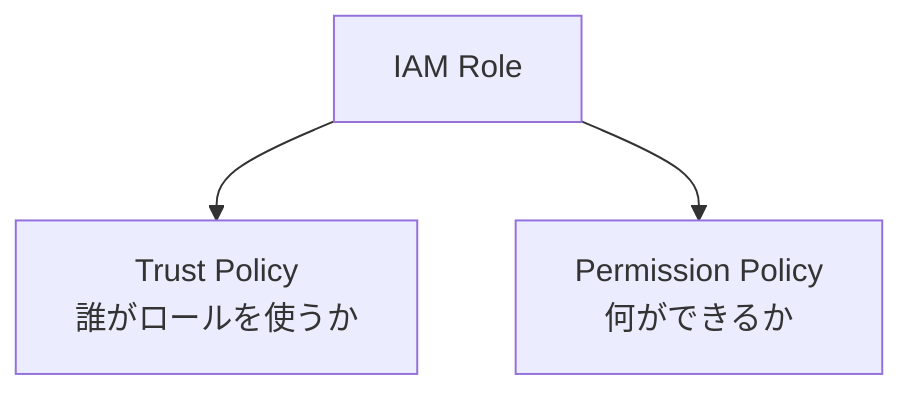

# Day 4：IAM が分からないと Lambda は詰む（権限設計入門）

---

## はじめに

Lambda 運用の 8割のトラブルは IAM が原因です。

* S3 読み込みできない
* CloudWatch Logs に書き込めない
* EventBridge の実行に失敗する

これらはすべて IAM ロール（と周辺ポリシー）の理解不足から生まれます。
逆に言えば、IAM を押さえるだけで **「動かない→原因不明」** の大半が解消します。

---

## IAM ロールの構造（最重要）

IAM ロールは **2つのポリシーで構成** されています。



> 重要: Lambda の「実行ロール（execution role）」は、**Lambda サービスが引き受けて実行時に使うロール**です。
> そのため trust policy は “Lambda が AssumeRole して良い” という許可になります。

---

## 信頼ポリシー（trust policy）

Lambda がこのロールを使うための許可です。

実務では、IAM コンソールで見ると次のように `Version` / `Statement` を含む形になっています（初心者が迷いやすいので“実物”を載せます）。

```json
{
  "Version": "2012-10-17",
  "Statement": [
    {
      "Effect": "Allow",
      "Principal": { "Service": "lambda.amazonaws.com" },
      "Action": "sts:AssumeRole"
    }
  ]
}
```

---

## 権限ポリシー（permission policy）

Lambda 実行中に呼べる AWS API の許可です。

```json
{
  "Version": "2012-10-17",
  "Statement": [
    {
      "Effect": "Allow",
      "Action": ["s3:GetObject"],
      "Resource": ["arn:aws:s3:::my-bucket/*"]
    }
  ]
}
```

---

## ここで一段深掘り：IAM は「3か所」で詰まる

初心者が混乱しやすいので、先に整理します。
Lambda で権限が絡む場所は、実務ではだいたい次の 3 つです。

1. **実行ロール（identity-based policy）**

* Lambda が実行中に S3/DynamoDB/SSM 等を叩く権限

2. **リソースベースポリシー（resource-based policy）**

* 「誰がこの Lambda を呼んでよいか」を Lambda 側に付与する権限
  例：S3/EventBridge/SNS などから呼ばれるときの `AWS::Lambda::Permission`

3. **呼び出し先リソース側のポリシー**

* S3 バケットポリシー / KMS キーポリシー / Secrets Manager のリソースポリシー等
  → 実行ロールが正しくても、ここが原因で弾かれることがあります

> つまり「実行ロール直したのにまだ動かない」は、(2) or (3) が原因であることが多いです。

---

## 最短で運用を安定させる基本セット（Logs）

CloudWatch Logs への出力は運用の生命線なので、まずここを確実にします。

* 最低限必要な権限は、概ね以下（代表例）

  * `logs:CreateLogGroup`
  * `logs:CreateLogStream`
  * `logs:PutLogEvents`

AWS 管理ポリシーなら、まずは **AWSLambdaBasicExecutionRole** を付けるのが定番です。
（最小権限に寄せるのは、動作が安定してからでOKです）

---

## S3 で“初心者が確実に詰まる”2大ポイント

### 1) `GetObject` と `ListBucket` は Resource が違う

* `s3:GetObject` → **オブジェクト ARN（`arn:aws:s3:::bucket/prefix/*`）**
* `s3:ListBucket` → **バケット ARN（`arn:aws:s3:::bucket`）**

この違いを知らずに「`GetObject` は許可したのに一覧取得で死ぬ」ケースが頻発します。

例：プレフィックス配下だけ一覧許可したい場合

```json
{
  "Version": "2012-10-17",
  "Statement": [
    {
      "Sid": "ListOnlyPrefix",
      "Effect": "Allow",
      "Action": ["s3:ListBucket"],
      "Resource": ["arn:aws:s3:::my-bucket"],
      "Condition": {
        "StringLike": {
          "s3:prefix": ["incoming/*"]
        }
      }
    },
    {
      "Sid": "GetObjectsInPrefix",
      "Effect": "Allow",
      "Action": ["s3:GetObject"],
      "Resource": ["arn:aws:s3:::my-bucket/incoming/*"]
    }
  ]
}
```

### 2) SSE-KMS のときは KMS 権限も要る

S3 側が SSE-KMS の場合、S3 権限だけでは復号できず、以下が追加で必要になることがあります。

* `kms:Decrypt`
* （暗号化して書くなら）`kms:Encrypt` / `kms:GenerateDataKey`

さらに厄介なのが、**KMS キーポリシー側**でロールを許可していないと弾かれる点です（前述の “3か所” の (3)）。

---

## VPC 配置の Lambda は別の罠がある

Lambda を VPC に入れると、ENI を作る都合で **EC2 系の権限**が追加で必要になることがあります。
自前で最小化するより、まずは AWS 管理ポリシー（例：**AWSLambdaVPCAccessExecutionRole**）で動作確認するのが現実的です。

---

## よくある IAM ミス（増量版）

| 症状                     | 原因                                          | 対策                                                |
| ---------------------- | ------------------------------------------- | ------------------------------------------------- |
| S3 の読み込みに失敗            | `Resource` がバケット直下しか許可していない                 | `/*` を付けてオブジェクトARNにする                             |
| S3 の一覧取得が失敗            | `ListBucket` の Resource にオブジェクトARNを指定している   | `arn:aws:s3:::bucket` を使う（必要なら `s3:prefix` 条件）    |
| Logs 出力失敗              | `logs:CreateLogGroup` / `PutLogEvents` 等がない | まず AWSLambdaBasicExecutionRole を付与                |
| Lambda 起動失敗            | trust policy が間違い（Principal が違う等）           | `lambda.amazonaws.com` を確認                        |
| EventBridge/S3 から起動しない | Lambda 側の **呼び出し許可（resource-based）** がない    | `AWS::Lambda::Permission`（または add-permission）を見直す |
| SSE-KMS の S3 で落ちる      | KMS 権限 or キーポリシーが不足                         | `kms:Decrypt` とキーポリシー双方を確認                        |
| “権限付けたのにダメ”            | 違うロールを見ている / デプロイ反映漏れ                       | 関数の「実行ロールARN」を再確認、反映後に再実行                         |

---

## トラブルシュート最短手順（現場向け）

IAM は闇雲にいじると泥沼化します。次の順で潰すと早いです。

1. **CloudWatch Logs のエラーメッセージを読む**

   * `AccessDenied` / `is not authorized to perform` の “Action” と “Resource” を抜く
2. **「実行ロール」「呼び出し許可」「リソース側ポリシー」のどれかを切り分ける**
3. **S3 なら ListBucket と GetObject の Resource 違いをまず疑う**
4. **KMS を使っているなら kms:Decrypt とキーポリシーを疑う**
5. 変更したら、必ず **再実行してログで検証**（“付けたつもり”が一番多い）

---

## まとめ

* trust / permission の違いを理解する（ここが全ての出発点）
* Lambda の権限は「実行ロール」だけでなく「呼び出し許可」「リソース側ポリシー」でも詰まる
* S3 は `ListBucket` と `GetObject` の Resource 違いが典型的な落とし穴
* 次回は S3 イベントのトラブル10選を解説

---

以下を **Day4 の末尾**（まとめの直前 or まとめの後）に、そのまま貼れる形で追記してください。短く、かつ実務で使える「最短パターン」に絞っています。

---

## SAM テンプレでの IAM 最短パターン（Policies の書き方例）

SAM では、Lambda の実行ロールに付ける権限（permission policy）を `Policies` で簡潔に書けます。まずは **動く最短**として「AWS 管理ポリシー」や「SAM の Policy Template」を使い、安定してから最小権限へ寄せるのがおすすめです。

### パターン1：まずは CloudWatch Logs を確実に（最短）

`AWSLambdaBasicExecutionRole` 相当の権限を付ける定番です。

```yaml
Resources:
  MyFunction:
    Type: AWS::Serverless::Function
    Properties:
      Runtime: python3.12
      Handler: app.lambda_handler
      CodeUri: src/
      Policies:
        - AWSLambdaBasicExecutionRole
```

### パターン2：S3 読み取り（最短・対象バケットを限定）

S3 の「読み取り」を最短で付けたい場合は、SAM のテンプレートを使うと事故が減ります。

```yaml
Resources:
  MyFunction:
    Type: AWS::Serverless::Function
    Properties:
      Runtime: python3.12
      Handler: app.lambda_handler
      CodeUri: src/
      Policies:
        - AWSLambdaBasicExecutionRole
        - S3ReadPolicy:
            BucketName: my-bucket
```

> `S3ReadPolicy` は **バケット単位での読み取り**を付ける用途に向きます。
> プレフィックス（`incoming/` だけ）まで絞りたい場合は、後述の「パターン4」のように JSON を明示する方が確実です。

### パターン3：S3 書き込み（最短・対象バケットを限定）

アップロードや生成物の保存が必要な場合。

```yaml
Resources:
  MyFunction:
    Type: AWS::Serverless::Function
    Properties:
      Runtime: python3.12
      Handler: app.lambda_handler
      CodeUri: src/
      Policies:
        - AWSLambdaBasicExecutionRole
        - S3WritePolicy:
            BucketName: my-bucket
```

### パターン4：ポリシーを JSON で直書き（プレフィックス制限など “実務向け”）

「`incoming/*` だけ許可」など、条件付きで絞りたい場合はインラインで書くのが早いです。

```yaml
Resources:
  MyFunction:
    Type: AWS::Serverless::Function
    Properties:
      Runtime: python3.12
      Handler: app.lambda_handler
      CodeUri: src/
      Policies:
        - AWSLambdaBasicExecutionRole
        - Version: "2012-10-17"
          Statement:
            - Sid: ListOnlyIncomingPrefix
              Effect: Allow
              Action:
                - s3:ListBucket
              Resource:
                - arn:aws:s3:::my-bucket
              Condition:
                StringLike:
                  s3:prefix:
                    - incoming/*
            - Sid: GetObjectsInIncomingPrefix
              Effect: Allow
              Action:
                - s3:GetObject
              Resource:
                - arn:aws:s3:::my-bucket/incoming/*
```

### 補足：SAM の `Policies` は「実行ロール」の話

`Policies` で付くのは **Lambda が実行中に AWS API を叩く権限（permission policy）** です。
一方で、S3/EventBridge など “外部から Lambda を呼ぶ” 側の許可（resource-based）は、基本的に SAM がイベント定義から作ります（例：`Events:` を書くと `AWS::Lambda::Permission` が生成されます）。「起動しない」場合は、実行ロールだけでなくこの観点でも切り分けると早いです。

