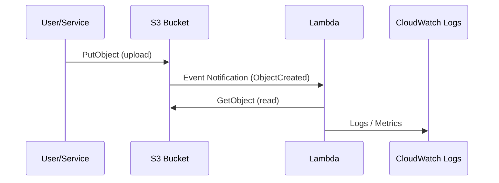

# Day 5：S3 → Lambda が動かない理由トップ10（完全保存版）

---

## はじめに

最も多い Lambda トラブルは **「S3 イベントが来ない」問題** です。しかし安心してください。原因はほぼ **10個のパターン**に収まります。

この記事は「**S3 → Lambda が動かない**」問題を、**最短で切り分けて解決する**ための完全保存版チェックリストです。
対象は **AWS Lambda 初心者〜中級者**（S3通知は触ったことがあるが、ハマりがちな人）を想定しています。

---

## まず最初にやる：5分で切り分ける順番

「来てない」のか「来てるけど落ちてる」のかを先に分けます。

1. **Lambda 側に実行ログが1行でも出ているか？**

   * CloudWatch Logs（ロググループ）に新しいログがある → “イベントは届いている”可能性が高い
2. **Lambda のメトリクス（Invocations / Errors）が増えているか？**

   * Invocations が 0 のまま → “そもそもイベントが届いていない”
3. **S3 の通知設定が正しく入っているか？**

   * 変更直後なら **最大5分の反映遅延**も疑う

この3点で、原因候補が一気に絞れます。

---

## 0. 事前確認：S3 通知設定を CLI で見える化（おすすめ）

コンソールで迷子になったら、まずこれで現状を確かめます。

```bash
# バケットに設定されているイベント通知（Lambda/SQS/SNS）を確認
aws s3api get-bucket-notification-configuration --bucket <bucket-name>

# Lambda 側のリソースベースポリシー（S3がinvokeできるか）を確認
aws lambda get-policy --function-name <function-name>
```

---

## 1. prefix / suffix の条件にマッチしていない

S3 イベントの **6〜7割はここ**が原因です。

### よくある落とし穴

* `prefix` は “フォルダ”ではなく **キーの先頭一致**（例: `incoming/`）
* 大文字小文字の違い（`Incoming/` と `incoming/`）
* `suffix` のドット忘れ（`.csv` のつもりが `csv`）
* 想定と違うイベント種別（`ObjectCreated:Put` しか拾っていない、など）

### チェックポイント

* S3 のイベント通知で **Filter**（prefix/suffix）が設定されている場合、まずここを疑う
* 一時的に Filter を外して **“全部拾う”** で動作確認 → 原因切り分けが速い

---

## 2. ファイル名が URL エンコードされている

S3 イベントの `object.key` は **URLエンコード**されていることがあります（スペースや日本語、`+` などで顕在化）。

```python
from urllib.parse import unquote

key = unquote(event["Records"][0]["s3"]["object"]["key"])
```

### よくある症状

* `folders%2Ffile+name.csv` のように見えて、実際のキーと一致せず GetObject で失敗
* ローカルでは想定通りなのに、本番の日本語ファイル名だけ失敗する

---

## 3. IAM の GetObject 権限が不足（Lambda → S3）

ここは「S3 から Lambda が呼べない」と混同されやすいですが、これは **Lambda が S3 を読めない**パターンです。

### 症状

* Lambda は起動している（ログが出る）
* しかし `AccessDenied` で `GetObject` に失敗する

### チェックポイント

* Lambda の **実行ロール**に `s3:GetObject`（対象バケット/プレフィックス）があるか
* KMS 暗号化（SSE-KMS）なら `kms:Decrypt` も必要になることがある

例（最小イメージ）:

```json
{
  "Version": "2012-10-17",
  "Statement": [
    {
      "Effect": "Allow",
      "Action": ["s3:GetObject"],
      "Resource": "arn:aws:s3:::<bucket-name>/*"
    }
  ]
}
```

---

## 4. S3 から Lambda を呼ぶ権限が不足（S3 → Lambda）

こちらは **Lambda のリソースベースポリシー**側の話です。
「Lambda 実行ロールに S3 権限を付けたのに動かない」とき、ここで詰まりがちです。

### チェックポイント

* `aws lambda get-policy` の結果に、S3 を許可するステートメントが入っているか
* SAM/CloudFormation で作った場合は自動で入ることが多いが、手動設定や移行時に抜けることがあります

---

## 5. S3 と Lambda のリージョンが違う

S3 のイベント通知は、基本的に **同一リージョン**前提で考えるのが安全です。
「バケットは東京、Lambda は別リージョン」などは事故りやすい構成です。

### 対策の方向性

* 可能なら **同一リージョンに揃える**
* どうしても跨ぐなら、S3 → **SQS / EventBridge** など “中継” を検討（運用は増えますが安定します）

---

## 6. S3 イベント設定の反映にタイムラグがある（最大5分）

「設定した直後に上げたファイルだけ発火しない」は、反映遅延の典型です。

### チェックポイント

* 設定変更直後は **5分待って**再アップロードで確認
* 何度も通知設定をいじるほど“検証が不安定”になるので、切り分けは **最小回数**で

---

## 7. ファイルが大きすぎて処理に失敗している

イベント自体は届いているが、処理が重くて落ちているパターンです。

### よくある原因

* タイムアウト（Timeout）が短い
* メモリ不足（Memory を増やすと CPU も増える）
* `/tmp` 容量不足（大きい一時ファイルを置くと詰む）
* 全部ダウンロードしてから処理している（ストリーミング処理に切り替える余地）

### 対策例

* まずは **Timeout / Memory を増やして**事象を安定させる
* 重い処理は Step Functions / 分割処理 / キュー化（SQS）を検討

---

## 8. 冪等性がなく、複数回イベントが届いて処理が壊れている

S3 イベントは **少なくとも1回（at-least-once）**で届く前提で設計します。
つまり **重複**や**順不同**が起こり得ます。

### 典型的な壊れ方

* 同じファイルを二重取り込みして二重登録
* 途中まで作った成果物を上書きして破損

### 実務で効く冪等性の作り方（例）

* DynamoDB に `key + eTag (+ versionId)` を記録し、**条件付き書き込み**で二重実行を抑止
* 出力先を「同名上書き」ではなく「実行ID付き」で分離し、最後に確定させる

---

## 9. DLQ がなく、失敗イベントが闇に消えている

S3 から Lambda への呼び出しは非同期扱いになりやすく、失敗時に **取りこぼしが見えにくい**構造になりがちです。

### 対策（おすすめ）

* **Lambda Destinations（OnFailure）**で SQS/SNS に流す
  → “失敗したイベントを回収できる” ようにして、調査と再実行が可能になります
* さらに堅牢にするなら、S3 → **SQS** → Lambda（バッファリング＋DLQ）構成

---

## 10. イベントの JSON 構造を誤解している

初心者がハマるポイントとして、「思った場所にキーがない」があります。

### 最低限ここだけ押さえる

* `Records[0]["s3"]["bucket"]["name"]`
* `Records[0]["s3"]["object"]["key"]`（URLエンコードされることがある）
* `Records[0]["eventName"]`（Put / Copy / MultipartComplete など）

デバッグ時は、まずイベントを **丸ごとログ**に出すのが最速です（秘匿情報が無い範囲で）。

---

## 11. Lambda のエラーでリトライが絡み、意図せぬループに見える

失敗すると再試行され、結果として同じイベントが “何度も来る” ように見えることがあります。

### 対策の基本

* 冪等性（#8）を必ず入れる
* 失敗イベントの退避先（#9）を作る
* 「失敗時に同じ入力を再処理しても安全」な設計に寄せる

---

## 図解：S3 → Lambda のイベントフロー（詳細版）

“どこで止まっているか”が分かるように少しだけ詳細化します。



---

## 付録：運用で強い「推奨アーキテクチャ」2択

### A. シンプル最速（小規模〜中規模）

* S3 → Lambda（直結）
* ただし **Destinations（OnFailure）**は入れる

### B. 堅牢（イベント取りこぼしを避けたい）

* S3 → SQS → Lambda
* キューでバッファリングでき、DLQ/再実行がしやすい

---

## まとめ

* S3 → Lambda の失敗要因は **パターン化**して潰せる
* 最重要は **prefix/suffix** と **権限（IAM + Lambda リソースポリシー）**
* 実務では **冪等性**と **失敗イベントの退避（Destinations/DLQ）**が必須

---
以下を **Day5 の末尾にそのまま追記**してください（Qiita でそのまま動く形）。
ポイントは「S3 トリガ（prefix/suffix）」「最小 IAM」「失敗時の退避（OnFailure Destinations → SQS）」を **最短で揃える**ことです。

---

## 付録：SAM テンプレ最短パターン（S3トリガ＋prefix/suffix＋OnFailure 退避）

「S3 → Lambda が動かない」を潰すうえで、構成を **最小で正しく**持つのが一番効きます。
以下は **S3 の ObjectCreated を prefix/suffix で絞り、失敗したイベントを SQS に退避**する最短テンプレです。

> 目的：
>
> * **Filter（prefix/suffix）**を明示して「来ない」を潰す
> * **OnFailure**を用意して「闇に消える」を潰す
> * IAM は **必要最小限**に寄せる（バケット限定）

### template.yaml（最小構成）

```yaml
AWSTemplateFormatVersion: '2010-09-09'
Transform: AWS::Serverless-2016-10-31
Description: S3 -> Lambda (prefix/suffix) + OnFailure(SQS)

Globals:
  Function:
    Runtime: python3.12
    Timeout: 60
    MemorySize: 256
    Tracing: Active

Parameters:
  BucketName:
    Type: String
    Description: Source S3 bucket name
  Prefix:
    Type: String
    Default: incoming/
  Suffix:
    Type: String
    Default: .csv

Resources:
  # 失敗イベントの退避先（OnFailure）
  FailureQueue:
    Type: AWS::SQS::Queue
    Properties:
      VisibilityTimeout: 120

  FailureQueuePolicy:
    Type: AWS::SQS::QueuePolicy
    Properties:
      Queues:
        - !Ref FailureQueue
      PolicyDocument:
        Version: '2012-10-17'
        Statement:
          - Sid: AllowLambdaSendMessage
            Effect: Allow
            Principal:
              Service: lambda.amazonaws.com
            Action: sqs:SendMessage
            Resource: !GetAtt FailureQueue.Arn
            Condition:
              ArnEquals:
                aws:SourceArn: !GetAtt S3EventFunction.Arn

  S3EventFunction:
    Type: AWS::Serverless::Function
    Properties:
      Handler: app.lambda_handler
      CodeUri: src/
      # 失敗時にイベントを退避（Lambda Destinations）
      EventInvokeConfig:
        MaximumRetryAttempts: 2
        DestinationConfig:
          OnFailure:
            Type: SQS
            Destination: !GetAtt FailureQueue.Arn

      # ここが最短の“必要十分”IAM（対象バケット限定）
      Policies:
        - Version: '2012-10-17'
          Statement:
            - Sid: AllowGetObjectFromTargetBucket
              Effect: Allow
              Action:
                - s3:GetObject
              Resource: !Sub arn:aws:s3:::${BucketName}/*

      # S3 トリガ + prefix/suffix フィルタ
      Events:
        S3ObjectCreated:
          Type: S3
          Properties:
            Bucket: !Ref SourceBucket
            Events: s3:ObjectCreated:*
            Filter:
              S3Key:
                Rules:
                  - Name: prefix
                    Value: !Ref Prefix
                  - Name: suffix
                    Value: !Ref Suffix

  # S3 バケット（既存バケットを使う場合はこの Resources ごと削除し、別パターンへ）
  SourceBucket:
    Type: AWS::S3::Bucket
    Properties:
      BucketName: !Ref BucketName

Outputs:
  FunctionName:
    Value: !Ref S3EventFunction
  FailureQueueUrl:
    Value: !Ref FailureQueue
```

### 実装側（src/app.py）の最小例

```python
from urllib.parse import unquote

def lambda_handler(event, context):
    record = event["Records"][0]
    bucket = record["s3"]["bucket"]["name"]
    key = unquote(record["s3"]["object"]["key"])

    # ここに処理を書く（例：S3 から取得→変換→保存）
    print({"bucket": bucket, "key": key})

    return {"ok": True}
```

---

## 既存バケットを使う場合の注意（重要）

上のテンプレは **バケットをSAMで作る**パターンです。
既存バケットに後付けでイベント通知を入れる場合は、S3 側の「通知設定」が別管理になりやすく、以下の点に注意してください。

* 既存バケットは CloudFormation 管理外になりがちで、**通知の差分が追いにくい**
* “来ない”の調査が難しくなるため、運用では

  * バケットも IaC 管理する
  * もしくは S3 → SQS → Lambda のように **中継点を IaC 管理**する
    がおすすめです

---

## このパターンを入れると解決できること

* prefix/suffix ミスによる「イベントが来ない」
* 失敗イベントが闇に消える問題（OnFailure 退避で回収可能）
* IAM を広げすぎず、バケット単位で最小権限にできる
