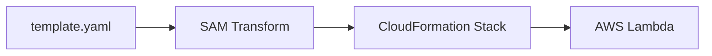

# Day 6：AWS SAM 入門（IaCでLambda管理）

---

## はじめに

AWS Lambda を GUI でポチポチ作っていると、本番運用で必ずこうなります。

* 設定が環境ごとに微妙に違う（差分・ドリフト）
* IAM 権限がどこで変わったか分からない
* Lambda のバージョン管理が破綻
* チーム内で再現できない（属人化）

これをまとめて解決するのが **AWS SAM（Serverless Application Model）** です。

SAM は「Lambda を作る便利ツール」ではなく、**Lambda 運用に必要な設定を “コード（IaC）” として固定する仕組み**です。
この記事では、Lambda 開発者なら必ず知っておくべき SAM の基礎を、最短で実務投入できる形で説明します。

---

## 対象読者

* Lambda を触ったことはあるが、設定がコンソール依存で不安
* 開発環境・検証環境・本番環境の差分に悩んでいる
* CI/CD（CircleCI / GitHub Actions 等）に繋げたい

---

## AWS SAM とは？

AWS SAM は「**サーバーレス専用の CloudFormation 拡張**」です。
SAM の template.yaml は、裏で **CloudFormation テンプレートに変換され、Stack として管理**されます。

SAM を使うと、次のようなリソースを **template.yaml に集約**できます。

* Lambda（Function）
* Lambda Layer
* API Gateway（/ Lambda URL / 認証連携など）
* EventBridge / SQS / S3 などのイベントソース
* IAM ロール・ポリシー
* ログ/トレーシング/環境変数/メモリ/タイムアウト等の運用設定

→ これらを **template.yaml** に書き、`sam deploy` で環境を再現可能にします。

---

## SAM を使うと何が嬉しい？（運用の話）

GUI 運用は「正しい状態」が人の記憶やメモに依存しがちです。
SAM（＝CloudFormation）に寄せると、運用はこう変わります。

* **変更が差分として見える**（変更点をレビューできる）
* **ロールバックがしやすい**（Stack 更新として戻せる）
* **環境差分をパラメータで吸収**しやすい（同テンプレで dev/stg/prod を作れる）
* 「いま本番はどうなっている？」が **template.yaml から追える**

---

## まずはここから：SAM プロジェクトを作る

最初の1回は `sam init` が便利です。

```bash
sam init
```

Python を選べば、最小のプロジェクト雛形（template.yaml と src など）が生成されます。
ここから「テンプレを編集 → ローカル実行 → デプロイ」の流れに入れます。

---

## SAM の基本コマンド（最低限これだけ）

SAM による開発フローは以下の3ステップです。

```bash
sam build
sam validate
sam deploy
```

| コマンド         | 意味                                           |
| ------------ | -------------------------------------------- |
| sam build    | 依存を解決してビルド成果物を作る（Python なら requirements を解決） |
| sam validate | template.yaml の構文チェック（早期にミスを潰す）              |
| sam deploy   | CloudFormation にデプロイ（Stack 更新として反映）          |

### 初回だけ重要：`sam deploy --guided`

初回は guided が鉄板です。Stack 名やリージョン、パラメータなどを対話で設定できます。

```bash
sam deploy --guided
```

guided 実行後に生成される **samconfig.toml** が重要です。
次回以降は `sam deploy` だけで **同条件のデプロイを再現**できます（CI/CD にも載せやすい）。

---

## ローカル検証（これが SAM の強み）

デプロイ前に「イベントを固定」して動作確認できると、チーム開発が一気に安定します。

### 単発で関数を実行（イベント JSON を与える）

```bash
sam local invoke MyFunction --event events/s3.json
```

### API をローカル起動（API Gateway 連携を試す）

```bash
sam local start-api
```

ローカル検証を入れるメリット：

* 「本番に上げてから気づく」を減らせる
* 同じイベントで同じ結果が出る（**再現性**）
* 障害調査が速くなる（イベント JSON がそのまま再利用できる）

---

## template.yaml の構造（最低限 + 実務でよく使う要素）

SAM の土台となる IaC が template.yaml です。
最低限の例に、現場で必ず使う `Globals` と `Outputs` を足します。

```yaml
AWSTemplateFormatVersion: '2010-09-09'
Transform: AWS::Serverless-2016-10-31

Globals:
  Function:
    Runtime: python3.12
    Timeout: 30
    MemorySize: 256

Resources:
  MyFunction:
    Type: AWS::Serverless::Function
    Properties:
      Handler: app.handler
      CodeUri: src/
      Environment:
        Variables:
          LOG_LEVEL: INFO

Outputs:
  MyFunctionName:
    Value: !Ref MyFunction
```

### ここだけ押さえるポイント

* `Transform` が「SAM の宣言」
* `Globals` は共通設定をまとめる（Day7 で深掘り）
* `Resources` が本体（Function / Layer / API / イベントなど）
* `Outputs` は「デプロイ後に参照すべき値」を出力でき、運用が楽になる

---

## おすすめの最小プロジェクト構成

最初は迷わずこの形に寄せるとスムーズです。

```text
.
├── template.yaml
├── samconfig.toml        # sam deploy --guided で生成（重要）
├── src/
│   ├── app.py
│   └── requirements.txt
└── events/
    └── s3.json           # sam local invoke 用のイベント
```

---

## SAM を使うメリット（まとめ）

* **環境差分が減る（テンプレが真実）**
* **チーム全員が同じ設定を再現できる**
* **CI/CD と統合しやすい**
* **手動操作が減り、事故が減る**
* **運用・障害対応が速くなる（設定が追える）**

---

## 図解：SAM → CloudFormation → Lambda の流れ

SAM は最終的に CloudFormation として展開され、Stack として管理されます。



---

## まとめ

* SAM は Lambda 運用で必須の IaC（CloudFormation 拡張）
* template.yaml に設定を集約し、環境を再現可能にする
* `build → validate → deploy` が基本の流れ
* 初回は `sam deploy --guided` で samconfig.toml を作ると運用が楽
* 次回は template.yaml の設計原則（Globals/Parameters/Resources）へ

---

## 付録：よくあるハマりどころ3選（Day7 につながる設計の話）

### 1) samconfig.toml をどこまで管理するか

`sam deploy --guided` で生成される **samconfig.toml** は便利ですが、運用方針を決めないと事故ります。

* **チーム開発では基本コミット推奨**（再現性・CI/CD 連携が楽）
* ただし、以下は入れない（または環境変数・SSM に逃がす）

  * 秘密情報（キー類、トークン類）
  * 個人PC固有のパスやプロファイル依存
* 環境（dev/stg/prod）を分けるなら

  * `samconfig.toml` の **環境セクション**で分岐する（次回 Day7 の Parameters 設計に直結）

---

### 2) CodeUri と requirements の置き方

初心者が最初に壊すのはここです。「ビルドは通るのにデプロイで落ちる」「ローカルと本番で挙動が違う」が起きがちです。

* `CodeUri` は **関数コードのルート**を指す（`src/` など）
* `requirements.txt` は **CodeUri 配下に置く**のが基本（Python の依存解決が迷子にならない）
* Layer を使うなら責務分離する

  * `layers/xxx/python/...`（共通ロジック）
  * `src/`（関数固有の薄いハンドラ）
    → Day7 の Resources 設計で「何を Layer に寄せるか」議論につながります

---

### 3) Stack 名と環境の命名規則

Stack 名は「あとから変えにくい識別子」です。命名が弱いと運用が破綻します。

* 推奨：**<system>-<app>-<env>** で固定

  * 例：`acme-receipt-prod` / `acme-receipt-stg`
* 関数名（FunctionName）まで固定するなら **env を含める**

  * 例：`receipt-converter-prod`
* 逆に、Stack 名に **日付・個人名・ブランチ名**を混ぜると管理不能になります
  → Day7 の Parameters / Mappings で「環境差分はテンプレ側で吸収」が基本方針
