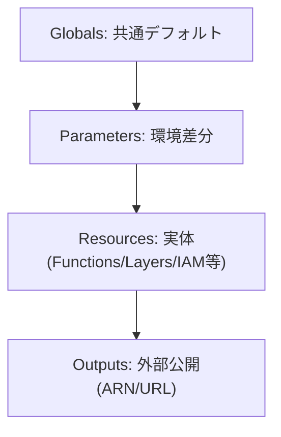

# Day 7：template.yaml の設計原則（Globals/Parameters/Resources）

---

### はじめに

SAM を使うと Lambda を IaC 管理できますが、**template.yaml の設計が悪いと保守コストが急上昇**します。

よくある“運用崩壊”の典型は次のパターンです。

* 関数ごとに `Runtime/Timeout/Memory` がバラバラで、差分レビューが地獄
* 本番・検証差分がコードに混ざり、事故が起きる
* Outputs がなく、他スタックや他サービス連携で手作業が増える
* CodeUri / Layer の置き方が統一されず、ビルドとデプロイが壊れる

そこで今回は、実務で必須となる **template.yaml 設計の5つの原則**を「チームで守れる形」に落とし込んでまとめます。

---

### 原則1：Globals で共通プロパティをまとめる

Lambda が増えるほど効きます。**“全関数のデフォルト”**を先に決め、個別差分は最小化します。

```yaml
Globals:
  Function:
    Runtime: python3.12
    Timeout: 300
    MemorySize: 1024
    Tracing: Active
    Environment:
      Variables:
        LOG_LEVEL: INFO
```

#### ポイント

* `Globals` は **デフォルト値**。関数ごとに上書き可能（上書きは最小限に）
* `Tracing: Active` など、運用で効く設定（X-Ray 等）を最初から入れると後が楽
* 環境変数も“共通”はここに寄せる（関数固有は各 Function に寄せる）

#### アンチパターン

* すべての Function に同じ `Timeout/Memory` をコピペ
  → レビューで差分が見えず、いつの間にか設定が破綄します

---

### 原則2：Parameters で環境差分を吸収する

本番・検証で変わるものは **Parameters 化**して、CI/CD から注入します。

```yaml
Parameters:
  EnvName:
    Type: String
    Default: STAGING
    AllowedValues:
      - STAGING
      - PROD

  LogLevel:
    Type: String
    Default: INFO
    AllowedValues:
      - DEBUG
      - INFO
      - WARNING
      - ERROR
```

CI/CD からは `--parameter-overrides EnvName=PROD LogLevel=WARNING` のように渡します。

#### もう一歩：Conditions で「本番だけ有効」を明示

“本番だけ予約実行を強める / 削除保護を強める” などは `Conditions` で事故を防げます。

```yaml
Conditions:
  IsProd: !Equals [!Ref EnvName, "PROD"]
```

> 「PROD であること」をテンプレート上に残すと、レビューで判断しやすくなります。

---

### 原則3：Resources は「分類」ではなく「命名規則＋並び順」で整理する

CloudFormation/SAM の `Resources:` 配下に `Functions:` のような任意階層は作れません。
代わりに、**命名規則（Prefix）と並び順・コメント**で“読めるテンプレ”にします。

```yaml
Resources:
  # ========= Layers =========
  LayerS3Utils:
    Type: AWS::Serverless::LayerVersion
    Properties:
      LayerName: !Sub "s3-utils-${EnvName}"
      ContentUri: layers/s3_utils/
      CompatibleRuntimes:
        - python3.12

  # ========= IAM Roles =========
  RoleAppLambda:
    Type: AWS::IAM::Role
    Properties:
      # ...

  # ========= Functions =========
  FnReceiptPdfToJpeg:
    Type: AWS::Serverless::Function
    Properties:
      FunctionName: !Sub "receipt-pdf-to-jpeg-${EnvName}"
      CodeUri: src/receipt_pdf_to_jpeg/
      Handler: app.lambda_handler
      Layers:
        - !Ref LayerS3Utils
      Environment:
        Variables:
          LOG_LEVEL: !Ref LogLevel
```

#### ポイント

* `Fn... / Layer... / Role...` のように **種別を Prefix にする**
  → grep / 差分レビューが楽になります
* “どれが依存の起点か（Layer, Role）→ Function” の順に並べる
  → 新規参画者が読みやすい

---

### 原則4：Outputs を必ず出す（参照点を固定する）

Outputs は「他から参照するための契約」です。**ARN / Name / URL** を出しておくと連携がスムーズになります。

```yaml
Outputs:
  ReceiptPdfToJpegFunctionArn:
    Description: "ReceiptPdfToJpeg function ARN"
    Value: !GetAtt FnReceiptPdfToJpeg.Arn

  S3UtilsLayerArn:
    Description: "S3 Utils Layer ARN"
    Value: !Ref LayerS3Utils
```

### さらに実務向け：Export を使う（必要な場合）

別スタックから参照するなら、Export 名も規則化します。

```yaml
Outputs:
  ReceiptPdfToJpegFunctionArn:
    Value: !GetAtt FnReceiptPdfToJpeg.Arn
    Export:
      Name: !Sub "${AWS::StackName}-ReceiptPdfToJpegArn"
```

---

### 原則5：CodeUri と Layer の設計を統一（ディレクトリ規約を決める）

ここが曖昧だと、次のような事故が増えます。

* `CodeUri` の相対パスが環境で変わり、CI だけ壊れる
* 依存ライブラリ（requirements）の置き場が揺れて、ビルド成果物が再現できない
* Layer が増えた瞬間に「どれを更新すべきか」分からなくなる

#### おすすめのディレクトリ規約（例）

```
.
├── template.yaml
├── src/
│   ├── receipt_pdf_to_jpeg/
│   │   ├── app.py
│   │   └── requirements.txt
│   └── pdf_annotator/
│       ├── app.py
│       └── requirements.txt
└── layers/
    └── s3_utils/
        └── python/
            ├── s3_utils.py
            └── requirements.txt
```

#### ポイント

* Function ごとに `src/<function>/` を切る（依存も閉じ込める）
* Layer は `layers/<layer>/python/` 配下に置く（Lambda Layer の慣例に寄せる）
* “どこに requirements を置くか”も規約化する（ここがブレると壊れます）

---

### 図解：template.yaml の3層構造

SAM テンプレは大雑把にこの流れで読むと理解が速いです。



---

### よくあるハマりどころ 3選（短く押さえる）

1. **samconfig.toml をどこまで管理するか**

* チーム運用なら「stack 名・region・s3 bucket・capabilities」などは samconfig に寄せ、`parameter-overrides` は CI/CD から渡す、など役割分担を決めると混乱が減ります。

2. **CodeUri と requirements の置き方がブレる**

* “Function ごとに閉じ込める”か、“共通は Layer に寄せる”かを先に決めましょう。中途半端に混ぜるとビルドが再現できません。

3. **Stack 名と環境名の命名規則がない**

* 例：`<project>-<component>-<env>`（`receipt-pdf-to-jpeg-prod` のように）
* テンプレ内でも `!Sub "...-${EnvName}"` を徹底すると、環境取り違え事故が減ります。

---

### まとめ

* `Globals` と `Parameters` は“必ず使う”前提で設計する
* `Resources` は階層化できないので、命名規則と並び順で読みやすくする
* `Outputs` は“他から参照される契約”として必ず出す
* `CodeUri / Layer / requirements` の規約は、早めに決めるほど後が楽

---

### 付録：最小テンプレート例

以下に、Day6 の付録としてそのまま貼れる **「最小の完成形」template.yaml 雛形**を用意しました。
（Globals / Parameters / Conditions / Resources / Outputs をすべて含み、実務で破綻しにくい形にしています）

```yaml
AWSTemplateFormatVersion: "2010-09-09"
Transform: AWS::Serverless-2016-10-31
Description: Minimal but production-friendly SAM template (Day6 appendix)

Parameters:
  EnvName:
    Type: String
    Default: STAGING
    AllowedValues:
      - STAGING
      - PROD
    Description: Deployment environment name

  LogLevel:
    Type: String
    Default: INFO
    AllowedValues:
      - DEBUG
      - INFO
      - WARNING
      - ERROR
    Description: Application log level

  AppName:
    Type: String
    Default: sample
    Description: Logical application name (used for naming resources)

Conditions:
  IsProd: !Equals [!Ref EnvName, "PROD"]

Globals:
  Function:
    Runtime: python3.12
    Timeout: 30
    MemorySize: 256
    Tracing: Active
    Environment:
      Variables:
        ENV_NAME: !Ref EnvName
        LOG_LEVEL: !Ref LogLevel

Resources:
  # ========= IAM Role =========
  RoleAppLambda:
    Type: AWS::IAM::Role
    Properties:
      RoleName: !Sub "${AppName}-lambda-role-${EnvName}"
      AssumeRolePolicyDocument:
        Version: "2012-10-17"
        Statement:
          - Effect: Allow
            Principal:
              Service:
                - lambda.amazonaws.com
            Action:
              - sts:AssumeRole
      Policies:
        - PolicyName: basic-logs
          PolicyDocument:
            Version: "2012-10-17"
            Statement:
              - Effect: Allow
                Action:
                  - logs:CreateLogGroup
                  - logs:CreateLogStream
                  - logs:PutLogEvents
                Resource: "*"

  # ========= Layer (optional but typical) =========
  LayerS3Utils:
    Type: AWS::Serverless::LayerVersion
    Properties:
      LayerName: !Sub "${AppName}-s3-utils-${EnvName}"
      Description: Common S3 utilities
      ContentUri: layers/s3_utils/
      CompatibleRuntimes:
        - python3.12
      RetentionPolicy: Retain

  # ========= Function =========
  FnHello:
    Type: AWS::Serverless::Function
    Properties:
      FunctionName: !Sub "${AppName}-hello-${EnvName}"
      CodeUri: src/hello/
      Handler: app.lambda_handler
      Role: !GetAtt RoleAppLambda.Arn
      Layers:
        - !Ref LayerS3Utils
      # 本番だけ少し強める例（“差分がここ”と分かる）
      Timeout: !If [IsProd, 60, 30]
      MemorySize: !If [IsProd, 512, 256]
      # 例：API Gateway 等のイベントは必要になってから足す
      # Events:
      #   Api:
      #     Type: Api
      #     Properties:
      #       Path: /hello
      #       Method: get

Outputs:
  EnvName:
    Description: Deployed environment name
    Value: !Ref EnvName

  HelloFunctionName:
    Description: Lambda function name
    Value: !Ref FnHello

  HelloFunctionArn:
    Description: Lambda function ARN
    Value: !GetAtt FnHello.Arn

  S3UtilsLayerArn:
    Description: Layer ARN (versioned)
    Value: !Ref LayerS3Utils
```

