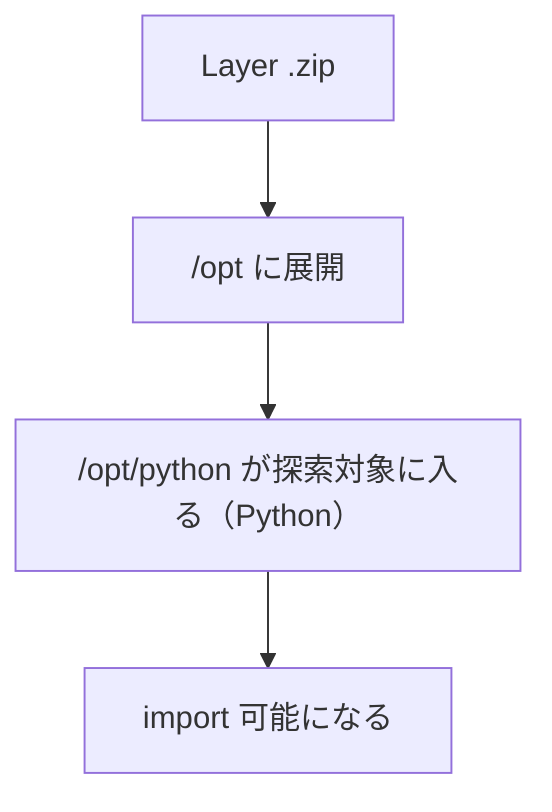

# Day 8：Lambda Layer 完全ガイド（依存管理とディレクトリ構造）

---

### はじめに

Lambda 開発が複雑になる最大の原因は **依存ライブラリ管理** です。
これを解決する代表的な手段が **Lambda Layer**。

ただし Layer の理解が浅いと、次のような運用事故が起きます。

* どの Lambda がどの Layer を参照しているか分からない
* 依存ライブラリのバージョンが散乱（再現性が落ちる）
* 変更の波及範囲が大きく、アップデート時に本番が壊れる

この記事では **Layer の正しい構造**と、**壊さない運用方法（実務版）**を整理します。

---

## Layer はどこに展開されるか（まずここ）

Layer は実行環境内で **`/opt`** 配下に展開されます。
そしてランタイムは、言語ごとに「探索されるパス」が決まっています。Python の場合は `python/`（または `python/lib/python3.x/site-packages`）に置くのが正攻法です。 ([AWS ドキュメント][1])



**結論**：Python Layer は「zip のルート直下に `python/`」が最重要です。 ([AWS ドキュメント][4])

---

## Python Layer の内部構造（正しい形）

Python Layer は最低限、次の構造を満たします。

### パターンA：シンプル（初心者におすすめ）

`python/` の直下に依存パッケージを置きます。

```
my-layer.zip
└── python/
    ├── requests/
    ├── boto3/
    └── （各パッケージの dist-info 等）
```

この形は AWS 公式の例としても示されています。 ([AWS ドキュメント][1])

### パターンB：site-packages 形式（高度だが明示的）

```
my-layer.zip
└── python/
    └── lib/
        └── python3.12/
            └── site-packages/
                ├── numpy/
                └── ...
```

どちらでも成立しますが、まずは **パターンA**で十分です。 ([AWS ドキュメント][1])

---

## requirements.txt の配置と考え方（誤解しやすい）

重要なのは次の2点です。

1. **Lambda は `requirements.txt` を読んで勝手にインストールしません**（あくまでビルド時の入力ファイル）
2. 依存は最終的に **Layer の `python/` 配下へ配置されている状態**がゴール

たとえば手動で Layer を作るなら、基本はこの形です。

```bash
mkdir -p layer/python
pip install -r requirements.txt -t layer/python
cd layer && zip -r my-layer.zip .
```

また、SAM で Layer をビルドする場合は `Metadata: BuildMethod` を指定し、ビルド成果物が Python ランタイムが期待する形（`python/`）になるようにします。 ([AWS ドキュメント][5])

---

## SAM で Layer をビルドする最小例（実務で使える）

```yaml
Resources:
  CommonDepsLayer:
    Type: AWS::Serverless::LayerVersion
    Properties:
      ContentUri: layers/common_deps/
      CompatibleRuntimes:
        - python3.12
    Metadata:
      BuildMethod: python3.12
```

SAM は Layer も `/opt` 前提の構造で扱うため、`python/` 配下に成果物を置く前提になります。 ([AWS ドキュメント][5])

---

## 「Layer 変更が破壊的」になる本当の理由

Layer 自体は **バージョン（ARN末尾の `:N`）で固定**されます。つまり、

* 新しい Layer バージョンを作っただけでは、既存関数は壊れない
* 壊れるのは、関数側を新 Layer バージョンへ更新したとき（特に一斉更新したとき）

という構造です。 ([AWS ドキュメント][2])

加えて、Layer は **最大 5 つまで**しか付けられず、**関数＋全 Layer の合計（解凍後）が 250MB を超えられません**。この制約の中で「共通化しすぎる」「詰め込みすぎる」と、更新も分割も難しくなり破壊的変更に繋がります。 ([AWS ドキュメント][3])

---

## Layer の運用ルール（実務版・事故らないための最低ライン）

### ルール1：1 Layer = 1用途（責務分割）

* `common-http-clients-layer`（requests 等）
* `data-processing-layer`（numpy/pandas 等）
* `internal-utils-layer`（社内共通モジュール）

「便利だから全部入れる」をやると、更新の影響範囲が肥大化します。

### ルール2：依存はピン留めする（再現性）

`requirements.txt` は最低でもバージョン固定（`==`）を推奨します。
Layer は“共通部品”なので、再現性が落ちると事故の温床になります。

### ルール3：更新は“段階適用”が前提（いきなり全関数更新しない）

1. Layer vNext を発行
2. ステージングの一部関数だけ更新
3. 動作確認とロールバック手順確認
4. 本番を段階的に更新

Layer は共有範囲が広いぶん、関数よりも慎重に扱うのが基本です。

### ルール4：Linux 互換とアーキテクチャを意識する

Lambda は Amazon Linux 上で動くため、ネイティブ依存（numpy 等）を含む場合は **Linux 前提でビルド**するのが安全です（Docker 推奨）。 ([AWS ドキュメント][1])

---

## よくあるハマりどころ（追記しておくと親切）

* **Layer は最大 5 個まで**（細かく分けすぎると詰む） ([AWS ドキュメント][3])
* **合計 250MB 制限**（Layer に逃がしても無限には増やせない） ([AWS ドキュメント][6])
* Mac/Windows で作った Layer が本番で import エラー（Linux 非互換） ([AWS ドキュメント][1])
* 依存の重複（関数側にも Layer 側にも同じライブラリが入っていて挙動が揺れる）
* “共通化”のしすぎで、ちょっとした修正が全関数更新になってしまう

---

## まとめ

* Layer は依存管理の中心になり得るが、**正しい構造（`python/`）**が必須 ([AWS ドキュメント][1])
* Layer は **バージョン ARN 固定**。壊れるのは「作成」より「一斉更新」 ([AWS ドキュメント][2])
* 実務では **責務分割・ピン留め・段階適用**をルール化する
* **最大 5 Layer / 合計 250MB**の制約を前提に設計する ([AWS ドキュメント][3])

---

## 付録：SAM + Layer の最小構成（template.yaml 完全例）

### ディレクトリ構成（最小）

```text
.
├── template.yaml
├── src/
│   └── app.py
└── layers/
    └── common_deps/
        └── requirements.txt
```

### template.yaml（Layer + Function 参照まで）

```yaml
AWSTemplateFormatVersion: '2010-09-09'
Transform: AWS::Serverless-2016-10-31
Description: Minimal SAM + Lambda Layer example (Python)

Globals:
  Function:
    Runtime: python3.12
    Timeout: 10
    MemorySize: 128
    Architectures:
      - x86_64
    Tracing: Active
    Environment:
      Variables:
        LOG_LEVEL: INFO

Resources:
  CommonDepsLayer:
    Type: AWS::Serverless::LayerVersion
    Properties:
      LayerName: common-deps-layer
      Description: Common Python dependencies for Lambda
      ContentUri: layers/common_deps/
      CompatibleRuntimes:
        - python3.12
      RetentionPolicy: Retain
    Metadata:
      BuildMethod: python3.12

  HelloFunction:
    Type: AWS::Serverless::Function
    Properties:
      FunctionName: hello-with-layer
      CodeUri: src/
      Handler: app.lambda_handler
      Layers:
        - !Ref CommonDepsLayer
      Policies:
        - AWSLambdaBasicExecutionRole

Outputs:
  HelloFunctionName:
    Value: !Ref HelloFunction
  CommonDepsLayerArn:
    Value: !Ref CommonDepsLayer
```

### layers/common_deps/requirements.txt（例）

```txt
requests==2.32.3
```

### src/app.py（Layer の依存が import できることを確認）

```python
import json
import requests  # <- Layer から読み込める想定


def lambda_handler(event, context):
    return {
        "statusCode": 200,
        "body": json.dumps(
            {
                "message": "Hello from Lambda with Layer!",
                "requests_version": requests.__version__,
            },
            ensure_ascii=False,
        ),
    }
```

### ビルドとローカル実行

```bash
sam build
sam local invoke HelloFunction
```

#### 動作確認のポイント

* `requests_version` が返れば、**Layer 経由で import できている**ことが分かります。
* `RetentionPolicy: Retain` を付けると、スタック削除時に Layer が残りやすいので、運用ルール（残す/残さない）をチームで決めておくと事故が減ります。

---


[1]: https://docs.aws.amazon.com/lambda/latest/dg/packaging-layers.html "Packaging your layer content - AWS Lambda"
[2]: https://docs.aws.amazon.com/lambda/latest/dg/chapter-layers.html?utm_source=chatgpt.com "Managing Lambda dependencies with layers"
[3]: https://docs.aws.amazon.com/lambda/latest/dg/adding-layers.html?utm_source=chatgpt.com "Adding layers to functions - AWS Lambda"
[4]: https://docs.aws.amazon.com/lambda/latest/dg/python-layers.html "Working with layers for Python Lambda functions - AWS Lambda"
[5]: https://docs.aws.amazon.com/serverless-application-model/latest/developerguide/building-layers.html "Building Lambda layers in AWS SAM - AWS Serverless Application Model"
[6]: https://docs.aws.amazon.com/lambda/latest/dg/gettingstarted-limits.html?utm_source=chatgpt.com "Lambda quotas"
