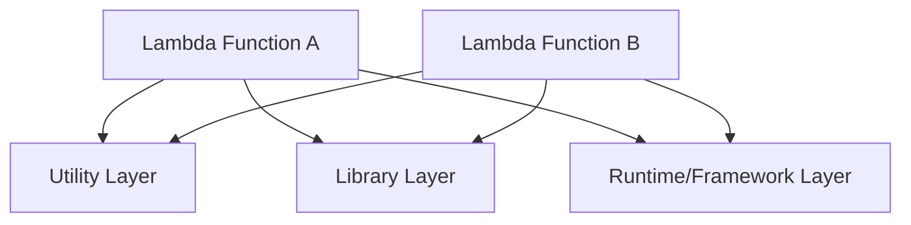

# Day 9：複数 Layer の統合設計（3分類で迷わない）

---

## はじめに
Layer が増えるほど「どの Layer が何を提供しているか」が分からなくなる問題が必ず発生します。

- 似た Layer が乱立する（logging / utils / common など）
- どの関数がどの Layer バージョンを使っているか追えない
- 破壊的変更で“関係ない Lambda”まで巻き込んで壊れる

この記事では、Layer を **3分類** することで設計を整理し、**運用コストを下げる**方法を紹介します。

---

## まず押さえる：Layer の制約（設計に直結）
Layer は便利ですが、制約を知らずに増やすと詰みます。

- 1つの Lambda 関数に追加できる Layer は **最大 5 つ** :contentReference[oaicite:2]{index=2}
- 関数本体＋全 Layer の合計（展開後サイズ）は **最大 250MB** :contentReference[oaicite:3]{index=3}

なので「とりあえず分ける」は危険で、**分け方（設計）**が重要になります。

---

## Layer の3分類
### 1. ライブラリ Layer（Third-party 専用）
**サードパーティライブラリだけ**を入れる Layer です。  
目的は「依存の再利用」と「関数デプロイの軽量化」。

例：
- Pillow
- PyPDF / pypdf
- cryptography など

注意：
- Python ランタイムには **boto3 が同梱**されます。  
  「常に同じ boto3 バージョンを使いたい」など明確な理由がなければ、boto3 を Layer に入れない方が無難です（バージョン差分が事故要因になりやすい） :contentReference[oaicite:4]{index=4}

---

### 2. ユーティリティ Layer（共通処理・社内標準の薄いライブラリ）
**自分たちが保守する共通処理**をまとめる Layer です。  
“関数横断の共通化”の本命ですが、破壊的変更の影響範囲が大きいので設計が重要。

例（Python の場合は /opt/python 配下に載る構造を意識）：
```text
python/
  utils/
    s3_utils.py
    pdf_utils.py
````

ポイント：

* 「小さく・薄く」保つ（巨大な共通基盤にしない）
* **インターフェースを固定**し、内部実装を入れ替えやすくする

---

### 3. ランタイム / フレームワーク Layer（特殊ケース）

特殊な事情がある場合にだけ使う分類です。

例：

* 社内共通ランタイム（カスタムランタイム）
* 監視・計測の共通仕組み（拡張、ラッパー）
* 共通のネイティブ依存（フォント、バイナリなど）

この Layer は更新頻度を低くし、**長期安定版**として扱うのが基本です。

---

## なぜ「3分類」が効くのか（設計判断が速くなる）

Layer の事故は多くが「責務が混ざる」ことで起きます。

* ライブラリ Layerに社内 util が混ざる
* util Layer に特定アプリ固有のロジックが混ざる
* runtime Layer が“全部入り”になって更新不能になる

3分類にすると「それはどこに入れるべきか？」の判断が一瞬でできます。
結果として、依存関係・更新頻度・テスト方針を **分類ごとに標準化**できます。

---

## Layer バージョン戦略（SemVer を前提にすると事故が減る）

| 種類            | 更新頻度 | 推奨戦略               | 注意点         |
| ------------- | ---- | ------------------ | ----------- |
| ライブラリ Layer   | 高    | patch/minor 更新を定期化 | CVE / 互換性差分 |
| ユーティリティ Layer | 中    | **破壊的変更は major**   | 影響範囲が広い     |
| ランタイム Layer   | 低    | 長期安定版（LTS）         | 変更は最小・計画的に  |

補足（実務で効く運用ルール）：

* **破壊的変更は“新しい Layer 名”で作る**のも有効（例：`utils-layer-v2`）
  → 既存関数を段階移行でき、緊急ロールバックも容易
* Library Layer は「入れ替え」になりがちなので、**依存はできるだけ固定（ピン留め）**して更新を計画化する

---

## 図解：Layer 依存モデル（推奨）

「薄い util を真ん中に置き、外側を差し替える」形が安定します。



---

## アンチパターン（やりがち）

* **common-layer 1枚に全部入れる**
  → 更新できない、影響範囲が読めない、5枚制限も圧迫
* **用途不明な名前**（`shared`, `common`, `misc`）
  → “分類”が崩れて探索コストが増える
* **util に業務ロジックを入れる**
  → util の変更が即「全関数の仕様変更」になる

---

## まとめ

* Layer は増えるほど“整理しないと”破綻する
* **Library / Utility / Runtime** の 3分類で設計判断が速くなる
* 制約（最大 5 Layer、合計サイズ上限）を前提に組む ([AWS ドキュメント][1])
* 次回は Layer 自動更新の CI/CD 連携（更新検知・影響確認・段階適用）を解説


---

## 付録1：Layer 命名規則テンプレ（迷ったらこれ）
Layer 名は「あとから検索して意味が分かる」ことが最優先です。  
おすすめは **責務・対象ランタイム・互換性（メジャー）** まで名前で表現するルールです。

### 推奨フォーマット
- **Library Layer**
  - `lib-<package>-py<major><minor>-<arch>`
  - 例：`lib-pillow-py312-x86_64` / `lib-pypdf-py312-arm64`

- **Utility Layer**
  - `util-<domain>-v<major>`
  - 例：`util-core-v1` / `util-pdf-v2` / `util-s3-v1`

- **Runtime / Framework Layer**
  - `rt-<name>-v<major>-py<major><minor>-<arch>`（必要な情報を乗せる）
  - 例：`rt-observability-v1-py312-x86_64`

### 命名に入れるべき要素（判断基準）
| 要素 | 例 | いつ必要？ |
|---|---|---|
| 種別プレフィックス | `lib-` / `util-` / `rt-` | 常に |
| 対象ランタイム | `py312` | ライブラリ／ランタイムで特に重要 |
| アーキテクチャ | `arm64` / `x86_64` | どちらか混在するなら必須 |
| メジャーバージョン | `v2` | Utility／Runtime は基本必須 |
| ドメイン | `pdf` / `s3` / `core` | Utility は必須（責務が見える） |

### アンチパターン（避けたい命名）
- `common` / `shared` / `misc` のような「用途不明」名称
- 役割が混ざる名称（`lib-utils` など）
- v がない Utility（破壊的変更の逃げ道がない）

---

## 付録2：Layer ごとの README 必須項目（テンプレ）
Layer は「使う側のためのプロダクト」なので、Layer 直下に README を置いて情報を固定化します。  
最低限、下記を埋めれば運用が回ります。

### README.md テンプレ（コピペ用）
```text
# <LayerName>

## 1. 概要（What）
- 種別: Library / Utility / Runtime
- 目的: （何を提供する Layer か）
- 対象ランタイム: python3.12 など
- 対象アーキ: x86_64 / arm64
- 提供物の場所: /opt/python/...（例）

## 2. 提供 API（Interface）
- Public API 一覧（関数・モジュール）
  - python/utils/s3_utils.py
    - s3_utils.upload_file(...)
    - s3_utils.download_file(...)
- 破壊的変更の定義（例：引数変更、戻り値変更、例外型変更）

## 3. 互換性（Compatibility）
- 対応 Lambda Runtime: python3.12
- 互換性ポリシー: SemVer（MAJOR.MINOR.PATCH）
  - MAJOR: 破壊的変更
  - MINOR: 後方互換の機能追加
  - PATCH: バグ修正のみ
- 依存ライブラリ（Library Layer の場合は requirements の方針）
  - ピン留め有無 / 例外ルール（セキュリティ修正など）

## 4. 変更履歴（Changelog）
- v2.1.0: ...
- v2.0.0: 破壊的変更（内容 / 移行ガイドへのリンク）
- v1.9.3: ...

## 5. 更新手順（How to Release）
- ローカルでの build 方法
- テスト方法（最小テスト・互換性テスト）
- リリース手順（タグ付け／発行／ARN 更新）
- ロールバック手順（前バージョンへ戻す方法）

## 6. 利用例（How to Use）
- SAM template での Layers 指定例
- import 例（例：from utils import s3_utils）
- 典型ユースケース（1〜3個）

## 7. 利用 Lambda 一覧（Consumer）
- どの関数が使っているか（可能なら自動生成）
  - pdf-annotator
  - receipt-pdf-to-jpeg
````


[1]: https://docs.aws.amazon.com/lambda/latest/dg/adding-layers.html?utm_source=chatgpt.com "Adding layers to functions - AWS Lambda"
[2]: https://docs.aws.amazon.com/lambda/latest/dg/lambda-python.html?utm_source=chatgpt.com "Building Lambda functions with Python"
